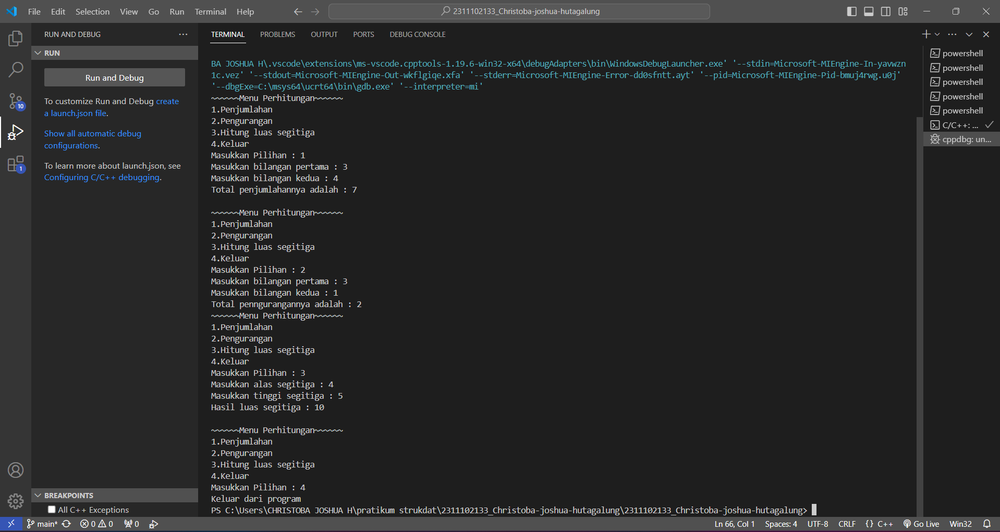
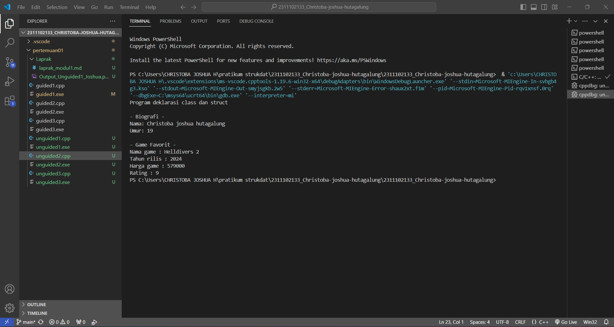
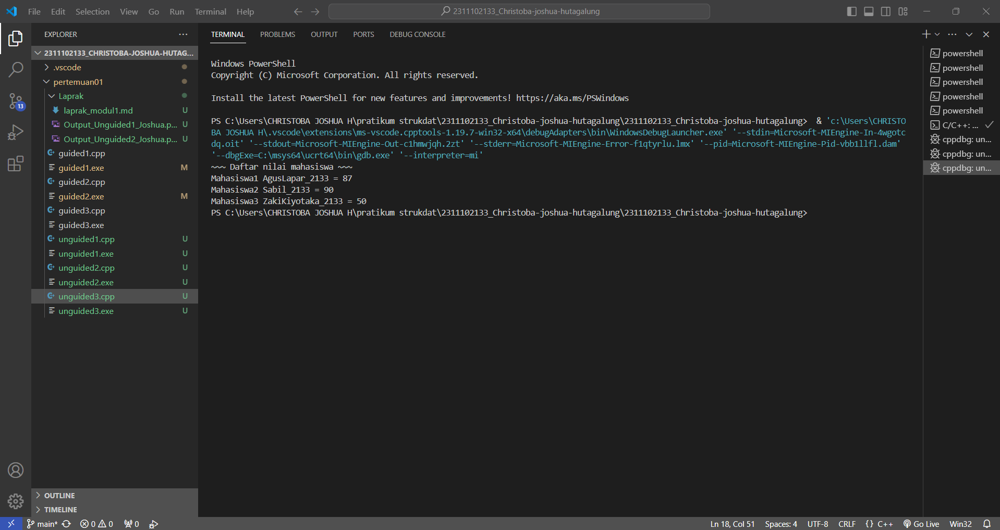

# <h1 align="center">Laporan Praktikum Modul 1 - Tipe Data</h1>
<p align="center">Christoba Joshua Hutagalung - 2311102133</p>

## Dasar Teori
Tipe data merupakan sebuah jenis nilai atau berupa nilai apa yang akan  ditampung  oleh  sebuah  variabel.  Tipe  data  ini  wajib  ada  ketika  akan membuat  sebuah  variabel  agar  variabel  tersebut  memiliki  nilai  yang  spesifik dan  jelas  ketika  digunakan  nantinya.Berikut ini terdapat jenis jenis tipe data yang ada dalam c++ beserta penjelasannya:

1.Tipe data primitif
Tipe data primitif adalah tipe data yang sudah ditentukan oleh sistem, tipe data primitif ini disediakan oleh banyak bahasa pemrograman, perbedaannya terletak pada jumlah bit yang dialokasikan untuk setiap bit pada tipe data primitif tergantung pada bahasa pemrograman,compiler dan sistem operasinya.contoh:

1.Int
tipe data yang digunakan untuk menyimpan bilangan bulat.  

2.Float
tipe data yang digunakan untuk menyimpan bilangan desimal.

3.Char
tipe data yang digunakan untuk menyimpan data berupa sebuah huruf.

4.Boolean
tipe data ini digunakan untuk menyimpan nilai true dan false.

2.Tipe data abstrak
Tipe data abstrak atau yang biasa disebut Abstrak Data Tipe(ADT) merupakan tipe data yang dibentuk oleh programer itu sendiri.tipe data abstrak bisa memilikki nilai lebih dari satu ragam tipe data.

3.Tipe data koleksi 
Tipe data koleksi (Collection Data Type) adalah tipe data yang digunakan untuk mengelompokkan dan menyimpan beberapa nilai atau objek secara bersamaan. Tipe data koleksi memungkinkan Anda menyimpan, mengelola, dan mengakses sejumlah besar data dengan cara yang terstruktur.contoh:

1.Array
struktur data statis yang menyimpan elemen-elemen dengan tipe data yang sama.
Array dapat berupa array berdimensi satu, dua, tiga atau lebih seperti berikut:

a.Array berdimensi satu (one-dimensional array) mewakili bentuk suatu vektor.

b.Array berdimensi dua (two-dimensional array) mewakili bentuk dari suatu matriks atau tabel.

c.Array berdimensi tiga (three-dimensional array) mewakili bentuk suatu ruang.

2.Vector
Standard Template Library (STL) jika di dalam C/C++ memiliki bentuk std::vector . Umumnya, vector mirip seperti array yang memiliki kemampuan untuk menyimpan data dalam bentuk elemen-elemen yang alokasi memorinya dilakukan otomatis dan bersebelahan. 

3.Map
Map terasa mirip dengan array namun dengan index yang memungkinkan untuk berupa tipe data selain integer.

## Guided 

### 1. Tipe Data Primitif

```C++
#include <iostream>
#include <iomanip>
using namespace std;

int main() {
    char op;
    float num1, num2;

    //it allows user to enter operator i.e. +, -, *, /
    cout << "Enter operator (+, -, *, /): ";
    cin >> op;

    //it allows user to enter the operands
    cout << "Enter two operands: ";
    cin >> num1 >> num2;

    //switch statement begins 
    switch (op) {
    //if user enters +
    case '+':
        cout << "Result: " << num1 + num2;
        break;
    //if user enters - 
    case '-':
        cout << "Result: " << num1 - num2;
        break;
    //if user enters *
    case '*':
        cout << "Result: " << num1 * num2;
        break;
    //if user enters /
    case '/':
          if (num2 != 0) { 
                cout << "Result: " << fixed << setprecision(2) << 
num1 / num2; 
            } else { 
                cout << "Error! Division by zero is not allowed."; 
            } 
            break; 
        // If the operator is other than +, -, * or /, 
        // error message will display 
        default: 
            cout << "Error! Operator is not correct"; 
    } // switch statement ends 
 
    return 0; 
}
```
Kode program diatas memilikki 4 operasi pertambahan,pengurangan,perkalian dan pembagian.masing masing operasi dapat menginputkan dua bilangan lalu terdapat perkondisian menggunakan switch case dengan menginputkan pilihan dengan tipe data char dan terdapat tipe data primitif yaitu char dan float.

### 2. Tipe Data Abstrak

```C++
#include <stdio.h> 
#include <string.h>

//Struct
struct Mahasiswa
{
    char name[50];
    char address[100];
    int age;
};
int main()
{
    // menggunakan struct
    struct Mahasiswa mhs1, mhs2;
    // mengisi nilai ke struct 
    strcpy(mhs1.name, "Dian");
    strcpy(mhs1.address, "Mataram");
    mhs1.age = 22;
    strcpy(mhs2.name, "Bambang");
    strcpy(mhs2.address, "Surabaya");
    mhs2.age = 23;

    // mencetak isi struct 
    printf("## Mahasiswa 1 ##\n"); 
    printf("Nama: %s\n", mhs1.name); 
    printf("Alamat: %s\n", mhs1.address); 
    printf("Umur: %d\n", mhs1.age); 
    printf ("\n"); 
    printf("## Mahasiswa 2 ##\n"); 
    printf("Nama: %s\n", mhs2.name); 
    printf("Alamat: %s\n", mhs2.address); 
    printf("Umur: %d\n", mhs2.age); 
    return 0; 
}
```
Program diatas berisikan kode yang menggunakan struct yang dimana struct merupakan tipe data abstrak.struct mahasiswa diatas berisikan name char[50],address char[50], dan age int.lalu isi dari nilai struct tadi berupa data mahasiswa dengan nama dian mataram dan bambang surabaya dengan data umur dan alamat yang berbeda yang kemudian dicetak/ditampilkan dengan printf.

### 3. Tipe Data Koleksi

```C++
#include <iostream> 
#include <array> 
using namespace std; 
 
int main() { 
    // Deklarasi dan inisialisasi array
    int nilai[5];
    nilai[0] = 23;
    nilai[1] = 50;
    nilai[2] = 34;
    nilai[3] = 74;
    nilai[4] = 90;

    // Mencetak array dengan tab
    cout << "Isi array pertama  : " << nilai[0] << endl;
    cout << "Isi array kedua    : " << nilai[1] << endl;
    cout << "Isi array ketiga   : " << nilai[2] << endl;
    cout << "Isi array keempat  : " << nilai[3] << endl;
    cout << "Isi array kelima   : " << nilai[4] << endl;

    return 0;
}
```
Program diatas menampilkan sebuah array yang dimana array adalah sebuah jenis data yang dapat menyimpan beberapa elemen yang sama dengan indeks yang berbeda.terdapat 5 nilai yang terdapat di array diatas dengan nilai 23,50,34,74 dan 90 lalu ditampilkan dengan cout << "Isi array pertama  : " << nilai[0] << endl; hingga nilai array terakhir.

## Unguided 

### 1. Buatlah program menggunakan tipe data primitif minimal dua fungsi dan bebas. Menampilkan program, jelaskan program tersebut dan ambil kesimpulan dari materi tipe data primitif!

```C++
/*
oleh Christoba Joshua Hutagalung - 2311102133
*/
// Unguided 1 program menggunakan tipe data primitif
#include <iostream>

using namespace std;
float phi_2133 = 3.14; // Menggunakan nama variabel dengan akhiran _2133
int FungsiPenjumlahan_2133(int b1_2133, int b2_2133) { // Fungsi buat hitung tambah
    return b1_2133 + b2_2133;
}

int FungsiPengurangan_2133(int b3_2133, int b4_2133) {  // Fungsi buat hitung pengurangan
    return b3_2133 - b4_2133;
}

int FungsiLuasSegitiga_2133(int alas_2133, int tinggi_2133) { // Fungsi buat hitung luas segitiga
    return 0.5 * alas_2133 * tinggi_2133;
}

int main()
{
    int Pilih_2133, b1_2133, b2_2133, b3_2133, b4_2133, alas_2133, tinggi_2133;//Deklarasi variabel
    ulang_2133:
    cout << "~~~~~~Menu Perhitungan~~~~~~" << endl;//output menu awal menu perhitungan
    cout << "1.Penjumlahan" << endl;
    cout << "2.Pengurangan" << endl;
    cout << "3.Hitung luas segitiga" << endl;
    cout << "4.Keluar" << endl;
    cout << "Masukkan Pilihan : ";
    cin >> Pilih_2133;

    switch(Pilih_2133) {
    case 1 :
    //Operator pertambahan
        cout << "Masukkan bilangan pertama : ";
        cin >> b1_2133;
        cout << "Masukkan bilangan kedua : ";
        cin >> b2_2133;
        cout << "Total penjumlahannya adalah : " << FungsiPenjumlahan_2133(b1_2133 , b2_2133) << endl;// Menampilkan output hasil operasi pertambahan
        cout << endl;
        goto ulang_2133;// Buat ulang ke menu awal
        break;
    case 2 :
    //Operator pengurangan
        cout << "Masukkan bilangan pertama : ";
        cin >> b3_2133;
        cout << "Masukkan bilangan kedua : ";
        cin >> b4_2133;
        cout << "Total penngurangannya adalah : " << FungsiPengurangan_2133(b3_2133 , b4_2133) << endl;// Menampilkan output hasil operasi pengurangan
        goto ulang_2133;// Buat ulang ke menu awal
        break;
    case 3 :
    //Operator hitung luas segitiga
        cout << "Masukkan alas segitiga : ";
        cin >> alas_2133;
        cout << "Masukkan tinggi segitiga : ";
        cin >> tinggi_2133;
        cout << "Hasil luas segitiga : " << FungsiLuasSegitiga_2133(alas_2133, tinggi_2133) << endl;// Menampilkan output hasil operasi hitung luas
        cout << endl;
        goto ulang_2133;// Buat ulang ke menu awal
        break;
    case 4 :
    //Perintah keluar dari program dengan break
        cout << "Keluar dari program" << endl;// Mengakhiri program
        break;
    }
    return 0;
}
```
#### Output:

Kode diatas adalah program kalkulator atau menu perhitungan terdapat 3 fungsi perhitungan didalam program tersebut.ada pertambahan,pengurangan dan luas segitiga.terdapat juga perkondisian menggunakan switch case untuk memilh menu dengan inputan int pilih_2133 dan terdapat dua tipe data primitif yaitu int dan float.

Kesimpulan Tipe data primitif:
Tipe data primitif adalah tipe data yang memilikki karakteristik seperti Sudah ditentukan oleh sistem seperti nilai boolean,bilangan desimal,karakter,dan bilangan bulat, memilikki jumlah bit yang bervariasi dan digunakan untuk menyimpan nilai sederhana.

### 2.Jelaskan fungsi dari class dan struct secara detail dan berikan contoh programnya!

```C++
/*
oleh Christoba Joshua Hutagalung - 2311102133
*/
// Unguided 2 program struct dan class
#include <iostream>

using namespace std;

// Struct datapribadi_2133 yang berisi data nama dan alamat string dan umur int
struct datapribadi_2133 {
    string Nama_2133;
    int Umur_2133;
};

// Class Gamefavorit_2133 yang berisi data Nama game string, Tahun rilis int, Harga game int dan Rating int dalam akses public
class Gamefavorit_2133 {
  public:
    string Namagame_2133;
    int Tahunrilis_2133;
    int Hargagame_2133;
    int Rating_2133;
};

int main() {
    cout << "Program deklarasi class dan struct" << endl;

    // Deklarasi Struct datapribadi_2133
    datapribadi_2133 data{"Christoba joshua hutagalung", 19};// inisialisasi nilai Nama_2133 dan Umur_2133
    cout << "\n- Biografi - " << endl;
    cout << "Nama: " << data.Nama_2133 << endl;/**/
    cout << "Umur: " << data.Umur_2133 << endl;
    //Kode cout Nama dan Umur diatas adalah untuk mencetak isi nilai dari variabel data yang menyimpan nama christoba joshua hutagalung dengan umur 19 tahun

    // Deklarasi Class Gamefavorit_2133
    Gamefavorit_2133 Game;
    Game.Namagame_2133 = "Helldivers 2";//inisialisasi nilai Namagame_2133
    Game.Tahunrilis_2133 = 2024;//inisialisasi nilai Tahunrilis_2133
    Game.Hargagame_2133 = 579000;//inisialisasi nilai Hargagame_2133
    Game.Rating_2133 = 9;// inisialisasi nilai Rating_2133
    cout << "\n- Game Favorit -" << endl;
    cout << "Nama game : " << Game.Namagame_2133 << endl;
    cout << "Tahun rilis : " << Game.Tahunrilis_2133 << endl;
    cout << "Harga game : " << Game.Hargagame_2133 << endl;
    cout << "Rating : " << Game.Rating_2133 << endl; 
    /*Bagian mulai dari cout << "\n- Game Favorit -" << endl; sampai cout << "Rating : " << Game.Rating_2133 << endl; adalah cetak output dari nilai
    Namagame_2133,Tahunrilis_2133,Hargagame_2133 dan Rating_2133
    */
    return 0;
}
```
#### Output:

Kode diatas adalah contoh program struct dan class,terdapat class Gamefavorit_2133 yang menampung data nama game (string), tahun rilis (int), harga game (int), dan rating (int).lalu terdapat struct datapribadi_2133 yang menampung data nama (string) dan umur (int).lalu variabel data berisi datapribadi_2133 akan dicetak ke konsol begitu juga dengan variabel game yang berisikan Gamefavorit_2133 akan dicetak ke konsol.

Fungsi pada Struct:
struct adalah tipe data terstruktur yang dapat memungkinkan untuk menyimpan lebih dari satu variabel dengan tipe data yang berbeda.struct dapat digunakan untuk menyusun data terstruktur yang terorganisir sehingga mempermudah pengelolaan dan manipulasi data terkait.

Fungsi pada Class:
Salah satu konsep OOP dalam C++  yang melibatkan pembungkusan data dan abstraksi prosedural. Dalam class, kita dapat menggunakan akses private dan protected untuk mengendalikan hak akses anggota.class dapat digunakan untuk membantu kita dalam mengorganisir kode kita dengan mengelompokkan data dan fungsi terkait bersamaan.

### 3.Buat dan jelaskan program menggunakan fungsi map dan jelaskan perbedaan dari array dengan map!

```C++
/*
oleh Christoba Joshua Hutagalung - 2311102133
*/
// Unguided 3 program fungsi map
#include <iostream>
#include <map> // Library supaya bisa menggunakan fungsi map dibawah

using namespace std;

int main() {
    
    // Deklarasi map dengan key string dan value int
    map<string, int> nilaiMahasiswa_2133;
  
    // Menambahkan elemen-elemen ke dalam map
    nilaiMahasiswa_2133["Sabil_2133"] = 90;
    nilaiMahasiswa_2133["AgusLapar_2133"] = 87;
    nilaiMahasiswa_2133["ZakiKiyotaka_2133"] = 50;

    cout << "~~~ Daftar nilai mahasiswa ~~~" << endl;

    int i_2133 = 1; // Nomor urut mahasiswa dimulai dari 1
    for (const auto& pair_2133 : nilaiMahasiswa_2133) { // Loop untuk semua elemen map
        cout << "Mahasiswa" << i_2133++ << " " << pair_2133.first << " = " << pair_2133.second << endl;// Menampilkan elemen map yaitu nama mahasiswa dan nilainya
    }
    
    return 0;
}
```
#### Output:

Kode diatas adalah contoh program menggunakan map dengan nama nilaiMahasiswa_2133 dan program map ini untuk menyimpan nilai mahasiswa dan menampilkan daftar nilai tersebut.nilai nilai yang dimasukkan adalah 90 untuk Sabil_2133 lalu 87 untuk AgusLapar_2133 dan yang terakhir 50 untuk ZakiKiyotaka_2133.

Perbedaan Array dan Map
Ukuran array dengan map itu berbeda karena ukuran array itu tetap sedangkan untuk map dinamis dalam hal ukuran,lalu perbedaanya lagi adalah array dapat menyimpan data sebagai indeksnya dengan tipe data integer tetapi map dapat menyimpan tipe data selain integer,perbedaan berikutnya adalah array memilikki elemen elemen yang disusun secara berurut berdasarkan indeksnya tetapi untuk map tidak dijamin urutannya karena biasanya tidak mempertahankan urutan kunci dan yang terakhir array cuman bisa pakai indeks bilangan bulat sebagai kunci berbeda dengan map yang bisa tipe data apa aja jadi lebih fleksibel.

## Kesimpulan
Dari hasil pratikum tentang tipe data dalam c++ ini kita tau bahwa tipe data adalah salah satu aspek penting dalam bahasa pemrograman lalu tipe data dibagi menjadi 3 jenis primitif,abstrak dan koleksi masing masing memilikki contoh seperti tipe data primitif contohnya int,float dan char sedangkan tipe data abstrak contohnya ada struct dan class dan yang terakhir tipe data koleksi memilikki contoh yaitu array,vector,dan map.dengan mengetahui lebih dalam mengenai tipe data dapat memudahkan programmer membuat program yang lebih rapi,efisien,dan lebih mudah dibaca.

## Referensi
[1] Purbasari, Wika, et al. ALGORITMA PEMROGRAMAN. Edited by Setiya Putra, Yusuf W., and Hanson P. Putro, CV WIDINA MEDIA UTAMA, 2024.
[2] U. Indahyanti and Y. Rahmawati, “Buku Ajar Algoritma Dan Pemrograman Dalam Bahasa C++”, umsidapress, pp. 1-146, Aug. 2021.    
[3] Putra, Muhammad Taufik D., et al. BELAJAR DASAR PEMROGRAMAN DENGAN C++. Edited by Damayanti, Evi, CV WIDINA MEDIA UTAMA, 2022.