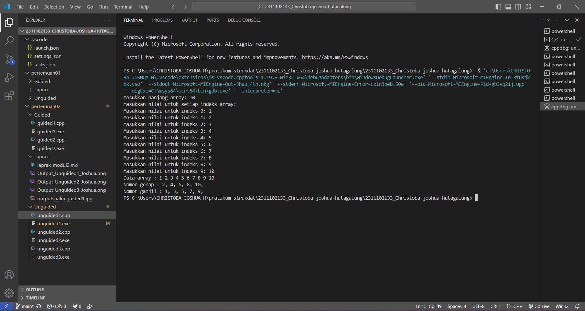

# <h1 align="center">Laporan Praktikum Modul 2 - Array</h1>
<p align="center">Christoba Joshua Hutagalung - 2311102133</p>

## Dasar Teori
Array  atau  larik  adalah  sebuah  tipe  data  bentukan  atau  terstruktur yang terdiri dari sejumlah komponen dengan tipe yang sama. Dengan array  dapat  menyimpan  banyak  data  dengan  satu  namavariabel array. Jumlah komponen ditunjukkan dengan nilai indeks atau dimensi dari array.<br> 
Array adalah cara mendasar C++ untuk merepresentasikan rangkaian objek dalam memori.Jika apa yang Anda inginkan adalah rangkaian objek sederhana dengan panjang tetap dari tipe tertentu di memori, array adalah solusi ideal.
.<br>
Jenis jenis array ada 3 yaitu:<br>
1.Array satu dimensi<br>
Array berdimensi satu (one-dimensional array) mewakili bentuk suatu vektor.<br>

2.Array dua dimensi<br>
Array berdimensi dua (two-dimensional array) mewakili bentuk dari suatu matriks atau tabel.<br>

3.Array tiga dimensi<br>
Array berdimensi tiga (three-dimensional array) mewakili bentuk suatu ruang.<br>

berikut contoh contoh dari masing masing jenis tipe data array:
1.Array satu dimensi :<br>
```C++
int nilai[5] = {80, 30, 96, 85, 75};<br>
```
2.Array dua dimensi :<br>
```C++
int matriks[3][3] = {
    {1, 2, 3},
    {4, 5, 6},
    {7, 8, 9}
};<br>
```
3.Array 3 dimensi :<br>
```C++
int volume[3][3][3] = {
    {
        {1, 2, 3},
        {4, 5, 6},
        {7, 8, 9}
    },
    {
        {10, 11, 12},
        {13, 14, 15},
        {16, 17, 18}
    },
    {
        {19, 20, 21},
        {22, 23, 24},
        {25, 26, 27}
    }
};<br>
```

## Guided 

### 1. Program Input Array Tiga Dimensi

```C++
#include <iostream>
using namespace std;

int main() {
    // Deklarasi array
    int arr[2][3][3];

    // Input elemen
    for (int x = 0; x < 2; x++) {
        for (int y = 0; y < 3; y++) {
            for (int z = 0; z < 3; z++) {
                cout << "Input Array[" << x << "][" << y << "][" << z << "] = ";
                cin >> arr[x][y][z];
            }
        }
        cout << endl;
    }

    // Output Array
    for (int x = 0; x < 2; x++) {
        for (int y = 0; y < 3; y++) {
            for (int z = 0; z < 3; z++) {
                cout << "Data Array[" << x << "][" << y << "][" << z << "] = " << arr[x][y][z] << endl;
            }
        }
    }
    cout << endl;

    // Tampilan array
    for (int x = 0; x < 2; x++) {
        for (int y = 0; y < 3; y++) {
            for (int z = 0; z < 3; z++) {
                cout << arr[x][y][z] << ' ';
            }
            cout << endl;
        }
        cout << endl;
    }

    return 0;
}
```
Program diatas adalah contoh program array tiga dimensi dengan dimensi 2x3x3 lalu kita sebagai user disuruh untuk menginputkan nilai atau angka disetiap elemen array setelah itu array menyimpan nilai yang kita masukkan tadi setelah itu program akan mencetak angka atau nilai yang kita masukkan tadi dalam format matriks.

### 2. Program Mencari Nilai Maksimal pada Array

```C++
#include <iostream>
using namespace std;

int main() {
    int maks, a, i = 1, lokasi;
    cout << "Masukkan panjang array: ";
    cin >> a;
    int array[a];

    cout << "Masukkan " << a << " angka\n";
    for (i = 0; i < a; i++) {
        cout << "Array ke-" << (i) << ": ";
        cin >> array[i];
    }

    maks = array[0];
    for (i = 0; i < a; i++) {
        if (array[i] > maks) {
            maks = array[i];
            lokasi = i;
        }
    }

    cout << "Nilai maksimum adalah " << maks << " berada di Array ke " << lokasi << endl;
}

```
Program diatas adalah program untuk mencari nilai maksimum dari sebuah array,user akan menginputkan panjang array dan menginputkan nilai nilai untuk setiap elemen array lalu nilai nilai tadi disimpan dalam array,kemudian program akan mencari nilai maksimum dari nilai yang dimasukkan tadi dengan cara menggunaan perulangan for yang dimana dalam perulangan tersebut program akan membandingkan setiap elemen lalu jika sudah ditemukan nilai yang paling besar program akan menampilkan hasil maksimumnya.

## Unguided 

### 1. Buatlah program untuk menampilkan Output seperti berikut dengan data yang diinputkan oleh user!

```C++
#include <iostream>

using namespace std;

int main() {
    //Deklarasi variabel untuk menyimpan panjang array
    int panjangArray_133;
    //Deklarasi array setelah meminta panjang array dari pengguna
    int array_133[panjangArray_133];
    cout << "Masukkan panjang array: ";
    cin >> panjangArray_133;

    //Meminta user untuk menginputkan nilai untuk setiap elemen array
    cout << "Masukkan nilai untuk setiap indeks array:\n";
    for (int i = 0; i < panjangArray_133; ++i) {
        cout << "Masukkan nilai untuk indeks " << i << ": ";
        cin >> array_133[i];
    }

    // Menampilkan data array yang tadi diinputkan oleh user
    cout << "Data array : ";
    for (int i = 0; i < panjangArray_133; ++i) {
        cout << array_133[i] << " ";
    }
    cout << endl;

    // Menampilkan nomor genap dari array
    cout << "Nomor genap : ";
    for (int i = 0; i < panjangArray_133; ++i) {
        if (array_133[i] % 2 == 0) {
            cout << array_133[i] << ", ";
        }
    }
    cout << endl;

    // Menampilkan nomor ganjil dari array
    cout << "Nomor ganjil : ";
    for (int i = 0; i < panjangArray_133; ++i) {
        if (array_133[i] % 2 != 0) {
            cout << array_133[i] << ", ";
        }
    }
    cout << endl;

    return 0;
}
```
#### Output:

Jadi program c++ diatas berdasarkan foto output soal kita diminta untuk bisa menampilkan jumlah panjang array kita sebanyak 10 lalu diminta untuk program dapat menentukan dan menampilkan bilangan ganjil dan genapnya yang mana maka dari itu untuk mencari nilai genap tersebut menggunakan rumus jumlah nilai dibagi 2 jika hasilnya 0 atau habis maka termasuk bilangan genap namun sebaliknya jika bilangan ganjil jika dibagi 2 hasilnya bukan 0 atau ada sisa maka disebut bilangan ganjil,kemudian program akan mencetak atau menampilkan hasilnya menggunakan cout.

### 2. Buatlah program Input array tiga dimensi (seperti pada guided) tetapi jumlah atau ukuran elemennya diinputkan oleh user!

```C++
#include <iostream>
using namespace std;

int main() {
    // Deklarasi variabel untuk menyimpan ukuran array
    int X_133, Y_133, Z_133;

    // Input ukuran array dari user
    cout << "Masukkan ukuran array x : ";
    cin >> X_133;
    cout << "Masukkan ukuran array y : ";
    cin >> Y_133;
    cout << "Masukkan ukuran array z : ";
    cin >> Z_133;

    // Deklarasi array dengan ukuran yang diinputkan oleh user
    int arr[X_133][Y_133][Z_133];

    // Input elemen array
    for (int x = 0; x < X_133; x++) {
        for (int y = 0; y < Y_133; y++) {
            for (int z = 0; z < Z_133; z++) {
                cout << "Input Array[" << x << "][" << y << "][" << z << "] = ";
                cin >> arr[x][y][z];
            }
        }
        cout << endl;
    }

    // Output Array
    for (int x = 0; x < X_133; x++) {
        for (int y = 0; y < Y_133; y++) {
            for (int z = 0; z < Z_133; z++) {
                cout << "Data Array[" << x << "][" << y << "][" << z << "] = " << arr[x][y][z] << endl;
            }
        }
    }
    cout << endl;

    // Tampilan array
    for (int x = 0; x < X_133; x++) {
        for (int y = 0; y < Y_133; y++) {
            for (int z = 0; z < Z_133; z++) {
                cout << arr[x][y][z] << ' ';
            }
            cout << endl;
        }
        cout << endl;
    }

    return 0;
}
```
#### Output:

program diatas adalah program array tiga dimensi yang dimana kita user dapat menginputkan nilai x,y,z dan nilai nilai di dalam elemen array tersebut lalu setelah user menginputkan semua nilai nilai sesuai dengan elemen elemen yang di inginkan program akan menampilkan kembali nilai dari elemen array tersebut sesuai dengan urutan yang tadi diinputkan dalam bentuk matriks,jadi jika di guided itu cuman menampilkan array 3 dimensi itu sendiri di unguided 2 kita bisa menginputkan nilai dan elemen array yang kita mau menggunakan cin.

### 3. Buatlah program menu untuk mencari nilai maksimum, minimum dan nilai rata – rata dari suatu array dengan input yang dimasukkan oleh user!

```C++
#include <iostream>
using namespace std;

int main() {
    int jmlhElemen_133;
    // User menginputkan jumlah elemen array
    cout << "Masukkan jumlah elemen array: ";
    cin >> jmlhElemen_133;

    // Mendeklarasikan array dengan ukuran yang dimasukkan oleh pengguna
    int arr[jmlhElemen_133];

    // Menginputkan nilai untuk setiap elemen array
    cout << "Masukkan nilai untuk setiap elemen array: " << endl;
    for(int i = 0; i < jmlhElemen_133; ++i) {
        cout << "Elemen " << i + 1 << " : ";
        cin >> arr[i];
    }

    // Menampilkan menu pilihan 
    int pilih_133;
    // menggunakan perulangan do while agar saat sudah selesai di menu maksimum contohnya nanti dia bakal looping lgi ke menu awal
    do {
        cout << "---- MENU BY JOSHUA ----" << endl;
        cout << "1. Mencari Nilai Maksimum\n";
        cout << "2. Mencari Nilai Minimum\n";
        cout << "3. Mencari Nilai Rata-rata\n";
        cout << "4. Keluar\n";
        cout << "Pilih menu: ";
        cin >> pilih_133;

        // Melakukan operasi sesuai dengan pilihan user
        switch(pilih_133) {
            case 1: {
                // Mencari nilai maksimum
                int max_133 = arr[0];
                for(int i = 1; i < jmlhElemen_133; i++) {
                    if(arr[i] > max_133) {
                        max_133 = arr[i];
                    }
                }
                cout << "Hasil nilai maksimumnya adalah: " << max_133 << endl;
                break;
            }
            case 2: {
                // Mencari nilai minimum
                int min_133 = arr[0];
                for(int i = 1; i < jmlhElemen_133; i++) {
                    if(arr[i] < min_133) {
                        min_133 = arr[i];
                    }
                }
                cout << "Hasil nilai minimumnya adalah: " << min_133 << endl;
                break;
            }
            case 3: {
                // Mencari nilai rata-rata
                double rataRata_133 = 0;
                for(int i = 0; i < jmlhElemen_133; i++) {
                    rataRata_133 += arr[i];
                }
                rataRata_133 /= jmlhElemen_133;
                cout << "Hasil nilai rata-ratanya adalah: " << rataRata_133 << endl;
                break;
            }
            case 4: {
                // Mengakhiri program
                cout << "Anda keluar dari program" << endl;
                break;
            }
            default:
                // Jika inputan tidak ada di pilihan
                cout << "Pilihan anda tidak tersedia" << endl;
        }
    } while(pilih_133 != 4);

    return 0;
}
```
#### Output:

Pada program diatas user disuruh untuk menginputkan berapa jumlah elemen array yang diinginkan,nilai nilai elemen array dan kemudian disuruh untuk memilih operasi yang ingin dilakukan pada array tadi.terdapat tiga operasi yaitu mencari nilai maksimum,minimum,dan rata rata lalu cara array mencari nilai maksimum itu adalah dengan membandingkan setiap elemen dengan nilai maksimum saat ini lalu jika nilai saat ini lebih besar dari nilai maksimum maka nilai maksimum akan di simpan dalam variabel max_133 dan dicetak,begitu juga dengan minimum hanya saja yang dicari nilai paling kecil atau minimumnya kemudian untuk rata-rata program akan menghitung rata-rata dengan cara membagikan nilai dari variabel rataRata_133 dengan jumlah elemen array kemudian hasil rata-rata tadi dicetak.

## Kesimpulan
Dalam pemrograman C++, array memungkinkan penyimpanan beberapa data serupa dalam urutan tertentu. Dengan memahami cara menggunakan array kita sebagai programmer bisa dengan mudah mengakses dan pengelolaan data. Sangat penting untuk memahami konsep array ini karena banyak digunakan saat membuat program seperti menyimpan daftar nilai mahasiswa dalam program.dalam materi array ini juga dijelaskan bahwa ada 3 jenis tipe data array yaitu ada array satu dimensi yang disusun dalam satu baris dan kolom,array dua dimensi yang disusun dalam bentuk tabel dua dimensi(baris dan kolom),array multidimensi yang disusun 3 atau lebih dimensi.

## Referensi
[1] W. Purbasari, et al., Algoritma Pemrograman, Y. W. Setiya Putra, H. P. Putro and C. V. Widina Media Utama, Eds., 2024.  
<br>[2] Putra, et al., Belajar Dasar Pemrograman Dengan C++, E. Damayanti and C. V. Widina Media Utama, Eds., 2022.
[3] B. Stroustrup, The C++ Programming Language, 4th ed. Upper Saddle River, NJ: Addison-Wesley, 2013.
[4] U. Indahyanti and Y. Rahmawati, “Buku Ajar Algoritma Dan Pemrograman Dalam Bahasa C++”, umsidapress, pp. 1-146, Aug. 2021.