# <h1 align="center">Laporan Praktikum Modul 4 - Linked List Circular Dan Non Circular</h1>
<p align="center">Christoba Joshua Hutagalung - 2311102133</p>

## Dasar Teori
Linked List adalah jenis struktur data yang berisi kumpulan data yang disusun secara linear dengan setiap data disimpan dalam sebuah simpul dan antara satu simpul dengan simpul lain dihubungkan melalui pointer. Struktur data ini mempunyai bentuk dasar dengan sifat data disisipkan ke dalam senarai melalui salah satu ujungnya.  

Bentuk Linked list dibagi jadi 2 yaitu:<br>
-Single Linked List<br>
Single linked list atau biasa disebut linked list terdiri dari elemen-elemen individu, dimana masing masing dihubungkan dengan pointer tunggal. Masing-masing elemen terdiri dari dua bagian, yaitu sebuah data dan sebuah pointer yang disebut dengan pointer next<br>
-Double Linked List<br>
Elemen-elemen dihubungkan dengan dua pointer dalam satu elemen. Struktur ini menyebabkan list melintas baik ke depan maupun ke belakang. Masing-masing elemen pada double linked list terdiri dari tiga bagian, disamping data dan pointer next, masing-masing elemen dilengkapi dengan pointer prev yang menunjuk ke elemen sebelumnya.<br> 

Lau linked list memilikki 4 jenis lagi yaitu:<br>
-Single linked list Non Circular
Single linked list Non Circular adalah jenis struktur data linked list yang terdiri dari sejumlah node yang setiap node hanya memiliki satu pointer, yaitu pointer yang digunakan untuk menunjuk ke node selanjutnya dalam urutan linked list, kecuali untuk node terakhir yang disebut sebagai tail. Pada node tail atau node terakhir ini, pointer yang dimilikinya menunjuk ke NULL, menandakan akhir dari linked list tersebut.<br>

-Double Linked List Non Circular
Double Linked List Non Circular, saat berada pada node yang berfungsi sebagai head atau node pertama dalam linked list, nilai dari pointer prev pada node tersebut akan diatur menjadi NULL. Hal ini dikarenakan node head tidak memiliki node sebelumnya. Sedangkan untuk node yang berfungsi sebagai tail atau node terakhir dalam linked list, nilai dari pointer next pada node tersebut akan diatur untuk menunjuk ke NULL, menandakan akhir dari linked list tersebut.<br>

-Single Circluar Linked List
Single Circular Linked List adalah suatu jenis linked list di mana setiap node memiliki sebuah field pointer yang menunjuk ke node berikutnya dalam urutan, tetapi dengan satu keistimewaan. Keistimewaan tersebut adalah pointer next dari node terakhir akan kembali menunjuk ke node pertama atau head, sehingga membentuk suatu lingkaran atau sirkuit. Dengan kata lain, dalam Single Circular Linked List, node tail atau node terakhir akan selalu menunjuk kembali ke node head atau node pertama, menghasilkan suatu struktur data yang berputar atau bersirkulasi.<br>

-Double Circluar Linked List
Double Circular Linked List adalah jenis linked list di mana field pointer-nya terdiri dari dua buah pointer yang bergerak ke dua arah, yaitu prev dan next. Selain itu, pointer next pada Double Circular Linked List akan menunjuk kembali pada elemen tersebut sendiri, menciptakan sebuah pola sirkular. Dengan kata lain, baik pointer next maupun pointer prev pada Double Circular Linked List akan membentuk sebuah loop yang menghubungkan setiap elemen dalam struktur data ini secara berputar.


## Guided 

### 1. Linked List Non Circular 

```C++
#include <iostream>
using namespace std;
/// PROGRAM SINGLE LINKED LIST NON-CIRCULAR
// Deklarasi Struct Node
struct Node
{
    int data;
    Node *next;
};
Node *head;
Node *tail;

// Inisialisasi Node
void init()
{
    head = NULL;
    tail = NULL;
}
// Pegecekan
bool isEmpty()
{
    if (head == NULL)
        return true;
    else
        return false;
}
// Tambah depan
void insertDepan(int nilai)
{
    // Buat Node Baru
    Node *baru = new Node;
    baru->data = nilai;
    baru->next = NULL;
    if (isEmpty() == true)
    {
        head = tail = baru;
        tail->next = NULL;
    }
    else
    {
        baru->next = head;
        head = baru;
    }
}
// Tambah belakang
void insertBelakang(int nilai)
{
    // Buat Node baru
    Node *baru = new Node;
    baru->data = nilai;
    baru->next = NULL;
    if (isEmpty() == true)
    {
        head = tail = baru;
        tail->next = NULL;
    }
    else
    {
        tail->next = baru;
        tail = baru;
    }
}
// Hitung jumlah list
int hitungList()
{
    Node *hitung;
    hitung = head;
    int jumlah = 0;
    while (hitung != NULL)
    {
        jumlah++;
        hitung = hitung->next;
    }
    return jumlah;
}
// Tambah tengah
void insertTengah(int data, int posisi)
{
    if (posisi < 1 || posisi > hitungList())
    {
        cout << "Posisi diluar jangkauan" << endl;
    }
    else
    {
        Node *baru, *bantu;
        baru = new Node();
        baru->data = data;
        // Traversing
        bantu = head;
        int nomor = 1;
        while (nomor < posisi - 1)
        {
            bantu = bantu->next;
            nomor++;
        }
        baru->next = bantu->next;
        bantu->next = baru;
    }
}
// Hapus depan
void hapusDepan()
{
    Node *hapus;
    if (isEmpty() == false)
    {
        if (head->next != NULL)
        {
            hapus = head;
            head = head->next;
            delete hapus;
        }
        else
        {
            head = tail = NULL;
        }
    }
    else
    {
        cout << "List kosong!" << endl;
    }
}
// Hapus Belakang
void hapusBelakang()
{
    Node *hapus;
    Node *bantu;
    if (isEmpty() == false)
    {
        if (head != tail)
        {
            hapus = tail;
            bantu = head;
            while (bantu->next != tail)
            {
                bantu = bantu->next;
            }
            tail = bantu;
            tail->next = NULL;
            delete hapus;
        }
        else
        {
            head = tail = NULL;
        }
    }
    else
    {
        cout << "List kosong!" << endl;
    }
}
// Hapus Tengah
void hapusTengah(int posisi)
{
    Node *bantu, *hapus, *sebelum;
    if (posisi < 1 || posisi > hitungList())
    {
        cout << "Posisi di luar jangkauan" << endl;
    }
    else if (posisi == 1)
    {
        cout << "Posisi bukan posisi tengah" << endl;
    }
    else
    {
        int nomor = 1;
        bantu = head;
        while (nomor <= posisi)
        {
            if (nomor == posisi - 1)
            {
                sebelum = bantu;
            }
            if (nomor == posisi)
            {
                hapus = bantu;
            }
            bantu = bantu->next;
            nomor++;
        }
        sebelum->next = bantu;
        delete hapus;
    }
}
// Ubah depan
void ubahDepan(int data)
{
    if (isEmpty() == 0)
    {
        head->data;
    }
    else
    {
        cout << "List masih kosong!" << endl;
    }
}
// Ubah tengah
void ubahTengah(int data, int posisi)
{
    Node *bantu;
    if (isEmpty() == 0)
    {
        if (posisi < 1 || posisi > hitungList())
        {
            cout << "Posisi diluar jangkauan" << endl;
        }
        else if (posisi == 1)
        {
            cout << "Posisi bukan posisi tengah" << endl;
        }
        else
        {
            bantu = head;
            int nomor = 1;
            while (nomor < posisi)
            {
                bantu->data = data;
            }
        }
    }
    else
    {
        cout << "List Masih kosong!" << endl;
    }
}
// Ubah belakang
void ubahBelakang(int data)
{
    if (isEmpty() == 0)
    {
        tail->data = data;
    }
    else
    {
        cout << "List masih kosong!" << endl;
    }
}
// Hpus List
void clearList()
{
    Node *bantu, *hapus;
    bantu = head;
    while (bantu != NULL)
    {
        hapus = bantu;
        bantu = bantu->next;
        delete hapus;
    }
    head = tail = NULL;
    cout << "List berhasil terhapus" << endl;
}
// Tampilkan list
void tampil()
{
    Node *bantu;
    bantu = head;
    if (isEmpty() == false)
    {
        while (bantu != NULL)
        {
            cout << bantu->data << ends;
            bantu = bantu->next;
        }
        cout << endl;
    }
    else
    {
        cout << "List masih kosong" << endl;
    }
}
int main()
{
    init();
    insertDepan(3);
    tampil();
    insertBelakang(5);
    tampil();
    insertDepan(2);
    tampil();
    insertDepan(1);
    tampil();
    hapusDepan();
    tampil();
    hapusBelakang();
    tampil();
    insertTengah(7, 2);
    tampil();
    hapusTengah(2);
    tampil();
    ubahDepan(1);
    tampil();
    ubahBelakang(8);
    tampil();
    ubahTengah(11, 2);
    tampil();
    return 0;
}
```
Program di atas adalah implementasi sebuah single linked list non-circular dalam bahasa C++. Ini adalah struktur data yang terdiri dari serangkaian node yang saling terhubung, di mana setiap node memiliki dua bagian utama yaitudata yang menyimpan nilai dan pointer yang menunjuk ke node berikutnya dalam linked list.Program ini memungkinkan operasi dasar pada linked list,seperti menambah dan menghapus node di bagian depan, belakang, dan posisi tengah. Selain itu, program juga dapat menghitung jumlah node dalam linked list, mengubah nilai data pada node tertentu, serta membersihkan semua node dari linked list. Melalui fungsi-fungsi seperti `insertDepan`, `insertBelakang`, `insertTengah`, `hapusDepan`, `hapusBelakang`, dan lainnya, program dapat memanipulasi linked list sesuai dengan kebutuhan pengguna. Semua operasi dilakukan dengan memanfaatkan konsep traversal melalui linked list menggunakan pointer. 

### 2. Latihan Circular

```C++
#include <iostream>
using namespace std;

// Deklarasi Struct Node
struct Node
{
    string data;
    Node *next;
};

Node *head, *tail, *baru, *bantu, *hapus;

void init()
{
    head = NULL;
    tail = head;
}

// Pengecekan
int isEmpty()
{
    if (head == NULL)
        return 1; // true
    else
        return 0; // false
}

// Buat Node Baru
void buatNode(string data)
{
    baru = new Node;
    baru->data = data;
    baru->next = NULL;
}

// Hitung List
int hitungList()
{
    bantu = head;
    int jumlah = 0;
    while (bantu != NULL)
    {
        jumlah++;
        bantu = bantu->next;
    }
    return jumlah;
}

// Tambah Depan
void insertDepan(string data)
{
    // Buat Node baru
    buatNode(data);

    if (isEmpty() == 1)
    {
        head = baru;
        tail = head;
        baru->next = head;
    }
    else
    {
        while (tail->next != head)
        {
            tail = tail->next;
        }
        baru->next = head;
        head = baru;
        tail->next = head;
    }
}

// Tambah Belakang
void insertBelakang(string data)
{
    // Buat Node baru
    buatNode(data);

    if (isEmpty() == 1)
    {
        head = baru;
        tail = head;
        baru->next = head;
    }
    else
    {
        while (tail->next != head)
        {
            tail = tail->next;
        }
        tail->next = baru;
        baru->next = head;
    }
}

// Tambah Tengah
void insertTengah(string data, int posisi)
{
    if (isEmpty() == 1)
    {
        head = baru;
        tail = head;
        baru->next = head;
    }
    else
    {
        baru->data = data;
        // transversing
        int nomor = 1;
        bantu = head;
        while (nomor < posisi - 1)
        {
            bantu = bantu->next;
            nomor++;
        }
        baru->next = bantu->next;
        bantu->next = baru;
    }
}

// Hapus Depan
void hapusDepan()
{
    if (isEmpty() == 0)
    {
        hapus = head;
        tail = head;
        if (hapus->next == head)
        {
            head = NULL;
            tail = NULL;
            delete hapus;
        }
        else
        {
            while (tail->next != hapus)
            {
                tail = tail->next;
            }
            head = head->next;
            tail->next = head;
            hapus->next = NULL;
            delete hapus;
        }
    }
    else
    {
        cout << "List masih kosong!" << endl;
    }
}

// Hapus Belakang
void hapusBelakang()
{
    if (isEmpty() == 0)
    {
        hapus = head;
        tail = head;
        if (hapus->next == head)
        {
            head = NULL;
            tail = NULL;
            delete hapus;
        }
        else
        {
            while (hapus->next != head)
            {
                hapus = hapus->next;
            }
            while (tail->next != hapus)
            {
                tail = tail->next;
            }
            tail->next = head;
            hapus->next = NULL;
            delete hapus;
        }
    }
    else
    {
        cout << "List masih kosong!" <  < endl;
    }
}

// Hapus Tengah
void hapusTengah(int posisi)
{
    if (isEmpty() == 0)
    {
        // transversing
        int nomor = 1;
        bantu = head;
        while (nomor < posisi - 1)
        {
            bantu = bantu->next;
            nomor++;
        }
        hapus = bantu->next;
        bantu->next = hapus->next;
        delete hapus;
    }
    else
    {
        cout << "List masih kosong!" << endl;
    }
}

// Hapus List
void clearList()
{
    if (head != NULL)
    {
        hapus = head->next;
        while (hapus != head)
        {
            bantu = hapus->next;
            delete hapus;
            hapus = bantu;
        }
        delete head;
        head = NULL;
    }
    cout << "List berhasil terhapus!" << endl;
}

// Tampilkan List
void tampil()
{
    if (isEmpty() == 0)
    {
        tail = head;
        do
        {
            cout << tail->data << ends;
            tail = tail->next;
        } while (tail != head);
        cout << endl;
    }
    else
    {
        cout << "List masih kosong!" << endl;
    }
}

int main()
{
    init();
    insertDepan("Ayam");
    tampil();
    insertDepan("Bebek");
    tampil();
    insertBelakang("Cicak");
    tampil();
    insertBelakang("Domba");
    tampil();
    hapusBelakang();
    tampil();
    hapusDepan();
    tampil();
    insertTengah("Sapi", 2);
    tampil();
    hapusTengah(2);
    tampil();
    return 0;
}
```
Program ini adalah implementasi dari struktur data Linked List menggunakan bahasa pemrograman C++. Linked List adalah struktur data linear di mana elemen-elemennya tersusun dalam urutan yang saling terhubung melalui pointer.Di dalam program ini, terdapat definisi dari struct Node yang memiliki dua atribut: data (untuk menyimpan nilai) dan next (pointer yang menunjukkan ke node berikutnya). Ada juga beberapa fungsi untuk melakukan operasi pada Linked List, seperti inisialisasi (init), pengecekan apakah Linked List kosong (isEmpty), pembuatan node baru (buatNode), penambahan elemen di depan (insertDepan), di belakang (insertBelakang), di tengah (insertTengah), penghapusan elemen di depan (hapusDepan), di belakang (hapusBelakang), di tengah (hapusTengah), membersihkan seluruh isi Linked List (clearList), dan menampilkan isi Linked List (tampil).Di dalam fungsi main, beberapa operasi ditampilkan, seperti menambahkan beberapa elemen, menghapus elemen di belakang dan di depan, menambahkan elemen di tengah, dan menghapus elemen di tengah.
Program ini menggunakan konsep circular dalam Linked List, di mana tail (ekor) menunjuk kembali ke head (kepala), sehingga membentuk sebuah lingkaran. Ini memungkinkan penambahan atau penghapusan elemen di depan atau di belakang untuk dilakukan dengan efisien.

## Unguided 

### 1. Buatlah menu untuk menambahkan, mengubah, menghapus, dan melihat Nama dan NIM mahasiswa, berikut contoh tampilan output dari nomor 1:

_modul4.png)
```C++
#include<iostream>
#include<iomanip>

using namespace std;

//deklarasi struct node
struct node{
    string Nama_133;
    string NIM_133;
    node *next;
};
node *head;
node *tail;

//Inisialisasi node head & tail
void Inisialisasi_133(){
    head = NULL;
    tail = NULL;
}

//fungsi pengecekan
bool isEmpty_133(){
    if(head == NULL){
        return true;
    } else {
        return false;
    }
}

//prosedur hitung node
int HitungNode_133(){
    node *hitung = head;
    int jumlah_133 = 0;
    while (hitung != NULL){
        hitung = hitung->next;
        jumlah_133++;
    }
    return jumlah_133;
}

//prosedur tambah depan
void TambahDepan_133(string Name_133, string NIM_133){
    node *baru = new node;
    baru->Nama_133 = Name_133;
    baru->NIM_133 = NIM_133;
    baru->next = NULL;
    if(isEmpty_133() == true){
        head = tail = baru;
        tail->next = NULL;
    } else {
        baru->next = head;
        head = baru;
    }
}

//prosedur tambah tengah
void TambahTengah_133(string Name_133, string NIM_133, int Position_133){
    if(Position_133 < 1 || Position_133 > HitungNode_133() + 1){ 
        cout << "Node yang ingin ditambah diluar jangkauan!" << endl;
    } else if(Position_133 == 1){
        cout << "Node yang ingin ditambah bukan ditengah!"<< endl;
    } else {
        node *bantu = head;
        node *baru = new node;
        baru->Nama_133 = Name_133;
        baru->NIM_133 = NIM_133;
        int hitung_133 = 1;
        while(hitung_133 < Position_133 - 1){
            bantu = bantu->next;
            hitung_133++;
        }
        baru->next = bantu->next;
        bantu->next = baru;
    }
}

//prosedur hapus depan
void HapusDepan_133(){
    node *hapus;
    if(isEmpty_133() == true){
        cout << "List masih kosong!" << endl;
    } else {
        if(head->next != NULL){
            hapus = head;
            head = head->next;
            delete hapus;
        } else {
            head = tail = NULL;
        }
    }
}

//fungsi tampil data depan
string TampilDepan_133(){
    string NamaYangDihapus_133 = "";
    if(isEmpty_133() == false){
        NamaYangDihapus_133 = head->Nama_133;
    } else {
        cout << "List masih kosong" << endl;
    }
    return NamaYangDihapus_133;
}

//prosedur hapus belakang
void HapusBelakang_133(){
    node *hapus, *bantu;
    if(isEmpty_133() == true){
        cout << "List masih kosong!" << endl;
    } else {
        if(head != tail){
            hapus = tail;
            bantu = head;
            while(bantu->next != tail){
                bantu = bantu->next;
            }
            tail = bantu;
            tail->next = NULL;
            delete hapus;
        } else {
            head = tail = NULL;
        }
    }
}

// prosedur tambah belakang
void TambahBelakang_133(string Name_133, string NIM_133) {
    node *baru = new node;
    baru->Nama_133 = Name_133;
    baru->NIM_133 = NIM_133;
    baru->next = NULL; // inisialisasi next pointer ke NULL
    if (isEmpty_133() == true) {
        head = tail = baru;
        tail->next = NULL;
    } else {
        tail->next = baru;
        tail = baru; // Mengubah pointer tail untuk menunjuk pada elemen terakhir yang baru
    }
}

//prosedur hapus tengah
void HapusTengah_133(int posisi_133){
    if(posisi_133 < 1 || posisi_133 > HitungNode_133()){ 
        cout << "Posisi node yang akan dihapus offside" << endl;
    } else if(posisi_133 == 1){
        cout << "Node yang ingin dihapus bukan node tengah" << endl;
    } else {
        node *hapus, *bantu, *bantu2;
        bantu = head;
        int nomor_133 = 1;
        while(nomor_133 <= posisi_133){
            if(nomor_133 == posisi_133 - 1){
                bantu2 = bantu;
            } else if(nomor_133 == posisi_133){
                hapus = bantu;
            }
            bantu = bantu->next;
            nomor_133++; 
        }
        bantu2->next = bantu;
        delete hapus;
    }
}

//fungsi tampil data tengah
string TampilTengah_133(int Position_133){
    string NamaYangDihapus_133 = "";
    node *tampil = head;
    node *bantu;
    if(isEmpty_133() == false){
        int nomor_133 = 1;
        while (nomor_133 <= Position_133 - 1){
            if(nomor_133 == Position_133 - 1){
                bantu = tampil;
            }
            tampil = tampil->next;
            nomor_133++;
        }
        bantu->next = tampil;
        NamaYangDihapus_133 = tampil->Nama_133;       
    } else {
        cout << "List masih kosong" << endl;
    }
    return NamaYangDihapus_133;
}

//prosedur Ubah depan
void UbahDepan_133(string NewName_133, string NewNIM_133){
    if(isEmpty_133() == true){
        cout << "List masih kosong!" << endl;
    } else {
        head->Nama_133 = NewName_133;
        head->NIM_133 = NewNIM_133;
    }
}

//prosedur ubah belakang
void UbahBelakang_133(string NewName_133, string NewNIM_133){
    if(isEmpty_133() == true){
        cout << "List masih kosong!" << endl;
    } else {
        tail->Nama_133 = NewName_133;
        tail->NIM_133 = NewNIM_133;
    }
}

//prosedur ubah tengah
void UbahTengah_133(string NewName_133, string NewNIM_133, int Position_133){
    if(isEmpty_133() == true){
        cout << "List masih kosong!" << endl;
    } else {
        if(Position_133 < 1 || Position_133 > HitungNode_133()){
            cout << "Node yang ingin diubah diluar jangkauan!" << endl;
        } else if(Position_133 == 1){
            cout << "Node yang ingin diubah bukan ditengah!" << endl;
        } else {
            node *bantu;
            bantu = head;
            int nomor_133 = 1;
            while(nomor_133 < Position_133){
                bantu = bantu->next;
                nomor_133++;
            }
           bantu->Nama_133 = NewName_133;
           bantu->NIM_133 = NewNIM_133;
        }
    }
}

//prosedur hapus list
void HapusList_133(){
    node *hapus;
    node *bantu = head;
    if(isEmpty_133() == true){
        cout << "List masih kosong!" << endl;
    } else {
        while(bantu != NULL){
            hapus = bantu;
            bantu = bantu->next;
            delete hapus;   
        }
        head = tail = NULL;
    }
}

// fungsi tampil list
void TampilList_133() {
    if (isEmpty_133()) {
        cout << "List masih kosong!" << endl;
    } else {
        node *bantu = head;
        cout << "------------------------------------------" << endl;
        cout << "|         NAMA         |       NIM       |" << endl;
        cout << "------------------------------------------" << endl;
        while (bantu != NULL) {
            cout << "|" << setw(22) << left << bantu->Nama_133 << "|" << setw(17) << left << bantu->NIM_133 << "|" << endl;
            bantu = bantu->next;
        }
        cout << "------------------------------------------" << endl;
    }
}

int main(){
    int Position_133, Choose_133;
    string Nama_133, Namalama_133, NIM_133, Nimlama_133;
    char Yakin_133;
    Inisialisasi_133();
    Menu:
    //Menu Program linked list
    cout << "------- PROGRAM SINGLE LINKED LIST -------" << endl;
    cout << "-------------- NON-CIRCULAR --------------" << endl; 
    cout << "| 1. TAMBAH DEPAN                        |" << endl;
    cout << "| Menambahkan data pada awal list        |" << endl;
    cout << "| 2. TAMBAH BELAKANG                     |" << endl;
    cout << "| Menambahkan data pada akhir list       |" << endl;
    cout << "| 3. TAMBAH TENGAH                       |" << endl;
    cout << "| Menambahkan data pada urutan tertentu  |" << endl;
    cout << "| 4. UBAH DEPAN                          |" << endl;
    cout << "| Mengubah data pada urutan pertama      |" << endl;
    cout << "| 5. UBAH BELAKANG                       |" << endl;
    cout << "| Mengubah data pada urutan terakhir     |" << endl;
    cout << "| 6. UBAH TENGAH                         |" << endl;
    cout << "| Mengubah data pada urutan tertentu     |" << endl;
    cout << "| 7. HAPUS DEPAN                         |" << endl;
    cout << "| Menghapus data urutan pertama          |" << endl;
    cout << "| 8. HAPUS BELAKANG                      |" << endl;
    cout << "| Menghapus data urutan terakhir         |" << endl;
    cout << "| 9. HAPUS TENGAH                        |" << endl;
    cout << "| Menghapus data urutan tertentu         |" << endl;
    cout << "| 10. HAPUS LIST                         |" << endl;
    cout << "| Menghapus seluruh data                 |" << endl;
    cout << "| 11. TAMPILKAN                          |" << endl;
    cout << "| Menampilkan list data yang tersimpan   |" << endl;
    cout << "| 0. KELUAR                              |" << endl;
    cout << "| Keluar dari program                    |" << endl;
    cout << "------------------------------------------" << endl;
    cout << "Masukkan pilihan anda = ";
    cin >> Choose_133;
    cout << endl;
    switch(Choose_133){
        case 1:
            //Tambah depan pada list
            cout << "-------------- TAMBAH DEPAN --------------" << endl;
            cout << "-- Masukkan data yang ingin ditambahkan --" << endl;
            cout << "Nama Mahasiswa = ";
            cin >> Nama_133;
            cout << "NIM Mahasiswa = ";
            cin >> NIM_133;
            TambahDepan_133(Nama_133, NIM_133);
            cout << "Data berhasil ditambahkan" << endl;
            cout << endl;
            goto Menu;
            break;
        case 2:
            //Tambah belakang pada list
            cout << "------------ TAMBAH BELAKANG -------------" << endl;
            cout << "-- Masukkan data yang ingin ditambahkan --" << endl;
            cout << "Nama Mahasiswa = ";
            cin >> Nama_133;
            cout << "NIM Mahasiswa = ";
            cin >> NIM_133;
            TambahBelakang_133(Nama_133, NIM_133);
            cout << "Data berhasil ditambahkan" << endl;
            cout << endl;
            goto Menu;
            break;
        case 3:
            //Tambah tengah pada list
            cout << "------------- TAMBAH TENGAH --------------" << endl;
            cout << "-- Masukkan data yang ingin ditambahkan --" << endl;
            cout << "Nama Mahasiswa = ";
            cin >> Nama_133;
            cout << "NIM Mahasiswa = ";
            cin >> NIM_133;
            cout << "Posisi data = ";
            cin >> Position_133;
            TambahTengah_133(Nama_133, NIM_133, Position_133);
            cout << "Data berhasil ditambahkan" << endl;
            cout << endl;
            goto Menu;
            break;
        case 4:
            //Ubah depan pada list
            cout << "----------------- UBAH DEPAN -----------------" << endl;
            cout << "------- Masukkan data yang akan diubah -------" << endl;
            cout << "--- Data Lama ---" << endl;
            cout << "Nama Mahasiswa lama = ";
            cin >> Namalama_133;
            cout << "NIM Mahasiswa lama = ";
            cin >> Nimlama_133;
            cout << "--- Data Baru ---" << endl;
            cout << "Nama Mahasiswa baru = ";
            cin >> Nama_133;
            cout << "NIM Mahasiswa baru = ";
            cin >> NIM_133;
            UbahDepan_133(Nama_133, NIM_133);
            cout << "Data berhasil diubah" << endl;
            cout << endl;
            goto Menu;
            break;
        case 5:
            //Ubah belakang pada list
            cout << "---------------- UBAH BELAKANG ----------------" << endl;
            cout << "------- Masukkan data yang akan diubah -------" << endl;
            cout << "--- Data Lama ---" << endl;
            cout << "Nama Mahasiswa lama = ";
            cin >> Namalama_133;
            cout << "NIM Mahasiswa lama = ";
            cin >> Nimlama_133;
            cout << "--- Data Baru ---" << endl;
            cout << "Nama Mahasiswa baru = ";
            cin >> Nama_133;
            cout << "NIM Mahasiswa baru = ";
            cin >> NIM_133;
            UbahBelakang_133(Nama_133, NIM_133);
            cout << "Data berhasil diubah" << endl;
            cout << endl;
            goto Menu;
            break;
        case 6:
            //Ubah tengah pada list
            cout << "----------------- UBAH TENGAH -----------------" << endl;
            cout << "------- Masukkan data yang akan diubah -------" << endl;
            cout << "--- Data Lama ---" << endl;
            cout << "Nama Mahasiswa lama = ";
            cin >> Namalama_133;
            cout << "NIM Mahasiswa lama = ";
            cin >> Nimlama_133;
            cout << "--- Data Baru ---" << endl;
            cout << "Nama Mahasiswa baru = ";
            cin >> Nama_133;
            cout << "NIM Mahasiswa baru = ";
            cin >> NIM_133;
            cout << "Posisi data = ";
            cin >> Position_133;
            UbahTengah_133(Nama_133, NIM_133, Position_133);
            cout << "Data berhasil diubah" << endl;
            cout << endl;
            goto Menu;
            break;
        case 7:
            //Hapus depan pada list
            cout << "-------------- HAPUS DEPAN --------------" << endl;
            cout << "Apakah anda yakin ingin menghapus data pertama (Y/N)? ";
            cin >> Yakin_133;
            if(Yakin_133 == 'Y' || Yakin_133 == 'y'){
                HapusDepan_133();
                cout << "Data berhasil dihapus" << endl;
            }
            cout << endl;
            goto Menu;
            break;
        case 8:
            //Hapus belakang pada list
            cout << "------------- HAPUS BELAKANG -------------" << endl;
            cout << "Apakah anda yakin ingin menghapus data terakhir (Y/N)? ";
            cin >> Yakin_133;
            if(Yakin_133 == 'Y' || Yakin_133 == 'y'){
                HapusBelakang_133();
                cout << "Data berhasil dihapus" << endl;
            }
            cout << endl;
            goto Menu;
            break;
        case 9:
            //Hapus tengah pada list
            cout << "------------- HAPUS TENGAH -------------" << endl;
            cout << "Apakah anda yakin ingin menghapus data tertentu (Y/N)? ";
            cin >> Yakin_133;
            if(Yakin_133 == 'Y' || Yakin_133 == 'y'){
                cout << "Posisi data yang akan dihapus = ";
                cin >> Position_133;
                HapusTengah_133(Position_133);
                cout << "Data berhasil dihapus" << endl;
            }
            cout << endl;
            goto Menu;
            break;
        case 10:
            //Hapus semua data pada list
            cout << "------------- HAPUS LIST -------------" << endl;
            cout << "Apakah anda yakin ingin menghapus semua data (Y/N)? ";
            cin >> Yakin_133;
            if(Yakin_133 == 'Y' || Yakin_133 == 'y'){
                HapusList_133();
                cout << "Seluruh data berhasil dihapus" << endl;
            }
            cout << endl;
            goto Menu;
            break;
        case 11:
            //Menampilkan semua data pada list
            cout << "------------- TAMPIL LIST ------------" << endl;
            TampilList_133();
            cout << endl;
            goto Menu;
            break;
        case 0:
            //Keluar dari program
            cout << "Terima kasih telah menggunakan program ini!" << endl;
            break;
        default:
            cout << "Pilihan tidak tersedia" << endl;
            cout << endl;
            goto Menu;
            break;
    }
    return 0;
}
```
#### Output:

##### Output 1 (Tampilan Menu)
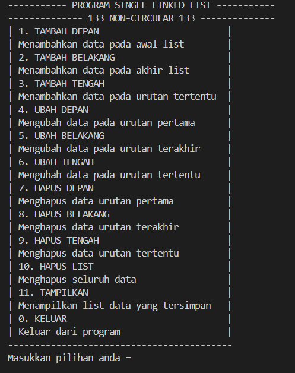

##### Output 2 (Tampilan Menu Tambah Depan)
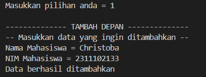

##### Output 3 (Tampilan Menu Tambah Tengah)
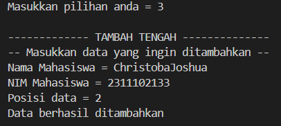

##### Output 4 (Tampilan Menu Tambah Belakang)
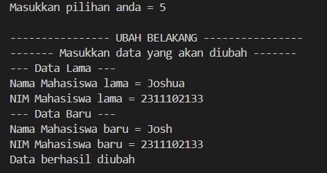

##### Output 5 (Tampilan Menu Ubah Depan)
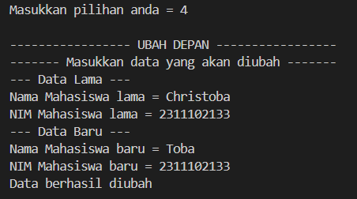

##### Output 6 (Tampilan Menu Ubah Belakang)


##### Output 7 (Tampilan Menu Ubah Tengah)
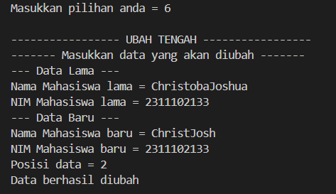

##### Output 8 (Tampilan Menu Hapus Depan)
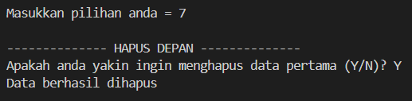

##### Output 9 (Tampilan Menu Hapus Belakang)
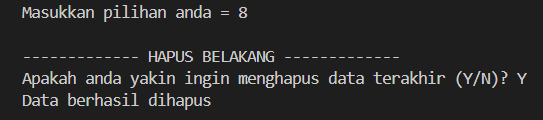

##### Output 10 (Tampilan Menu Hapus Tengah)
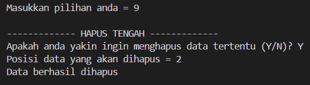

##### Output 11 (Tampilan Menu Hapus List)
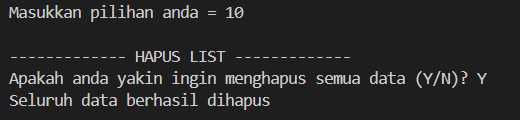

##### Output 12 (Tampilan Menu Tampil List)
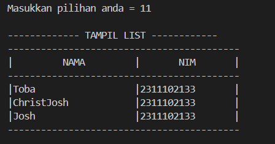

##### Output 13 (Tampilan Menu Keluar)
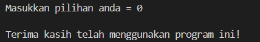

### 2. Setelah membuat menu tersebut, masukkan data sesuai urutan berikut, lalu tampilkan data yang telah dimasukkan. (Gunakan insert depan, belakang atau tengah)
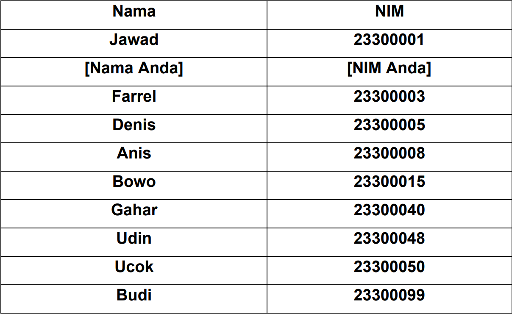

#### Output:

##### Output 1 (Data Jawad)
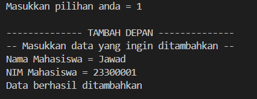

##### Output 2 (Data Nama sendiri 'Joshua')
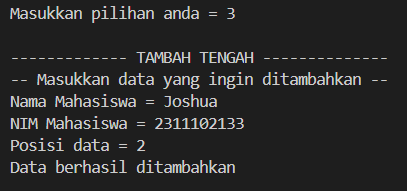

##### Output 3 (Data Farrel)
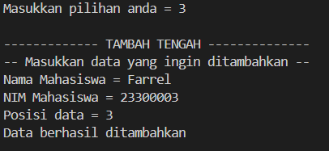

##### Output 4 (Data Dennis)
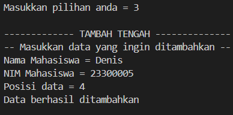

##### Output 5 (Data Anis)
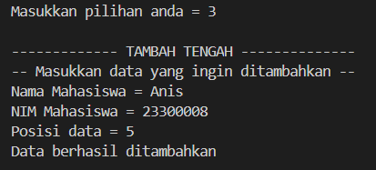

##### Output 6 (Data Bowo)
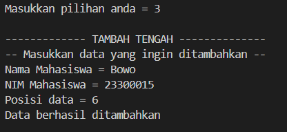

##### Output 7 (Data Gahar)
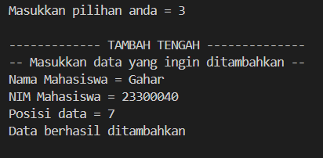

##### Output 8 (Data Udin)
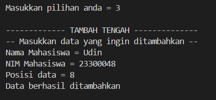

##### Output 9 (Data Ucok)
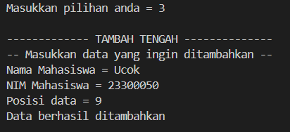

##### Output 10 (Data Budi)
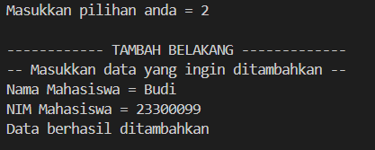

##### Output 11 (Tampil semua data list)
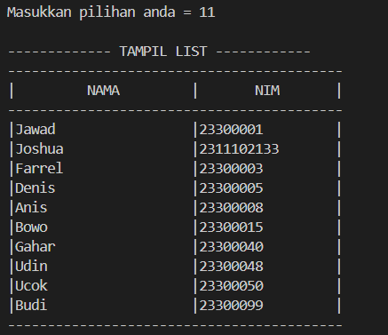

### 3. Lakukan perintah berikut!
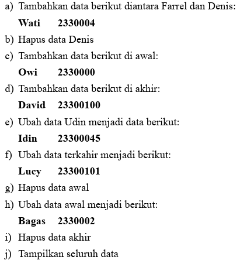

#### Output:

##### Output 1 (Tambah wati diantara farrel dan denis)
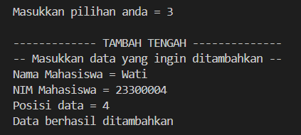

##### Output 2 (Hapus data denis)
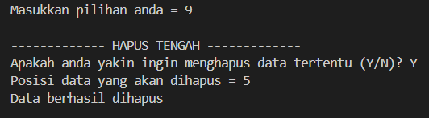

##### Output 3 (Tambah data owi di awal)
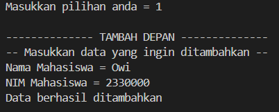

##### Output 4 (Tambah data david di akhir)
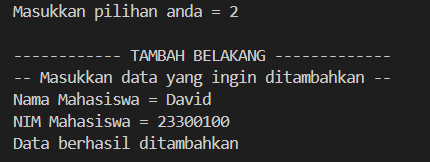

##### Output 5 (Ubah data udin menjadi idin)
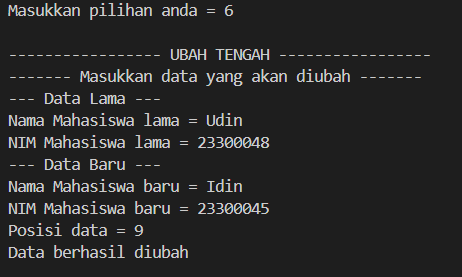

##### Output 6 (Ubah data terakhir menjadi lucy)


##### Output 7 (Hapus data awal)
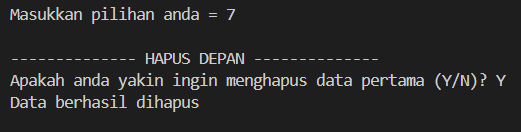

##### Output 8 (Ubah data awal menjadi bagas)
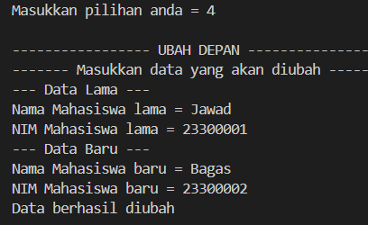

##### Output 9 (Hapus data akhir)
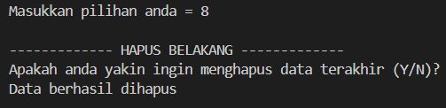

##### Output 10 (Tampil seluruh data)
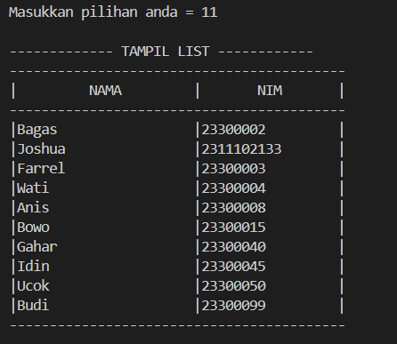

## Penjelasan keseluruhan program
program C++ diatas menggunakan konsep linked list non-circular untuk menyimpan dan mengelola data mahasiswa. Program ini menyediakan berbagai operasi dasar seperti menambah, mengubah, dan menghapus data, serta menampilkan seluruh data yang tersimpan.
-Program dimulai dengan deklarasi struktur `node` yang berisi informasi tentang nama dan NIM mahasiswa, serta pointer `next` untuk menunjukkan ke node selanjutnya dalam linked list.
-Terdapat fungsi fungsi seperti `Inisialisasi_133`, `isEmpty_133`, dan `HitungNode_133` untuk memeriksa status dan menghitung jumlah node dalam linked list.
-Terdapat juga prosedur-prosedur seperti `TambahDepan_133`, `TambahBelakang_133`, `TambahTengah_133` untuk menambahkan node pada berbagai posisi dalam linked list.
-Proses penghapusan node juga diimplementasikan melalui prosedur-prosedur seperti `HapusDepan_133`, `HapusBelakang_133`, dan `HapusTengah_133`.
-Fungsi-fungsi seperti `TampilDepan_133`, `TampilTengah_133` digunakan untuk menampilkan data dari posisi tertentu dalam linked list.
-Terdapat juga prosedur-prosedur untuk mengubah data pada node, yaitu `UbahDepan_133`, `UbahBelakang_133`, dan `UbahTengah_133`.
-Fungsi `TampilList_133` digunakan untuk menampilkan seluruh data yang tersimpan dalam linked list.
-Fungsi `main` merupakan tempat dimana pengguna dapat memilih operasi yang ingin dilakukan melalui menu yang disediakan. Setiap operasi diimplementasikan menggunakan switch-case dan pengguna dapat memilih untuk kembali ke menu utama setelah setiap operasi.

program ini memberikan pengguna kemampuan untuk mengelola daftar data mahasiswa dengan berbagai operasi yang tersedia, menggunakan konsep linked list non-circular untuk menyimpan dan mengakses data lebih efisien

## Kesimpulan
Linked list non-circular adalah struktur data linear di mana setiap elemen terhubung dengan elemen berikutnya dalam satu arah, dengan elemen terakhir menunjuk ke null sedangkan linked list circular memiliki elemen terakhir yang menunjuk kembali ke elemen pertama, membentuk lingkaran.Pentingnya mempelajari kedua jenis linked list ini terletak pada kemampuannya untuk menyimpan dan mengelola data dalam urutan yang dinamis. Linked list non-circular memungkinkan penambahan dan penghapusan elemen di awal, tengah, atau akhir daftar dengan efisiensi, sementara linked list circular dapat digunakan untuk aplikasi yang membutuhkan iterasi berulang dalam loop tak terbatas atau ketika data perlu diatur dalam siklus tertutup.

## Referensi
[1] A. Sindar, STRUKTUR DATA Dan Algoritma DENGAN C++, 2018.<br>
[2] Triase, Triase. "Struktur Data: Diktat Edisi Revisi." (2020).<br>
[3] Dr. Joseph Teguh Santoso., Struktur Data dan ALgoritma. Semarang: Yayasan Prima Agus Teknik, 2021.<br>
[4] Hussain Anwar," Cara Jitu Mahir C++ untuk Pemula". Jakarta: Elex media, 2020.<br>