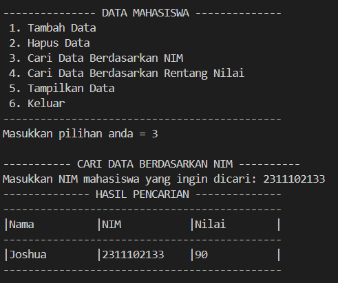
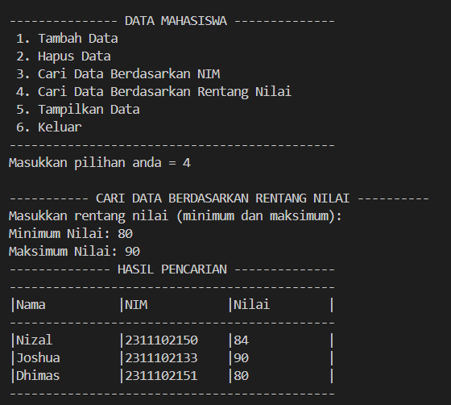
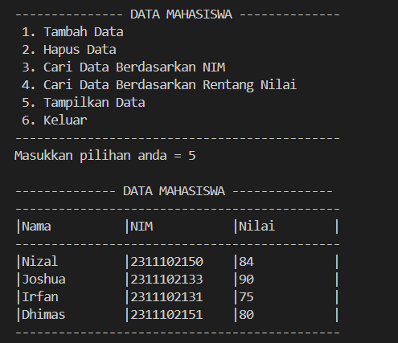
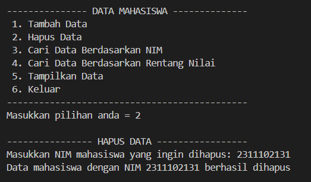
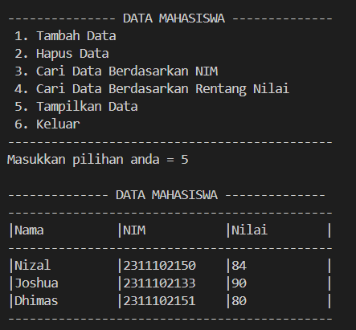

# <h1 align="center">Laporan Praktikum Modul 5 - Hash Table</h1>
<p align="center">Christoba Joshua Hutagalung - 2311102133</p>

## Dasar Teori
### Hash Table

Hash table (tabel hash) adalah struktur data yang digunakan untuk menyimpan dan mengakses data dengan cepat berdasarkan kunci (key). Ini menggunakan teknik hashing, di mana fungsi hash digunakan untuk mengonversi kunci menjadi indeks di dalam array. Hal ini memungkinkan akses yang efisien ke elemen-elemen data.<br>

### Fungsi Hash

Fungsi hash adalah fungsi matematika yang mengonversi kunci (key) menjadi indeks array. Fungsi ini harus:
- Konsisten menghasilkan indeks yang sama untuk kunci yang sama.
- Mendistribusikan kunci secara merata di seluruh array untuk menghindari tabrakan (collisions).<br>

Contoh implementasi dari fungsi hash:
```cpp
size_t myhash(const HashedObj &x) const {
    size_t hashVal = hash<string>{}(x); // Contoh penggunaan hash untuk string
    return hashVal % array.size(); // Mengembalikan indeks berdasarkan modulus ukuran array
}
```

### Teknik Tabrakan (Collisions)<br>

Tabrakan terjadi ketika dua kunci (key) yang berbeda dihasilkan oleh fungsi hash yang sama. Ada beberapa teknik untuk mengatasi tabrakan:<br>

1. **Probing Linier**:
   - Mengunjungi sel berikutnya dalam array jika slot yang dihasilkan sudah terisi.
   - Contoh implementasi: `currentPos = (currentPos + 1) % array.size();`

2. **Probing Kuadrat**:
   - Mengunjungi sel dengan interval yang meningkat secara kuadrat jika slot yang dihasilkan sudah terisi.
   - Contoh implementasi: `offset = 1; currentPos = (currentPos + offset) % array.size(); offset += 2;`

3. **Penggabungan Berpisah (Separate Chaining)**:
   - Menyimpan elemen-elemen dengan kunci yang sama di dalam linked list atau struktur data lain di dalam setiap slot array.
   - Contoh implementasi: `vector<list<HashedObj>> array;`

### Mengatasi Tabrakan<br>

Untuk mengatasi tabrakan, beberapa langkah yang dapat diambil:<br>

- **Probing**: Terus mencari slot kosong jika slot yang diinginkan sudah terisi.
- **Penggabungan Berpisah**: Menambahkan elemen ke dalam linked list atau struktur data lain di slot yang sama.
- **Rehashing**: Membuat array yang lebih besar dan memindahkan elemen-elemen lama ke array yang baru untuk mengurangi peluang tabrakan.

### Contoh Implementasi Rehashing<br>

Rehashing diperlukan jika faktor muatan (load factor) tabel hash melebihi batas tertentu (biasanya 0.5). Berikut adalah contoh implementasi rehashing untuk probing kuadrat dan penggabungan berpisah:

```cpp
// Rehashing untuk probing kuadrat
void rehash() {
    vector<HashEntry> oldArray = array;
    array.resize(nextPrime(2 * oldArray.size()));
    for (auto &entry : array)
        entry.info = EMPTY;
    currentSize = 0;
    for (auto &entry : oldArray)
        if (entry.info == ACTIVE)
            insert(std::move(entry.element));
}

// Rehashing untuk penggabungan berpisah
void rehash() {
    vector<list<HashedObj>> oldLists = theLists;
    theLists.resize(nextPrime(2 * theLists.size()));
    for (auto &thisList : theLists)
        thisList.clear();
    currentSize = 0;
    for (auto &thisList : oldLists)
        for (auto &x : thisList)
            insert(std::move(x));
}
```

## Guided 

### 1. Guided 1
```C++
#include <iostream>

using namespace std;

const int MAX_SIZE = 10;

//Fungsi Hash Sederhana
int hash_func(int key){
    return key % MAX_SIZE;
}

//Struktur data untuk setiap node
struct Node{
    int key;
    int value;
    Node* next;
    Node(int key, int value) : key(key), value(value), next(nullptr) {}
};

//Class hash table
class HashTable{
    private:
        Node** table;
    public:
        HashTable(){
            table = new Node*[MAX_SIZE]();
        }
        ~HashTable(){
            for(int i = 0; i < MAX_SIZE; i++){
                Node* current = table[i];
                while(current != nullptr){
                    Node* temp = current;
                    current = current->next;
                    delete temp;
                }
            }
            delete[] table;
        }

        //Insertion
        void insert(int key, int value){
            int index = hash_func(key);
            Node* current = table[index];
            while(current != nullptr){
                if(current->key == key){
                    current->value = value;
                    return;
                }
                current = current->next;
            }
            Node* node = new Node(key, value);
            node->next = table[index];
            table[index] = node;
        }

        //Searching
        int get(int key){
            int index = hash_func(key);
            Node* current = table[index];
            while(current != nullptr){
                if(current->key == key){
                    return current->value;
                }
                current = current->next;
            }
            return -1;
        }

        //Deletion
        void remove(int key){
            int index = hash_func(key);
            Node* current = table[index];
            Node* prev = nullptr;
            while(current != nullptr){
                if(current->key == key){
                    if(prev == nullptr){
                        table[index] = current->next;
                    } else {
                        prev->next = current->next;
                    }
                    delete current;
                    return;
                }
                prev = current;
                current = current->next;    
            }           
        }

        //Transversal
        void transverse(){
            for(int i = 0; i < MAX_SIZE; i++){
                Node* current = table[i];
                while(current != nullptr){
                    cout << current->key << ": " << current->value << endl;
                    current = current->next;
                }
            }
        }
};

int main(){
    HashTable ht;
    //Insertion
    ht.insert(1, 10);
    ht.insert(2, 20);
    ht.insert(3, 30);

    //searhing
    cout << "Get key 1 : " << ht.get(1) << endl;
    cout << "Get key 4 : " << ht.get(4) << endl;

    //deletion
    ht.remove(4);

    //transversal
    ht.transverse();

    return 0;
}
```
Program c++ di atas adalah implementasi dari hash tabel menggunakan teknik chaining untuk menangani tabrakan (collision) antara kunci-kunci yang berbeda tetapi dapat di-hash ke indeks yang sama.Struktur data `Node` digunakan untuk menyimpan pasangan kunci-nilai (key-value) dalam tabel hash. Setiap `Node` memiliki `key` (kunci), `value` (nilai), dan pointer `next` untuk menunjukkan ke `Node` berikutnya jika terjadi tabrakan.Fungsi `hash_func` adalah fungsi hash sederhana yang menggunakan operasi modulus untuk menentukan indeks di mana setiap kunci (`key`) akan disimpan dalam tabel.Kelas `HashTable` mengimplementasikan tabel hash menggunakan array yang berisi pointer ke `Node`. Fungsi-fungsi publiknya mencakup operasi penyisipan (`insert`), pencarian (`get`), penghapusan (`remove`), dan traversal (`traverse`) untuk mencetak semua pasangan kunci-nilai yang tersimpan.Dalam `main()`,contoh penggunaan dari `HashTable` meliputi penyisipan pasangan kunci-nilai,pencarian nilai berdasarkan kunci, penghapusan entri berdasarkan kunci, dan traversal untuk mencetak semua nilai yang tersimpan dalam tabel hash.Program ini menunjukkan implementasi dasar dari struktur data tabel hash dengan penanganan tabrakan menggunakan teknik chaining.

### 2. Guided 2
```C++
#include <iostream>
#include <string>
#include <vector>

using namespace std;

//Deklarasi isi tabel sebanyak 11
const int TABLE_SIZE = 11;

string name;
string phone_number;

//Deklarasi class HashNode
class HashNode{
    public:
    string name;
    string phone_number;

    //deklarasi konstruktor HashNode yang digunakan untuk membuat objek HashNode dengan parameter nama dan nomor telepon
    HashNode(string name, string phone_number){
        this->name = name;
        this->phone_number = phone_number;
    }
};

//Deklarasi class HashMap
class HashMap{
    private:
    //inisialisasi array table dengan ukuran TABLE_SIZE yang setiap elemen dari array tersebut merupakan sebuah vektor yang menyimpan pointer ke HashNode.
    vector<HashNode*> table[TABLE_SIZE];

    public:
    //fungsi hashFunc untuk menghitung nilai hash dari sebuah string key_151
    int hashFunc(string key){
        int hash_val = 0;
        for(char c : key){
            hash_val += c;
        }
    return hash_val % TABLE_SIZE;
    }

    //Prosedur insert untuk menambahkan data 
    void insert(string name, string phone_number){
        int hash_val = hashFunc(name);

        for(auto node : table[hash_val]){
            if(node->name == name){
                node->phone_number = phone_number;
                return;
            }
        }
        table[hash_val].push_back(new HashNode(name, phone_number));
    }

    //Prosedur remove untuk menghapus data tertentu berdasarkan key nama yang diinputkan user.
    void remove(string name){
        int hash_val = hashFunc(name);

        for(auto it = table[hash_val].begin(); it != table[hash_val].end(); it++){
            if((*it)->name == name){
                table[hash_val].erase(it);
                return;
            }
        }
    }

    //fungsi searchByName untuk mencari data nomor telepon berdasarkan key nama yang diinputkan user.
    string searchByName(string name){
        int hash_val = hashFunc(name);
        for(auto node : table[hash_val]){
            if(node->name == name){
                return node->phone_number;
            }
        }
        return "";
    }

    //prosedur print() untuk menampilkan data yang tersimpan dalam tabel 
    void print(){
        for(int i = 0; i < TABLE_SIZE; i++){
            cout << i << ": ";
            for(auto pair : table[i]){
                if(pair != nullptr){
                    cout << "[" << pair->name << ", " << pair->phone_number << "]";
                }
            }
            cout << endl;
        }
    }
};

int main(){
    //deklarasik objek employee_map dari kelas HashMap
    HashMap employee_map;

    //insertion
    employee_map.insert("Mistah", "1234");
    employee_map.insert("Pastah", "5678");
    employee_map.insert("Ghana", "91011");

    //Search by name
    cout << "Nomor HP Mistah : " << employee_map.searchByName("Mistah") << endl;
    cout << "Nomor HP Pastah : " << employee_map.searchByName("Pastah") << endl;

    //remove
    employee_map.remove("Mistah");

    //search by name
    cout << "Nomor HP Mistah setelah dihapus : " << employee_map.searchByName("Mistah") << endl << endl;

    //print
    employee_map.print();

    return 0;
}
```
Program c++ diatas adalah contoh program dari hash table dengan teknik chaining untuk menangani tabrakan (collision) antara kunci-kunci yang di-hash ke indeks yang sama. Class `HashNode` digunakan untuk merepresentasikan setiap entri dalam hash table, dengan menyimpan pasangan `name` (nama) dan `phone_number` (nomor telepon).Class `HashMap` memiliki array `vector` `table` dengan ukuran tetap `TABLE_SIZE` untuk menyimpan data. Fungsi `hashFunc(string key)` digunakan untuk menghitung nilai hash dari kunci (`name`) dengan cara menjumlahkan nilai ASCII dari karakter-karakter dalam kunci dan kemudian mengambil modulus terhadap `TABLE_SIZE` untuk menentukan indeks penyimpanan.Metode `insert(string name, string phone_number)`, `remove(string name)`, `searchByName(string name)`, dan `print()` digunakan untuk operasi penyisipan, penghapusan, pencarian, dan pencetakan isi hash table secara keseluruhan.Program ini memberikan implementasi dasar dari struktur data hash table dengan teknik chaining untuk pengelolaan data berdasarkan nama dan nomor telepon.

## Unguided 

### 1.  Implementasikan hash table untuk menyimpan data mahasiswa. 
Setiap mahasiswa memiliki NIM dan nilai. Implementasikan fungsi untuk menambahkan data baru, menghapus data, mencari data berdasarkan NIM, dan mencari data berdasarkan nilai. Dengan ketentuan :
- a. Setiap mahasiswa memiliki NIM dan nilai.
- b. Program memiliki tampilan pilihan menu berisi poin C.
- c. Implementasikan fungsi untuk menambahkan data baru, menghapus data, mencari data berdasarkan NIM, dan mencari data berdasarkan rentang nilai (80 – 90).

```C++
#include <iostream>
#include <vector>
#include <iomanip>

using namespace std;

// Deklarasi isi tabel sebanyak 100
const int TableSize_133 = 100;

// Deklarasi class HashNode
class HashNode
{
public:
    string nama_133; // Nama mahasiswa
    string NIM_133;  // NIM mahasiswa
    int nilai_133;   // Nilai mahasiswa

    // Deklarasi konstruktor HashNode
    HashNode(string name_133, string nim_133, int grade_133) : nama_133(name_133), NIM_133(nim_133), nilai_133(grade_133) {}
};

// Deklarasi class HashMap
class HashMap
{
private:
    vector<HashNode *> table_133[TableSize_133]; // Tabel hash untuk menyimpan node-node

    // Fungsi hash untuk menghitung nilai hash dari sebuah string
    int hashFunc_133(string key_133)
    {
        int hashValue_133 = 0;
        for (char c : key_133)
        {
            hashValue_133 += c;
        }
        return hashValue_133 % TableSize_133;
    }

public:
    // Fungsi untuk menambahkan data baru ke tabel
    void Tambah(string name_133, string nim_133, int nilai_133)
    {
        int hashValue = hashFunc_133(nim_133); // Hitung nilai hash dari NIM mahasiswa

        // Periksa apakah data dengan NIM yang sama sudah ada
        for (auto node : table_133[hashValue])
        {
            if (node->NIM_133 == nim_133)
            {
                node->nama_133 = name_133; // Jika sudah ada, perbarui nama dan nilai
                node->nilai_133 = nilai_133;
                cout << "Data mahasiswa dengan NIM " << nim_133 << " berhasil diperbarui" << endl;
                return;
            }
        }

        // Jika tidak ada data dengan NIM yang sama, buat node baru dan tambahkan ke tabel
        table_133[hashValue].push_back(new HashNode(name_133, nim_133, nilai_133));
        cout << "Data mahasiswa berhasil ditambahkan" << endl;
    }

    // Fungsi untuk mencari data berdasarkan NIM
    void CariByNIM(string nim_133)
    {
        bool found = false;
        cout << "-------------- HASIL PENCARIAN --------------" << endl;
        cout << "---------------------------------------------" << endl;
        cout << "|" << left << setw(14) << "Nama"
             << "|" << left << setw(14) << "NIM"
             << "|" << left << setw(13) << "Nilai"
             << "|" << endl;
        cout << "---------------------------------------------" << endl;

        int hashValue = hashFunc_133(nim_133); // Hitung nilai hash dari NIM mahasiswa

        for (auto node : table_133[hashValue])
        {
            if (node->NIM_133 == nim_133)
            {
                cout << "|" << left << setw(14) << node->nama_133 << "|" << left << setw(14) << node->NIM_133 << "|" << left << setw(13) << node->nilai_133 << "|" << endl;
                found = true;
                break;
            }
        }

        if (!found)
        {
            cout << "Data mahasiswa dengan NIM " << nim_133 << " tidak ditemukan" << endl;
        }
        cout << "---------------------------------------------" << endl;
    }

    // Fungsi untuk mencari data berdasarkan rentang nilai
    void CariByGradeRange(int minGrade_133, int maxGrade_133)
    {
        bool found = false;
        cout << "-------------- HASIL PENCARIAN --------------" << endl;
        cout << "---------------------------------------------" << endl;
        cout << "|" << left << setw(14) << "Nama"
             << "|" << left << setw(14) << "NIM"
             << "|" << left << setw(13) << "Nilai"
             << "|" << endl;
        cout << "---------------------------------------------" << endl;

        for (int i = 0; i < TableSize_133; i++)
        {
            for (auto node : table_133[i])
            {
                if (node->nilai_133 >= minGrade_133 && node->nilai_133 <= maxGrade_133)
                {
                    cout << "|" << left << setw(14) << node->nama_133 << "|" << left << setw(14) << node->NIM_133 << "|" << left << setw(13) << node->nilai_133 << "|" << endl;
                    found = true;
                }
            }
        }

        if (!found)
        {
            cout << "Data mahasiswa dengan rentang nilai " << minGrade_133 << " - " << maxGrade_133 << " tidak ditemukan" << endl;
        }
        cout << "---------------------------------------------" << endl;
    }

    // Fungsi untuk menghapus data berdasarkan NIM
    void Hapus(string nim_133)
    {
        int hashValue = hashFunc_133(nim_133); // Hitung nilai hash dari NIM mahasiswa

        auto &nodes = table_133[hashValue];

        // Gunakan iterator aman untuk iterasi dan hapus elemen
        for (auto it = nodes.begin(); it != nodes.end(); ++it)
        {
            if ((*it)->NIM_133 == nim_133)
            {
                // Hapus node dari memori
                delete *it;
                // Hapus node dari vektor
                nodes.erase(it);
                cout << "Data mahasiswa dengan NIM " << nim_133 << " berhasil dihapus" << endl;
                return;
            }
        }

        // Jika tidak ada node dengan NIM yang sesuai setelah iterasi selesai, tampilkan pesan
        cout << "Data mahasiswa dengan NIM " << nim_133 << " tidak ditemukan" << endl;
    }

    // Fungsi untuk menampilkan seluruh data di tabel
    void TampilkanData()
    {
        cout << "-------------- DATA MAHASISWA --------------" << endl;
        cout << "---------------------------------------------" << endl;
        cout << "|" << left << setw(14) << "Nama"
             << "|" << left << setw(14) << "NIM"
             << "|" << left << setw(13) << "Nilai"
             << "|" << endl;
        cout << "---------------------------------------------" << endl;

        for (int i = 0; i < TableSize_133; i++)
        {
            for (auto node : table_133[i])
            {
                cout << "|" << left << setw(14) << node->nama_133 << "|" << left << setw(14) << node->NIM_133 << "|" << left << setw(13) << node->nilai_133 << "|" << endl;
            }
        }
        cout << "---------------------------------------------" << endl;
    }
};

int main()
{
    HashMap mahasiswaMap; // Objek untuk memanipulasi data mahasiswa
    int choice_133, nilai_133, minNilai_133, maxNilai_133;
    string nama_133, NIM_133;

    while (true)
    {
        // Tampilkan menu interaktif untuk pengguna
        cout << "--------------- DATA MAHASISWA --------------" << endl;
        cout << " 1. Tambah Data                             " << endl;
        cout << " 2. Hapus Data                              " << endl;
        cout << " 3. Cari Data Berdasarkan NIM               " << endl;
        cout << " 4. Cari Data Berdasarkan Rentang Nilai     " << endl;
        cout << " 5. Tampilkan Data                          " << endl;
        cout << " 6. Keluar                                  " << endl;
        cout << "---------------------------------------------" << endl;
        cout << "Masukkan pilihan anda = ";
        cin >> choice_133; // Input pilihan menu dari pengguna
        cout << endl;

        switch (choice_133)
        {
        case 1:
            cout << "---------------- TAMBAH DATA ----------------" << endl;
            cout << "Masukkan nama mahasiswa   : ";
            cin >> nama_133;
            cout << "Masukkan NIM mahasiswa    : ";
            cin >> NIM_133;
            cout << "Masukkan nilai mahasiswa  : ";
            cin >> nilai_133;
            mahasiswaMap.Tambah(nama_133, NIM_133, nilai_133); // Panggil fungsi untuk menambahkan data
            cout << endl;
            break;
        case 2:
            cout << "---------------- HAPUS DATA -----------------" << endl;
            cout << "Masukkan NIM mahasiswa yang ingin dihapus: ";
            cin >> NIM_133;
            mahasiswaMap.Hapus(NIM_133); // Panggil fungsi untuk menghapus data
            cout << endl;
            break;
        case 3:
            cout << "----------- CARI DATA BERDASARKAN NIM ----------" << endl;
            cout << "Masukkan NIM mahasiswa yang ingin dicari: ";
            cin >> NIM_133;
            mahasiswaMap.CariByNIM(NIM_133); // Panggil fungsi untuk mencari data berdasarkan NIM
            cout << endl;
            break;
        case 4:
            cout << "----------- CARI DATA BERDASARKAN RENTANG NILAI ----------" << endl;
            cout << "Masukkan rentang nilai (minimum dan maksimum):" << endl;
            cout << "Minimum Nilai: ";
            cin >> minNilai_133;
            cout << "Maksimum Nilai: ";
            cin >> maxNilai_133;
            mahasiswaMap.CariByGradeRange(minNilai_133, maxNilai_133); // Panggil fungsi untuk mencari data berdasarkan rentang nilai
            cout << endl;
            break;
        case 5:
            mahasiswaMap.TampilkanData(); // Panggil fungsi untuk menampilkan seluruh data mahasiswa
            cout << endl;
            break;
        case 6:
            cout << "Terima kasih telah menggunakan program!" << endl;
            return 0; // Keluar dari program
        default:
            cout << "Pilihan tidak valid. Silakan coba lagi." << endl;
            cout << endl;
            break;
        }
    }

    return 0;
}
```
#### Output:

### Tambah data (Joshua,irfan,Dhimas,Nizal):
.png)<br>
.png)

### Cari Berdasarkan Nim:


### Cari Berdasarkan Nilai:


### Tampilkan Data Sebelum Ada Data Yang Dihapus:


### Menghapus Data Irfan:


### Tampilkan Data Sesudah Ada Data Yang Dihapus:


Program c++ diatas adalah program yang mengimplementasikan struktur data HashMap untuk data mahasiswa yang dimana struktur data HashMap digunakan untuk menyimpan data mahasiswa berdasarkan Nim dengan konsep hashing.Program diatas juga memilikki beberapa menu yang dapat user gunakan seperti:<br>
- Tambah Data: Untuk menambahkan data mahasiswa baru. Jika NIM sudah ada dalam tabel, data mahasiswa akan diperbarui.
- Hapus Data: Untuk menghapus data mahasiswa berdasarkan NIM.
- Cari Data Berdasarkan NIM: Untuk mencari data mahasiswa berdasarkan NIM.
- Cari Data Berdasarkan Rentang Nilai: Untuk mencari dan menampilkan data mahasiswa berdasarkan rentang nilai tertentu.
- Tampilkan Data: Untuk menampilkan seluruh data mahasiswa yang tersimpan dalam tabel hash.<br>

Setiap data mahasiswa yang dimasukkan direpresentasikan oleh HashNode, yang memiliki atribut nama, NIM, dan nilai. Data mahasiswa disimpan dalam HashMap menggunakan teknik hashing, di mana fungsi hashFunc_133(string key_133) digunakan untuk menghitung nilai hash dari NIM mahasiswa. Proses hashing dilakukan dengan menjumlahkan nilai ASCII dari karakter-karakter dalam NIM dan kemudian mengambil hasil modulo terhadap ukuran tabel (TableSize_133) untuk menentukan posisi penyimpanan data dalam tabel hash.Dengan menggunakan struktur data HashMap, program ini dapat menyimpan dan mengakses data mahasiswa dengan efisien, terutama saat mencari data berdasarkan NIM atau rentang nilai. Pengguna dapat dengan mudah melakukan operasi-operasi dasar pada data mahasiswa menggunakan menu-menu yang disediakan.
## Kesimpulan
hash table merupakan struktur data yang efisien untuk menyimpan dan mengakses data dengan cepat berdasarkan kunci (key) menggunakan teknik hashing. Fungsi hash digunakan untuk mengonversi kunci menjadi indeks array, dengan tujuan menghindari tabrakan (collisions) dan mendistribusikan data secara merata di seluruh array. Teknik penanganan tabrakan seperti chaining (penggabungan berpisah) memungkinkan penanganan kunci-kunci yang berbeda tetapi di-hash ke indeks yang sama melalui linked list atau vektor.

Implementasi hash table dalam bahasa C++, terutama untuk kasus data mahasiswa, memperlihatkan kegunaan praktis dari struktur data ini. Fitur-fitur seperti penambahan data, pencarian berdasarkan kunci (NIM), penghapusan data, dan pencarian berdasarkan rentang nilai memberikan fleksibilitas dalam manajemen data. Penggunaan hash table dengan chaining sangat berguna dalam aplikasi yang membutuhkan akses cepat dan efisien terhadap data dengan kunci tertentu.

dengan programmer mempelajari tabel hash ini programmer dapat membuat struktur data yang efisien dalam hal pencarian dan penyimpanan data.Dengan memahami hash table, programmer dapat menangani tabrakan (collisions) dengan baik dan meningkatkan kinerja aplikasi dalam mengelola data, terutama saat bekerja dengan kunci (key) untuk mengakses informasi dengan cepat.

## Referensi
[1] M. A. Weiss, "Data Structures and Algorithm Analysis in C++," 3rd ed. Boston, MA: Pearson Education, 2006.<br>
[2] D. S. Malik, Data Structures Using C++. Cengage Learning, 2009.