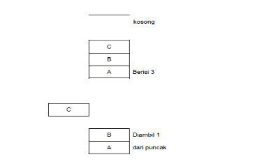
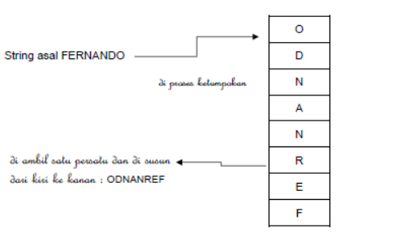
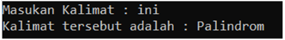
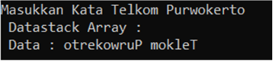

# <h1 align="center">Laporan Praktikum Modul 6 - Stack</h1>
<p align="center">Christoba Joshua Hutagalung - 2311102133</p>

## Dasar Teori
Stack (tumpukan) adalah struktur data yang memungkinkan penyisipan dan pengambilan data dilakukan dari satu ujung yang disebut puncak. Sesuai dengan namanya, struktur data ini digambarkan seperti tumpukan piring atau tumpukan buku. Untuk menambahkan piring ke dalam tumpukan, kita meletakkannya di bagian puncak. Begitu juga, ketika ingin mengambil piring, piring diambil dari data yang berada di puncak tumpukan. Proses ini menggambarkan prinsip "Last In, First Out" (LIFO). Data atau item yang disimpan di dalam stack akan membentuk tumpukan, dengan item paling akhir yang ditambahkan disebut sebagai "top of stack".Item ditempatkan membentuk tumpukan. 


Struktur Data Tumpukan

Tumpukan memiliki sifat Last In First Out (LIFO), yang berarti data yang terakhir dimasukkan atau disisipkan akan menjadi data yang pertama kali keluar. Pada contoh di atas dengan tumpukan A, B, dan C, terlihat bahwa C adalah data yang terakhir ditambahkan ke tumpukan. Jika operasi pengambilan data dilakukan, maka C akan menjadi data yang pertama kali diambil atau keluar dari tumpukan.

Dalam pemrograman C++, stack merupakan salah satu struktur data yang sangat berguna dan seringkali diimplementasikan menggunakan array atau linked list. Bayangkan stack seperti tumpukan buku di meja; setiap kali Anda menambahkan buku baru, itu diletakkan di atas buku-buku yang sudah ada. Operasi utama dalam stack adalah push untuk menambahkan buku baru ke tumpukan dan pop untuk mengambil buku paling atas dari tumpukan. Ada juga operasi lain seperti peek untuk sekadar melihat buku paling atas tanpa mengambilnya, dan isEmpty untuk memeriksa apakah tumpukan kosong atau tidak.

Penerapan stack dalam pemrograman sangat beragam, mulai dari penyelesaian masalah matematika hingga manajemen memori dalam sistem komputer. Karakteristik LIFO (Last In, First Out) membuat stack sangat berguna untuk mempertahankan urutan operasi atau data yang penting dan memudahkan akses ke data terbaru yang dimasukkan. Namun, ada juga dua kondisi yang perlu diwaspadai dalam struktur data stack, yaitu underflow dan overflow, berikut penjelasannya:

- Stack overflow terjadi saat tumpukan sudah penuh dengan buku namun kita masih mencoba menambahkan buku baru ke dalamnya, seperti mencoba menambahkan buku baru ke tumpukan yang sudah terlalu tinggi untuk menampungnya.
- Stack underflow terjadi saat kita mencoba mengambil buku dari tumpukan yang kosong, seperti mencoba mengambil buku dari tumpukan yang tidak memiliki buku sama sekali.

#### Operasi-operasi/fungsi Stack :

Operasi pada stack melibatkan serangkaian fungsi yang memberikan kita kemampuan untuk berinteraksi dengan struktur data ini. Mari kita jabarkan beberapa operasi dasar yang dapat kita lakukan pada stack:

 - Push : digunakan untuk menambah item pada stack pada tumpukan paling atas.
 - Pop : digunakan untuk mengambil item pada stack padatumpukan paling atas.
 - Clear : digunakan untuk mengosongkan stack.
 - IsEmpty : fungsi yang digunakan untuk mengecek apakah stack sudah kosong
 - IsFull : fungsi yang digunakan untuk mengecek apakah stack sudah penuh
 - Size : Digunakan untuk mengetahui berapa banyak buku yang telah Anda susun di tumpukan tersebut.

Operasi dasar pada tumpukan adalah PUSH dan POP:

- PUSH : Operasi untuk memasukkan data ke dalam tumpukan. Biasanya dinyatakan dengan `push(T, d)`, di mana T menyatakan tumpukan dan d menyatakan item data yang akan dimasukkan ke dalam tumpukan T.

- POP  : Operasi untuk mengambil data dari tumpukan. Biasanya dinyatakan dengan `pop(T)`. Dalam operasi ini, data teratas dari tumpukan T akan dikeluarkan dan menjadi nilai balik dari operasi pop. Sehingga, sering kali penggunaan pop dituangkan dalam bentuk pernyataan seperti `data = pop(T)`.

Dengan demikian, PUSH digunakan untuk menambahkan data ke dalam tumpukan, sedangkan POP digunakan untuk mengambil data dari tumpukan.<br>

### Aplikasi Tumpukan
Aplikasi Tumpukan (Stack) memiliki banyak penerapan. Salah satu penerapannya adalah untuk membalik string. Prosesnya dimulai dengan memproses string dari kiri ke kanan, kemudian setiap karakter dimasukkan ke dalam tumpukan satu per satu. Dengan cara ini, karakter paling kiri akan berada di posisi paling bawah dalam tumpukan. Setelah itu, jika karakter-karakter diambil satu per satu dari tumpukan dan disusun dari kiri ke kanan, maka string tersebut akan terbentuk dengan urutan terbalik dari aslinya,seperti diperlihatkan pada gambar di bawah ini.



Mengkonversikan bilangan system decimal ke system biner.Contoh Bilangan 19 identik dengan bilangan biner : 10011.Algoritma untuk melakukannya adalah seperti berikut :<br>
Algoritma untuk mengkonversikan bilangan desimal ke sistem biner:

1. Tumpukan <---- kosong
2. Selama Bilangan > 0
3. Digit <---- sisa pembagian bilangan bulat dengan 2
4. Push(Tumpukan, Digit)
5. Bilangan <---- pembagian bilangan bulat dengan 2
6. End-While
7. Selama (Tumpukan tidak kosong)
8. Digit <---- Pop
9. Tampilkan digit
10. End-While

Mengevaluasi Ekspresi Aritmetika. Misalnya,tumpukan dipakai untuk memproses perhitungan semacam(2+1)*3+5*2 yang melibatkan berbagai operator dengan prioritas yang berbeda. Memproses pasangan tanda kurung dalam suatu ekspresi. Misalnya, ekspresi seperti (a(b{c|d}[])dianggap valid, sedangkan ekspresi (a(b{c|d] dianggap tidak valid. Menangani fungsi Rekursif. Secara internal komputer
menggunakan tumpukan ketika terjadi pemanggilan fungsi secara rekursif.

#### Kelebihan dan kekurangan Stack:

##### 1. Kelebihan
- tidak mudah rusak karena ukuran variabel yang tetap.
- secara otomatis membersihkan objek  yang tidak lagi diperlukan.
- ukuran variabel tidak dapat diubah.
- Menggunakan metode LIFO untuk membantu mengelola data dengan mudah dan efektif.

##### 2. Kekurangan 
- ada kemungkinan stack akan meluap atau overflow jika objek terlalu banyak dimasukan.
- memori stack cenderung terbatas.
- tidak dapat mengakses data secara acak, karena harus mengeluarkan tumpukan paling atas terlebih dahulu untuk membuat proses pencarian menjadi lebih terstruktur dan berurutan.

## Guided 

### 1. Guided

```C++
#include<iostream>

using namespace std;

//Deklarasi array bernama arrayBuku dengan ukuran 5
string arrayBuku[5];
int maksimal = 5, top = 0;

//Fungsi isFull untuk memeriksa apakah stack full atau tidak
bool isFull(){
    return (top == maksimal);
}

//Fungsi isEmpty untuk memeriksa apakah stack kosong atau tidak
bool isEmpty(){
    return (top == 0);
}

//Prosedur push untuk menambahkan elemen pada stack posisi paling atas
void pushArrayBuku(string data){
    if(isFull()){
        cout << "Data telah penuh" << endl;
    } else {
        arrayBuku[top] = data;
        top++;
    }
}

//Prosedur pop untuk menghapus elemen pada stack posisi paling atas
void popArrayBuku(){
    if(isEmpty()){
        cout << "tidak ada data yang dihapus" << endl;
    } else {
        arrayBuku[top - 1] = "";
        top--;
    }
}

//Prosedur peek untuk melihat elemen pada stack posisi tertentu 
void peekArrayBuku(int posisi){
    if(isEmpty()){
        cout << "tidak ada data yang bisa dilihat" << endl;
    } else {
        int index = top;
        for(int i = 1; i <= posisi; i++){
            index--;
        }
        cout << "Posisi ke-" << posisi << " adalah " << arrayBuku[index] << endl;
    }
}

//Fungsi Count untuk menghitung jumlah elemen pada stack
int countStack(){
    return top;
}

//Prosedur change untuk mengubah elemen posisi tertentu pada stack
void changeArrayBuku(int posisi, string data){
    if(posisi > top){
        cout << "Posisi melebihi data yang ada" << endl;
    } else {
        int index = top;
        for(int i = 1; i <= posisi; i++){
            index--;
        }
        arrayBuku[index] = data;
    }
}

//Prosedur destroy atau clear untuk menghapus semua elemen pada stack
void destroyArrayBuku(){
    for(int i = top; i >= 0; i--){
        arrayBuku[i] = "";
    }
    top = 0;
}

//Prosedur cetak untuk menampilkan semua elemen pada stack
void cetakArrayBuku(){
    if(isEmpty()){
        cout << "tidak ada data yang bisa dicetak" << endl;
    } else {
        for (int i = top - 1; i >= 0; i--){
            cout << arrayBuku[i] << endl;
        }
    }
}

int main(){
    //Menambahkan elemen pada stack menggunakan prosedur push
    pushArrayBuku("Kalkulus");
    pushArrayBuku("Struktur Data");
    pushArrayBuku("Matematika Diskrit");
    pushArrayBuku("Dasar Multimedia");
    pushArrayBuku("Inggris");

    //mencetak semua elemen pada stack menggunakan prosedur cetak
    cetakArrayBuku();
    cout << "\n";

    //Memeriksa apakah stack penuh atau tidak menggunakan fungsi isFull
    cout << "Apakah data stack penuh? " << isFull() << endl;

    //Memeriksa apakah stack kosong atau tidak menggunakan fungsi isEmpty
    cout << "Apakah data stack kosong? " << isEmpty() << endl;
    cout << "\n";

    //Melihat elemen pada stack posisi ke 2 menggunakan prosedur peek
    peekArrayBuku(2);

    //Menghapus elemen stack posisi paling atas menggunakan prosedur pop
    popArrayBuku();
    cout << "\n";

    //Menghitung jumlah elemen pada stack menggunakan fungsi count
    cout << "Banyaknya data = " << countStack() << endl;

    //Mengubah elemen stack posisi ke 2 menjadi "Bahasa Jerman" menggunakan prosedur change
    changeArrayBuku(2, "Bahasa Jerman");

    //mencetak semua elemen pada stack menggunakan prosedur cetak
    cetakArrayBuku();
    cout << "\n";

    //Menghapus semua elemen pada stack menggunakan prosedur destroy atau clear
    destroyArrayBuku();

    //Menghitung jumlah elemen pada stack menggunakan fungsi count
    cout << "Jumlah data setelah dihapus = " << countStack() << endl;

    //mencetak semua elemen pada stack menggunakan prosedur cetak
    cetakArrayBuku();

    return 0;
}
```
Program ini adalah implementasi dari stack dalam pemrograman c++ menggunakan array.Stack adalah struktur data yang mengikuti prinsip Last In First Out (LIFO), di mana elemen terakhir yang dimasukkan akan menjadi elemen pertama yang dihapus.Di program ini array bernama 'arrayBuku' digunakan untuk menyimpan data buku,dengan ukuran array nya sebesar 5.Variabel 'maksimal'menentukan batas maksimum elemen yang dapat disimpan dalam stack,sementara 'top' menunjukkan indeks dari posisi teratas stack.ada beberapa fungsi dan prosesdur dalam program ini yang didefinisikan:
1. 'isFull()' = memeriksa apakah stack sudah penuh, yaitu jika 'top' sama dengan maksimal.
2. 'pushArrayBuku()' = menambahkan elemen baru ke dalam stack. Jika stack tidak penuh, elemen ditambahkan ke posisi teratas stack.
3. 'popArrayBuku()' = menghapus elemen dari posisi teratas stack. Jika stack tidak kosong, elemen pada posisi teratas dihapus.
4. 'isEmpty()' = memeriksa apakah stack kosong, yaitu jika top sama dengan 0.isEmpty() memeriksa apakah stack kosong, yaitu jika 'top' sama dengan 0.
5. 'peekArrayBuku()' = memungkinkan pengguna untuk melihat elemen pada posisi tertentu dalam stack tanpa menghapusnya.
6. 'destroyArrayBuku()' = menghapus semua elemen dari stack, mengosongkannya.
7. 'cetakArrayBuku()' = mencetak semua elemen dalam stack, dimulai dari elemen paling atas.

Dalam fungsi 'main()', berbagai macam operasi stack dilakukan seperti menambahkan buku ke dalam stack, mencetak semua buku yang ada, memeriksa apakah stack penuh atau kosong, melihat buku pada posisi tertentu, menghapus buku dari stack, mengubah buku pada posisi tertentu, menghitung jumlah buku dalam stack, menghapus semua buku dari stack, dan mencetak kembali stack setelah dihapus.

## Unguided 

### 1. Buatlah program untuk menentukan apakah kalimat yang diinputkan dalam program stack adalah palindrom atau tidak.Palindrom adalah kalimat yang dibaca dari depan dan belakang sama. Jelaskan bagaimana cara kerja programnya.

contoh = 

Kalimat = ini
<br>Kalimat tersebut adalah palindrom

Kalimat = telkom
<br>Kalimat tersebut adalah bukan palindrom


```C++
```
#### Output:

### 2. Buatlah program untuk melakukan pembalikan terhadap kalimat menggunakan stack dengan minimal 3 kata.Jelaskan output program dan source codenya beserta operasi/fungsi yang dibuat?

contoh = 

Kalimat = Telkom Purwokerto
<br>Hasil = otrekowruP mokleT


```C++

```
#### Output:

## Kesimpulan


## Referensi
[1] A. S. R. St. MTi, STRUKTUR DATA DAN ALGORITMA DENGAN C++. CV. AA. RIZKY, 2019. [Online]. Available: http://books.google.ie/books?id=GP_ADwAAQBAJ&pg=PR4&dq=978-623-7411-56-7&hl=&cd=1&source=gbs_api<br>
[2] M. Nugraha, Dasar Pemrograman Dengan C++ Materi Paling Dasar Untuk Menjadi Programmer Berbagai Platform. Deepublish, 2021. [Online]. Available: http://books.google.ie/books?id=Wfc2EAAAQBAJ&printsec=frontcover&dq=Dasar+Pemrograman+Dengan+C%2B%2B,+Materi+Paling+Dasar+untuk+Menjadi+Programmer+Berbagai+Platform&hl=&cd=1&source=gbs_api