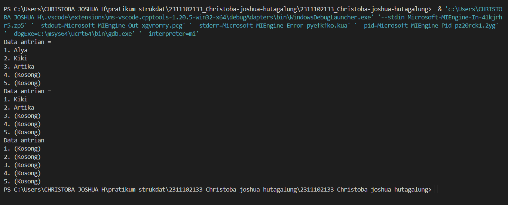

# <h1 align="center">Laporan Praktikum Modul 7 - QUEUE</h1>
<p align="center">Christoba Joshua Hutagalung - 2311102133</p>

## Dasar Teori
Queue disebut juga antrian dimana data masuk di satu sisi dan keluar di sisi yang lain. Karena itu, queue bersifat FIFO (First In First Out). Antrian (Queue) merupakan suatu kumpulan data yang penambahan elemennya (masuk antrian) hanya bisa dilakukan pada suatu ujung (disebut dengan sisi belakang/rear) atau disebut juga enqueue yaitu apabila seseorang masuk ke dalam sebuah antrian. Jika seseorang keluar dari antrian/penghapusan (pengambilan elemen) dilakukan lewat ujung yang lain (disebut dengan sisi depan/front) atau disebut juga dequeue yaitu apabila seseorang keluar dari antrian.Antrian menggunakan prinsip “masuk pertama keluar pertama” atau disebut juga dengan prinsip FIFO (first in first out). Dengan kata lain, urutan keluar akan sama dengan urutan masuknya. Contoh: antrian mobil saat membeli karcis di pintu jalan tol, antrian di bioskop, dan sebagainya.

### Operasi / Prosedur Standar pada Queue / Antrian

QUEUE merupakan struktur data dinamis, ketika program dijalankan, jumlah elemennya dapat berubah secara dinamis sesuai keperluan. Berikut ini operasi-operasi standar pada queue:

- a. **Inisialisasi**: Proses untuk membuat queue pada kondisi awal, yaitu queue yang masih kosong (belum mempunyai elemen).

- b. **InQueue** (Insert Queue): Prosedur untuk memasukkan sebuah elemen baru pada queue. Jumlah elemen Queue akan bertambah satu dan elemen tersebut merupakan elemen belakang.

- c. **DeQueue** (Delete Queue): Prosedur untuk menghapus/mengambil sebuah elemen dari queue. Elemen yang diambil adalah elemen depan dan jumlah elemen queue akan berkurang satu.

Operasi-operasi yang berhubungan dengan jumlah elemen suatu queue adalah:

1. **Size**: Operasi untuk mendapatkan banyaknya elemen queue.

2. **Empty**: Prosedur untuk mengetahui apakah queue dalam keadaan kosong atau tidak. Dengan status ini maka dapat dicegah dilakukannya operasi Dequeue dari suatu queue yang kosong.

3. **Full**: Prosedur untuk mengetahui apakah Queue penuh atau tidak. Prosedur ini hanya berlaku untuk queue yang jumlahnya terbatas.

### Pendeklarasian queue
```c
//deklarasi queue dengan struct dan array
struct QUEUE
{
 int data[5];
 int head;
 int tail;
};
//deklarasi variabel antrian dari struct
QUEUE antrian;
```

## Guided 

### 1. Guided 1
```C++
#include <iostream>

using namespace std;

const int maksimalQueue = 5;  // Maksimal antrian
int front = 0;                // Penanda antrian
int back = 0;                 // Penanda
string queueTeller[5];        // Fungsi pengecekan

bool isFull() {               // Pengecekan antrian penuh atau tidak
  if (back == maksimalQueue) {
    return true;  // =1
  } else {
    return false;
  }
}

bool isEmpty() {  // Antriannya kosong atau tidak
  if (back == 0) {
    return true;
  } else {
    return false;
  }
}

void enqueueAntrian(string data) {  // Fungsi menambahkan antrian
  if (isFull()) {
    cout << "Antrian penuh" << endl;
  } else {
    if (isEmpty()) {  // Kondisi ketika queue kosong
      queueTeller[0] = data;
      front++;
      back++;
    } else {  // Antrianya ada isi
      queueTeller[back] = data;
      back++;
    }
  }
}

void dequeueAntrian() {  // Fungsi mengurangi antrian
  if (isEmpty()) {
    cout << "Antrian kosong" << endl;
  } else {
    for (int i = 0; i < back; i++) {
      queueTeller[i] = queueTeller[i + 1];
    }
    back--;
  }
}

int countQueue() {  // Fungsi menghitung banyak antrian
  return back;
}

void clearQueue() {  // Fungsi menghapus semua antrian
  if (isEmpty()) {
    cout << "Antrian kosong" << endl;
  } else {
    for (int i = 0; i < back; i++) {
      queueTeller[i] = "";
    }
    back = 0;
    front = 0;
  }
}

void viewQueue() {  // Fungsi melihat antrian
  cout << "Data antrian teller:" << endl;
  for (int i = 0; i < maksimalQueue; i++) {
    if (queueTeller[i] != "") {
      cout << i + 1 << ". " << queueTeller[i] << endl;
    } else {
      cout << i + 1 << ". (kosong)" << endl;
    }
  }
}

int main() {
  enqueueAntrian("Andi");
  enqueueAntrian("Maya");
  viewQueue();
  cout << "Jumlah antrian = " << countQueue() << endl;
  dequeueAntrian();
  viewQueue();
  cout << "Jumlah antrian = " << countQueue() << endl;
  clearQueue();
  viewQueue();
  cout << "Jumlah antrian = " << countQueue() << endl;
  return 0;
}
```
Program ini adalah contoh dari struktur data antrian atau queue di c++.queue ini dibuat untuk simulasi antrian seperti loket teller yang dimana pelanggan ditambahkan ke dalam antrian dan kemudian dilayani berdasarkan nomor urut antrian mereka.berikut ini adalah fungsi fungsi dan penjelasan pada fungsi pada program diatas:
- 'isFull()': Fungsi ini memeriksa apakah antrian sudah penuh atau belum dengan cara membandingkan setiap nilai variabel back dengan maksimalQueue. Jika nilai back sama dengan maksimalQueue maka antrian dianggap penuh.
- 'isEmpty()': Fungsi ini memeriksa apakah antrian kosong atau tidak dengan cara memeriksa apakah nilai back sama dengan 0.
- 'enqueueAntrian(string data)': Fungsi ini digunakan untuk menambahkan data pelanggan ke dalam antrian. Jika antrian nya sudah penuh, program akan menampilkan pesan kepada pelanggan "Antrian penuh". Jika antrian masih ada ruang maka data pelanggan akan ditambahkan ke posisi belakang antrian (queueTeller[back]) dan nilai back akan dinaikkan.
- 'dequeueAntrian()': Fungsi ini menghapus data pelanggan dari depan antrian. Jika antrian kosong maka program akan menampilkan pesan "Antrian kosong". Jika tidak, data pada setiap elemen antrian akan digeser ke depan dan nilai back akan dikurangi.
- 'countQueue()': Fungsi ini mengembalikan jumlah pelanggan dalam antrian dengan cara mengembalikan nilai variabel back.
- 'clearQueue()': Fungsi ini menghapus semua data yang ada di dalam antrian. Semua elemen dalam array queueTeller akan diubah menjadi string kosong dan nilai back serta front akan diatur kembali menjadi 0.
- 'viewQueue()': Fungsi ini menampilkan data pelanggan dalam antrian. Jika suatu posisi dalam antrian kosong maka akan ditampilkan "(kosong)".

berikutnya,didalam fungsi main() beberapa operasi antrian dijalankan untuk menguji fungsionalitas dari program. Pertama, dua pelanggan ditambahkan ke dalam antrian menggunakan fungsi enqueueAntrian(), lalu antrian ditampilkan dengan menggunakan viewQueue() dan jumlah antrian dicetak menggunakan countQueue(). Selanjutnya, satu pelanggan dihapus dari depan antrian menggunakan dequeueAntrian(), dan operasi yang sama diulang untuk melihat hasilnya. Terakhir, semua data dalam antrian dihapus menggunakan clearQueue() dan antrian ditampilkan kembali.

## Unguided 

### 1.  Ubahlah penerapan konsep queue pada bagian guided dari array menjadi linked list.
```C++
#include <iostream>
using namespace std;

// Struktur data untuk setiap elemen di linked list
struct Node {
    string data_133; // Menyimpan data berupa string
    Node* next; // Pointer ke node berikutnya
};

// Pointer yang menunjuk ke depan (front) dan belakang (back) dari antrian
Node* front = nullptr;
Node* back = nullptr;

// Fungsi untuk menambah data ke belakang antrian
void TambahData_133(string nama_133) {
    Node* baru = new Node; // Buat node baru
    baru->data_133 = nama_133; // Set data dari node baru
    baru->next = nullptr; // Set next node dari node baru ke nullptr

    if (back == nullptr) { // Jika antrian kosong
        front = baru; // Set front ke node baru
        back = baru; // Set back ke node baru
    } else { // Jika antrian tidak kosong
        back->next = baru; // Set next dari node belakang ke node baru
        back = baru; // Update node belakang ke node baru
    }
}

// Fungsi untuk mengurangi data dari depan antrian
void KurangiAntrian_133() {
    if (front == nullptr) { // Jika antrian kosong
        cout << "Antrian masih kosong" << endl;
    } else { // Jika antrian tidak kosong
        Node* temp = front; // Simpan node depan ke temp
        front = front->next; // Pindahkan front ke node berikutnya
        delete temp; // Hapus node depan yang lama
    }
}

// Fungsi untuk menghitung banyaknya data dalam antrian
int jumlahAntrian_133() {
    int count_133 = 0; // Inisialisasi penghitung
    Node* current_133 = front; // Mulai dari depan antrian
    while (current_133 != nullptr) { // Iterasi sampai akhir antrian
        count_133++; // Tambah penghitung
        current_133 = current_133->next; // Pindah ke node berikutnya
    }
    return count_133; // Kembalikan jumlah elemen dalam antrian
}

// Fungsi untuk menghapus seluruh antrian
void HapusAntrian_133() {
    while (front != nullptr) { // Iterasi sampai antrian kosong
        Node* temp = front; // Simpan node depan ke temp
        front = front->next; // Pindahkan front ke node berikutnya
        delete temp; // Hapus node depan yang lama
    }
    back = nullptr; // Set back ke nullptr setelah antrian kosong
}

// Fungsi untuk menampilkan data dalam antrian
void TampilAntrian_133() {
    cout << "Data antrian = " << endl;
    Node* current = front; // Mulai dari depan antrian
    int i = 1; // Inisialisasi nomor antrian
    int MaksimalAntrian_133 = 5; // Batas maksimal tampilan antrian
    while (current != nullptr) { // Iterasi sampai akhir antrian
        cout << i << ". " << current->data_133 << endl; // Tampilkan data
        current = current->next; // Pindah ke node berikutnya
        i++; // Tambah nomor antrian
    }
    for (; i <= MaksimalAntrian_133; i++) { // Tambah elemen kosong jika kurang dari batas maksimal
        cout << i << ". " << "(Kosong)" << endl;
    }
}

int main() {
    // Menambah 3 data nama ke dalam antrian
    TambahData_133("Alya");
    TambahData_133("Kiki");
    TambahData_133("Artika");

    // Menampilkan data yang sudah ditambahkan
    TampilAntrian_133();

    // Mengurangi data dari depan antrian
    KurangiAntrian_133();

    // Menampilkan data setelah dikurangi
    TampilAntrian_133();

    // Menghapus seluruh antrian
    HapusAntrian_133();

    // Menampilkan data setelah dihapus
    TampilAntrian_133();

    return 0;
}
```
#### Output:


Program ini adalah implementasi struktur data queue yang menggunakan linked list di C++. queue merupakan struktur data yang mengikuti prinsip FIFO (First In, First Out), di mana elemen yang pertama dimasukkan akan menjadi elemen pertama yang dikeluarkan. Program ini memberikan beberapa menu fungsi seperti menambah, mengurangi, menghitung, menghapus, dan menampilkan elemen-elemen dalam antrian. Berikut adalah penjelasan mengenai setiap bagian fungsi dari program:
- Fungsi TambahData_133:fungsi ini digunakan untuk menambahkan elemen baru ke belakang antrian
- Fungsi KurangiAntrian_133:fungsi ini digunakan untuk menghapus elemen dari depan antrian
- Fungsi jumlahAntrian_133:fungsi ini digunakan untuk menghitung dan mengembalikan jumlah elemen yang ada dalam antrian.
- Fungsi HapusAntrian_133:fungsi ini digunakan untuk menghapus semua elemen yang ada dalam antrian.
- Fungsi TampilAntrian_133:fungsi ini digunakan untuk menampilkan semua elemen yang ada dalam antrian.
lalu terdapat struktur node dan pointer pada program ini seperti node data_133 untuk Menyimpan data berupa string dan pointer front dan back yang digunakan untuk menunjuk ke elemen pertama (depan) dari antrian dan menunjuk ke elemen terakhir (belakang) dari antrian.

### 2.  Dari nomor 1 buatlah konsep antri dengan atribut Nama mahasiswa dan NIM Mahasiswa.
```C++
#include <iostream>

using namespace std;

// Definisikan struktur untuk node
struct node {
    string NamaMahasiswa_133; // Nama mahasiswa
    string NIM_133; // NIM mahasiswa
    node *next; // Pointer ke node berikutnya
};

// Definisikan pointer front dan back untuk antrian
node *front;
node *back;

// Fungsi untuk inisialisasi antrian
void Inisialisasi_133(){
    front = NULL; // Set front ke NULL
    back = NULL; // Set back ke NULL
}

// Fungsi untuk memeriksa apakah antrian kosong
bool isEmpty_133(){
    return front == NULL; // Kembalikan true jika front NULL, sebaliknya false
}

// Fungsi untuk menambah data ke antrian
void TambahData_133(string Nama_133, string NIM_133){
    node *baru = new node; // Buat node baru
    baru->NamaMahasiswa_133 = Nama_133; // Set nama mahasiswa
    baru->NIM_133 = NIM_133; // Set NIM mahasiswa
    baru->next = NULL; // Set next pointer ke NULL

    // Periksa apakah antrian kosong
    if(isEmpty_133()){
        front = back = baru; // Set front dan back ke node baru
        back->next = NULL; // Pastikan next dari back adalah NULL
    } else {
        back->next = baru; // Hubungkan node baru ke akhir antrian
        back = baru; // Update back ke node baru
    }
}

// Fungsi untuk mengurangi data dari antrian
void KurangiAntrian_133(){
    node *hapus;
    if(!isEmpty_133()){
        if(front->next != NULL){
            hapus = front; // Set hapus ke node front
            front = front->next; // Pindahkan front ke node berikutnya
            delete hapus; // Hapus node lama front
        } else {
            front = back = NULL; // Jika hanya ada satu node, set front dan back ke NULL
        }
    }
}

// Fungsi untuk menghitung jumlah node dalam antrian
int HitungAntrian_133(){
    node *hitung;
    hitung = front;
    int jumlah_133 = 0;
    while(hitung != NULL){
        hitung = hitung->next; // Pindah ke node berikutnya
        jumlah_133++; // Tambah jumlah
    }
    return jumlah_133; // Kembalikan jumlah total
}

// Fungsi untuk menghapus semua node dalam antrian
void HapusAntrian_133(){
    node *hapus, *bantu;
    bantu = front;
    while(bantu != NULL){
        hapus = bantu; // Set hapus ke node saat ini
        bantu = bantu->next; // Pindah ke node berikutnya
        delete hapus; // Hapus node saat ini
    }
    front = back = NULL; // Set front dan back ke NULL
}

// Fungsi untuk menampilkan antrian
void TampilAntrian_133(){
    node *bantu;
    bantu = front;
    if(isEmpty_133()){
        cout << "Antrian kosong!" << endl; // Output Antrian kosong
    } else {
        cout << "--- Antrian Saat Ini ---" << endl;
        int NomorAntrian_133 = 1;
        while(bantu != NULL){
            cout << NomorAntrian_133 << ". " << bantu->NamaMahasiswa_133 << " - " << bantu->NIM_133 << endl;
            bantu = bantu->next; // Pindah ke node berikutnya
            NomorAntrian_133++; // Tambah nomor antrian
        }
    }
    cout << endl;
}

int main(){
    //Deklarasi variabel
    string NamaMhs_133, NIM_133;
    int Pilih_133;
    char Yakin_133;

    // Menu utama
    Menu:
    cout << "-----------------------------------------" << endl;
    cout << "-     MENU UTAMA ANTRIAN MAHASISWA      -" << endl;
    cout << "-----------------------------------------" << endl;
    cout << "1. Tambah antrian" << endl;
    cout << "2. Kurangi antrian" << endl;
    cout << "3. Hitung jumlah antrian" << endl;
    cout << "4. Hapus antrian" << endl;
    cout << "5. Tampilkan antrian" << endl;
    cout << "6. Keluar" << endl;
    cout << "Pilihan Anda [1-6] = ";
    cin >> Pilih_133;
    cout << endl;

    // Switch case untuk menangani menu
    switch(Pilih_133){
        case 1:
            cout << "~~~ Tambah Antrian ~~~" << endl;
            cout << "Masukkan nama mahasiswa = ";
            cin >> NamaMhs_133;
            cout << "Masukkan NIM mahasiswa = ";
            cin >> NIM_133;
            TambahData_133(NamaMhs_133, NIM_133);
            cout << "Data mahasiswa telah tersimpan!" << endl;
            cout << endl;
            goto Menu; // Kembali ke menu utama
            break;
        case 2:
            cout << "~~~ Kurangi Antrian ~~~" << endl;
            if(isEmpty_133()){
                cout << "Antrian masih kosong!" << endl;
            } else {
                cout << "Apakah anda ingin mengurangi antrian (menghapus antrian pertama)? [y/n] = ";
                cin >> Yakin_133;
                if(Yakin_133 == 'y' || Yakin_133 == 'Y'){
                    KurangiAntrian_133();
                    cout << "Antrian telah berhasil dikurangi" << endl;
                } else if(Yakin_133 == 'n' || Yakin_133 == 'N'){
                    cout << "Aksi dibatalkan" << endl;
                }
            }
            cout << endl;
            goto Menu; // Kembali ke menu utama
            break;
        case 3:
            cout << "~~~ Hitung Jumlah Antrian ~~~" << endl;
            cout << "Antrian yang tersimpan saat ini sebanyak " << HitungAntrian_133() << endl;
            cout << endl;
            goto Menu; // Kembali ke menu utama
            break;
        case 4:
            cout << "~~~ Hapus Antrian ~~~" << endl;
            cout << "Apakah Anda yakin untuk menghapus seluruh antrian? [y/n] = ";
            cin >> Yakin_133;
            if(Yakin_133 == 'y' || Yakin_133 == 'Y'){
                HapusAntrian_133();
                cout << "Antrian telah berhasil dihapus" << endl;
            } else if(Yakin_133 == 'n' || Yakin_133 == 'N'){
                cout << "Aksi dibatalkan" << endl;
            }
            cout << endl;
            goto Menu; // Kembali ke menu utama
            break;
        case 5:
            TampilAntrian_133();
            cout << endl;
            goto Menu; // Kembali ke menu utama
            break;
        case 6:
            cout << "Anda telah keluar dari program" << endl;
            cout << endl;
            return 0; // Keluar dari program
            break;
        default:
            cout << "Pilihan yang anda masukkan salah!" << endl;
            cout << endl;
            goto Menu; // Kembali ke menu utama
            break;
    }
}
```
#### Output:
.png)<br>
.png)<br>
.png)<br>
.png)<br>
.png)<br>
.png)<br>
.png)<br>
.png)

Program ini adalah implementasi dari sistem antrian atau queue menggunakan struktur data linked list dalam bahasa C++.queue dalam program ini digunakan untuk menyimpan data mahasiswa dengan nama dan NIM dan program ini menyediakan berbagai fungsi untuk mengelola antrian seperti menambah data, mengurangi data, menghitung jumlah data, menghapus seluruh data, dan menampilkan seluruh data dalam antrian. Selain itu,dalam program ini juga dilengkapi dengan menu yang memungkinkan pengguna atau user untuk memilih operasi yang ingin dilakukan.penjelasan singkat mengenai fungsi fungsi yang ada di program ini:<br>
- Fungsi Inisialisasi_133() digunakan untuk menginisialisasi pointer front dan back ke NULL, menandakan bahwa antrian kosong pada awalnya.
- Fungsi TambahData_133(string Nama_133, string NIM_133) digunakan untuk menambahkan data mahasiswa baru ke belakang antrian.
- Fungsi HitungAntrian_133() digunakan untuk menghitung jumlah total data yang ada dalam antrian.
- Fungsi HapusAntrian_133() digunakan untuk menghapus seluruh data dalam antrian.
- Fungsi TampilAntrian_133() digunakan untuk menampilkan seluruh data yang ada dalam antrian.
- Fungsi main() menyediakan menu utama yang interaktif untuk pengguna.
- Fungsi KurangiAntrian_133() digunakan untuk mengurangi data dari depan antrian, sesuai dengan konsep FIFO (First-In-First-Out). Jika antrian masih kosong maka fungsi ini akan memberikan pesan kepada pengguna bahwa antrian masih kosong.
Dalam fungsi main(), untuk menampilkan menu yang memungkinkan pengguna atau user menginputkan pilihan menu mana yang ingin mereka interaksi.

## Kesimpulan
Dengan mempelajari materi queue dalam bahasa pemrograman c++ kita dapat lebih memahami tentang konsep FIFO atau first in first out dalam struktur data.struktur data queue ini sangat membantu jika diterapkan ke dalam sebuah aplikasi dengan sistem antrian seperti layanan publik dan manajemen buffer dalam sistem komunikasi dan juga dalam praktikum queue kali ini kita juga mempelajari berbagai operasi dasar yang dapat dilakukan pada queue, seperti penambahan data, pengurangan data, penghitungan jumlah data, penghapusan seluruh antrian, dan penampilan seluruh data dalam antrian. Implementasi ini memungkinkan kita untuk membuat program yang lebih interaktif dengan memberikan opsi kepada pengguna untuk memilih operasi yang ingin dilakukan terhadap antrian.jadi pemahaman tentang queue ini sangat penting dalam pemrograman karena konsep ini diterapkan dalam banyak aplikasi dunia nyata dengan pemahaman yang kuat tentang konsep ini, kita dapat merancang dan mengimplementasikan solusi yang efisien dan efektif untuk berbagai masalah yang melibatkan manajemen data berbasis antrian.

## Referensi
[1] A. S. R. St. MTi, STRUKTUR DATA DAN ALGORITMA DENGAN C++. CV. AA. RIZKY, 2019. [Online]. Available: http://books.google.ie/books?id=GP_ADwAAQBAJ&pg=PR4&dq=978-623-7411-56-7&hl=&cd=1&source=gbs_api<br>
[2] Triase, Triase. "Struktur Data: Diktat Edisi Revisi." (2020). [Online]. Available: http://repository.uinsu.ac.id/9717/2/Diktat%20Struktur%20Data.pdf