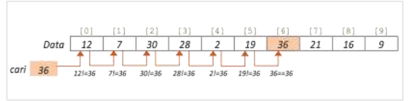
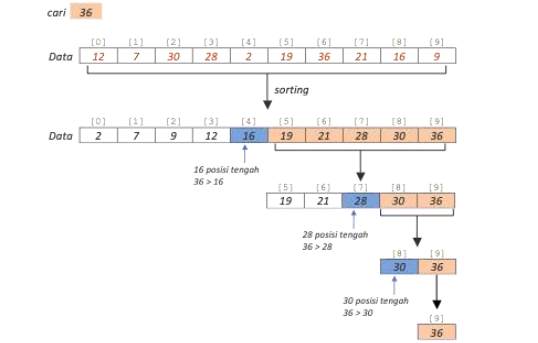
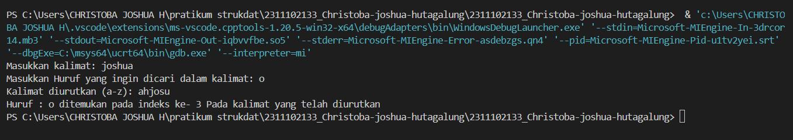
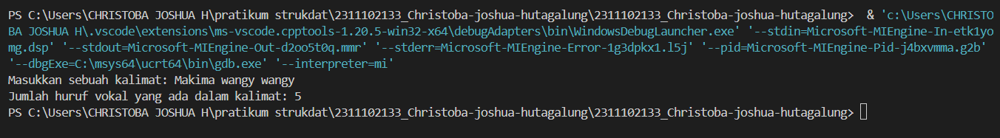
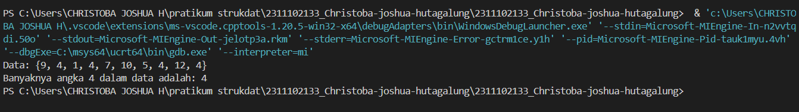

# <h1 align="center">Laporan Praktikum Modul 8 - SEARCHING</h1>
<p align="center">Christoba Joshua Hutagalung - 2311102133</p>

## Dasar Teori
Searching (pencarian) pada struktur data mengacu pada proses algoritmik untuk memeriksa, menemukan, mengambil posisi elemen tertentu (target) dari kumpulan elemen di dalam struktur data. Kumpulan elemen dapat berupa array, list, linked list, tree, dan lain sebagainya. Berdasarkan jenis operasinya, dua algoritma pencarian yaitu Sequential Search dan Binary Search pada data array.

### 1.Sequential search<br>
Sequential Search (pencarian berurutan) dikenal juga sebagai pencarian linier. Sequential Search merupakan algoritma pencarian paling dasar dan paling sederhana yang bekerja menggunakan pendekatan brute force, mencoba segala kemungkinan yang ada hingga target yang diinginkan ditemukan. Sebagai contoh, mencari nilai 36 dari data array {12, 7, 30, 28, 2, 19, 36, 21, 16, 9}. Sequential Search dimulai dengan membandingkan/mencocokkan 36 dengan elemen pertama/index[0] yaitu 12, karena 12 tidak sesuai dengan kriteria pencarian (12 != 36) maka dilanjutkan dengan membandingkan 36 dengan elemen berikutnya hingga ditemukan elemen yang cocok, yaitu pada index[6] dimana 36 == 36.<br>
<br>
Cara kerja sequential search Algoritma dimulai dengan membandingkan elemen pertama dengan elemen yang dicari. Jika cocok, pencarian selesai.Jika tidak, ia akan terus memeriksa elemen berikutnya sampai menemukan elemen yang dicari atau mencapai akhir kumpulan data.lalu sequential search memilikki kekurangan seperti kurang efisien untuk kumpulan data besar karena memerlukan pemeriksaan setiap elemen dalam kumpulan data, bahkan jika elemen yang dicari ada di awal kumpulan data.Berikut adalah konsep dasar dan langkah-langkah implementasi Sequential Search:<br>

#### A.Konsep Dasar:
- Pencarian Berurutan: Algoritma Sequential Search melakukan pencarian satu per satu dari awal hingga akhir kumpulan data.<br>
- Metode Brute Force: Ini adalah pendekatan brute force di mana algoritma mencoba semua kemungkinan sampai elemen yang dicari ditemukan.<br>
- Kompleksitas Waktu: Kompleksitas waktu dari Sequential Search adalah O(n), di mana n adalah jumlah elemen dalam kumpulan data.<br>

#### B.Langkah-langkah Implementasi:<br>
- 1.Inisialisasi indeks pencarian:
- 2.Memulai perulangan untuk memeriksa setiap elemen dalam kumpulan data.
- 3.Membandingkan elemen yang sedang diperiksa dengan elemen yang dicari.
- 4.Jika elemen yang sedang diperiksa cocok dengan elemen yang dicari, pencarian selesai, dan indeks elemen tersebut dikembalikan.
- 5.Jika tidak, lanjutkan perulangan untuk memeriksa elemen berikutnya.
- 6.Jika seluruh kumpulan data telah diperiksa dan elemen yang dicari tidak ditemukan, kembalikan nilai yang menunjukkan bahwa elemen tidak ada dalam kumpulan data.

### 2.Binary search<br>
Algoritma Binary Search bekerja dengan menggunakan pendekatan "divide and conquer" pada data array yang sudah terurut (sorted).Artinya, algoritma Binary Search diawali dengan mengurutkan (sorting) array terlebih dahulu sebelum melakukan proses pencarian.Setelah data array terurut,proses pencarian dimulai dengan perulangan pertama untuk mencari elemen yang posisinya berada di tengah array. Kemudian, elemen tengah tersebut dibandingkan dengan kunci pencarian.Jika kunci pencarian lebih besar dari elemen tengah,maka semua elemen array yang berada di posisi kiri diabaikan, dan perulangan dilanjutkan dengan mencari elemen tengah pada array sisi kanan untuk dibandingkan lagi dengan kunci pencarian. Namun, jika kunci pencarian lebih kecil dari elemen tengah, maka semua elemen array di posisi kanan diabaikan, dan perulangan dilanjutkan dengan mencari elemen tengah pada array sisi kiri untuk dibandingkan dengan kunci pencarian. Langkah-langkah ini dilakukan berulang sampai ditemukan elemen tengah yang sama dengan kunci pencarian atau semua elemen telah dibandingkan.
<br>
Algoritma Binary Search bekerja dengan membagi-bagi data secara terus-menerus dan membandingkan elemen tengah dengan kunci pencarian untuk menentukan di mana kunci tersebut berada dalam kumpulan data.
- Langkah-langkah Implementasi:
- 1.Pengurutan Data: Data acak diurutkan terlebih dahulu dengan memanggil method split dari class MergeSort.
- 2.Proses Pencarian: Proses pencarian kunci dilakukan oleh method cari, yang diawali dengan menentukan nilai tengah.
- 3.Perulangan Pencarian: Selama data array belum habis, method cari akan secara berulang membandingkan dan memisahkan posisi pencarian data.
- 4.Penentuan Posisi Pencarian:
- - Jika nilai kunci lebih besar dari nilai tengah, pencarian difokuskan pada posisi elemen di sebelah kanan.
- - Jika nilai kunci lebih kecil dari nilai tengah, pencarian difokuskan pada semua elemen sebelah kiri.
- - Jika kunci sama dengan elemen tengah, data ditemukan dan pencarian berakhir.
- 5.Iterasi: Setiap iterasi menentukan nilai tengah untuk posisi yang dilakukan.

## Guided 

### 1. Buatlah sebuah project dengan menggunakan sequential search sederhana untuk melakukan pencarian data.
```C++
#include <iostream>

using namespace std;

int main(){
    int n = 10;
    int data[n] = {9,4,1,7,5,12,4,13,4,10};
    int cari = 10;
    bool ketemu = false;
    int i;

    for (i = 0; i < n; i++){
        if(data[i] == cari){
            ketemu = true;
            break;
        }
    }

    cout << "Program Sequential Search" << endl;
    cout << "data : {9,4,1,7,5,12,4,13,4,10}" << endl;

    if (ketemu){
        cout << "\nAngka " << cari << " ditemukan pada indeks ke-" << i << endl;
    }else{
        cout << "data tidak ditemukan" << endl;
    }

    return 0;
}
```
Program diatas merupakan contoh dari metode sequential search,program diatas bertujuan untuk mencari nilai dari sebuah array dan apabila nilai yang dicari ditemukan maka program akan memberikan informasi terkait indeks posisi nilai tersebut dalam array,kalau tidak dapat ditemukan maka program akan memberikan output pesan bahwa nilai yang dicari tidak ada didalam array.berikut ini juga penjelasan mengenai bagaimana program berjalan;pada awal program terdapat beberapa deklarasi variabel penting seperti 'n' yang menunjukkan jumlah elemen array dan di inisialisasi dengan nilai 10,lalu ada 'data' yang berisikan array dengan 10 elemen,berikutnya ada 'cari' yang merupakan nilai yang ingin dicari didalama array dan di inisialisasi dengan nilai 10,dan masih banyak lagi.setelah mendeklarasikan beberapa variabel penting berikutnya program akan mencari nilai dengan menggunakan sequential search melalui array 'data' menggunakan perulangan for yang dimana perulangan for akan berjalan dari indeks 0 hingga indeks terakhir.pada setiap iterasi,program akan mengecek apakah nilai yang dicari sama atau tidak dengan elemen array pada indeks,jika ditemukan maka variabel 'ketemu' diatur menjadi 'true' dan perulangan dihentikan dengan 'break',setelah pencarian selesai program akan mencetak output "program mencetak pesan awal "Program Sequential Search" dan daftar nilai dalam array. Kemudian, program memeriksa nilai ketemu. Jika ketemu adalah true, program mencetak pesan bahwa nilai yang dicari ditemukan pada indeks tertentu. Jika ketemu adalah false, program mencetak pesan bahwa nilai yang dicari tidak ditemukan dalam array.

### 2. Buatlah sebuah project untuk melakukan pencarian data dengan menggunakan Binary Search.
```C++
#include<iostream>
#include<conio.h>
#include<iomanip>

using namespace std;

int dataArray[7] = {1, 8, 2, 5, 4, 9, 7};
int cari;

void Selection_Sort(){
    int temp, min, i, j;
    for(i = 0; i < 7; i++){
        min = i;
        for(j = i + 1; j < 7; j++){
            if(dataArray[j] < dataArray[min]){
                min = j;
            }
        }
        temp = dataArray[i];
        dataArray[i] = dataArray[min];
        dataArray[min] = temp;
    }
}

void BinarySearch(){
    int awal, akhir, tengah;
    bool b_flag = false;
    awal = 0;
    akhir = 6;
    while(!b_flag && awal <= akhir){
        tengah = (awal + akhir)/2;
        if(dataArray[tengah] == cari){
            b_flag = true;
        } else if(dataArray[tengah] < cari){
            awal = tengah + 1;
        } else {
            akhir = tengah - 1;
        }
    }
    if(b_flag){
        cout << "\nData ditemukan pada index ke-" << tengah << endl;
    } else {
        cout << "\nData tidak ditemukan" << endl;
    }
}

int main(){
    cout << "BINARY SEARCH" << endl;
    cout << "\nData : ";
    for(int x = 0; x < 7; x++){
        cout << setw(3) << dataArray[x];
    }
    cout << endl;

    cout << "Masukkan data yang ingin dicari : ";
    cin >> cari;
    
    cout << "\nData diurutkan : ";
    Selection_Sort();

    for(int x = 0; x < 7; x++){
        cout << setw(3) << dataArray[x];
    }
    cout << endl;
    BinarySearch();
    _getche();
    return 0;
}
```
Program diatas menggunakan algoritma Binary Search untuk mencari data dalam array `dataArray` yang telah diurutkan menggunakan algoritma Selection Sort. Pertama, program meminta pengguna untuk memasukkan data yang ingin dicari. Kemudian, program melakukan pencarian dengan membagi array menjadi dua bagian dan membandingkan nilai tengah dengan data yang dicari.Jika nilai tengah sama dengan data yang dicari, pencarian selesai. Jika tidak, program memilih bagian yang lain untuk dilanjutkan pencariannya, bagian kiri jika data yang dicari lebih kecil dari nilai tengah, atau bagian kanan jika data yang dicari lebih besar dari nilai tengah. Setelah pencarian selesai, program mencetak hasilnya. Jika data ditemukan, maka program akanmencetak indeks tempat data ditemukan. Jika tidak, program memberikan pesan bahwa data tidak ditemukan.Sebelum mencetak hasil pencarian, program juga menampilkan array `dataArray` yang sudah diurutkan kepada pengguna.

## Unguided 

### 1. Buatlah sebuah program untuk mencari sebuah huruf pada sebuah kalimat yang sudah di input dengan menggunakan Binary Search!  
```C++
#include <iostream>

using namespace std;

void bubbleSort_133(char arr[], int n) {
    for (int i = 0; i < n - 1; i++) {
        for (int j = 0; j < n - i - 1; j++) {
            if (arr[j] > arr[j + 1]) {
                char temp_133 = arr[j];
                arr[j] = arr[j + 1];
                arr[j + 1] = temp_133;
            }
        }
    }
}

int binarySearch_133(const char arr[], int kiri_133, int kanan_133, char cariHuruf_133) {
    while (kiri_133 <= kanan_133) {
        int tengah_133 = kiri_133 + (kanan_133 - kiri_133) / 2;

        if (arr[tengah_133] == cariHuruf_133)
            return tengah_133;
        if (arr[tengah_133] < cariHuruf_133)
            kiri_133 = tengah_133 + 1;
        else
            kanan_133 = tengah_133 - 1;
    }

    return -1;
}

int main() {
    char masukan_133[100];
    char cariHuruf_133;

    cout << "Masukkan kalimat: ";
    cin.getline(masukan_133, 100);

    cout << "Masukkan Huruf yang ingin dicari dalam kalimat: ";
    cin >> cariHuruf_133;

    int length_133 = 0;
    while (masukan_133[length_133] != '\0') {
        length_133++;
    }

    bubbleSort_133(masukan_133, length_133);

    cout << "Kalimat diurutkan (A-Z): " << masukan_133 << endl;

    int result_133 = binarySearch_133(masukan_133, 0, length_133 - 1, cariHuruf_133);
    if (result_133 != -1) {
        cout << "Huruf : " << cariHuruf_133 << " ditemukan pada indeks ke- " << result_133 << " Pada kalimat yang telah diurutkan" << endl;
    } else {
        cout << "Huruf " << cariHuruf_133 << " Tidak ditemukan dalam kalimat " << endl;
    }
    return 0;
}
```
#### Output:


Program C++ di atas merupakan sebuah program yang melakukan pengurutan karakter dalam sebuah kalimat menggunakan algoritma Bubble Sort, kemudian melakukan pencarian dengan menggunakan pencarian biner (binary search) terhadap karakter yang diinputkan pengguna dalam kalimat yang telah diurutkan.program C++ di atas menerima masukan sebuah kalimat dari pengguna,kemudian mengurutkan karakter-karakter dalam kalimat tersebut dari huruf terkecil ke huruf terbesar menggunakan algoritma Bubble Sort.Setelah pengurutan, program mencari huruf yang dimasukkan oleh pengguna dalam kalimat yang telah diurutkan menggunakan pencarian biner (binary search).Jika huruf yang dicari ditemukan, program mencetak output pesan yang menginformasikan huruf tersebut ditemukan beserta indeksnya dalam kalimat yang telah diurutkan. tetapi,jika huruf tersebut tidak ditemukan,program memberikan pesan bahwa huruf tersebut tidak ada dalam kalimat yang dimasukkan oleh pengguna. Dengan menggunakan algoritma pengurutan dan pencarian yang efisien, program ini memberikan fungsionalitas untuk mengurutkan dan mencari huruf dalam sebuah kalimat.

### 2. Buatlah sebuah program yang dapat menghitung banyaknya huruf vocal dalam sebuah kalimat!
```C++
#include <iostream>
#include <string>
using namespace std;

// Fungsi untuk mengecek apakah suatu karakter adalah huruf vokal
bool Vokal_133(char huruf_133) {
    huruf_133 = tolower(huruf_133); // Mengubah huruf menjadi huruf kecil untuk memudahkan pengecekan
    return huruf_133 == 'a' || huruf_133 == 'e' || huruf_133 == 'i' || huruf_133 == 'o' || huruf_133 == 'u';
}

// Fungsi untuk menghitung jumlah huruf vokal dalam sebuah kalimat
int banyakVokal_133(const string& kalimat_133) {
    int count = 0;
    for (char ch : kalimat_133) { 
        if (Vokal_133(ch)) {  
            count++;  
        }
    }
    return count; 
}

int main() {
    string data_133;

    cout << "Masukkan sebuah kalimat: "; // Masukkan Input kalimat yang ingin dihitung jumlah huruf vokalnya
    getline(cin, data_133); // Menerima input kalimat dari pengguna

    int JumlahVokal_133 = banyakVokal_133(data_133); // Menghitung jumlah huruf vokal dalam kalimat
    cout << "Jumlah huruf vokal yang ada dalam kalimat: " << JumlahVokal_133 << endl; // Menampilkan hasil jumlah huruf vokal dari kalimat yang dimasukkan

    return 0;
}
```
#### Output:


Program ini adalah program menghitung jumlah huruf vokal. Program ini menerima input kalimat dari pengguna dan menghitung jumlah huruf vokal (a, e, i, o, u) dalam kalimat tersebut. Algoritma yang digunakan adalah pencarian linier(linier/sequential searching), di mana setiap karakter dalam kalimat diperiksa satu per satu untuk menentukan apakah itu huruf vokal atau tidak. Jumlah huruf vokal yang ditemukan kemudian dicetak sebagai output. Dengan menggunakan fungsi 'Vokal_133' untuk memeriksa apakah suatu karakter adalah huruf vokal. Fungsi ini mengubah karakter menjadi huruf kecil terlebih dahulu untuk memastikan pemeriksaan tidak sensitif terhadap huruf besar/kecil, dan kemudian membandingkannya dengan daftar huruf vokal yang diizinkan, dan fungsi 'banyakVokal_133' menghitung jumlah huruf vokal dalam kalimat dengan iterasi melalui setiap karakter dalam kalimat dan menggunakan fungsi 'Vokal_133' untuk menentukan apakah itu huruf vokal atau bukan. Setiap kali huruf vokal ditemukan, variabel penghitung bertambah satu.

### 3. Diketahui data = 9, 4, 1, 4, 7, 10, 5, 4, 12, 4. Hitunglah berapa banyak angka 4 dengan menggunakan algoritma Sequential Search!
```C++
#include <iostream>

using namespace std;

int main() {
    // Deklarasi variabel
    int n_133 = 10; // Panjang array data
    int data_133[n_133] = {9, 4, 1, 4, 7, 10, 5, 4, 12, 4}; // Data yang akan dicari
    int target_133 = 4; // Angka yang dicari
    int count_133 = 0; // Variabel untuk menyimpan jumlah kemunculan angka 4

    // Melakukan pencarian sequential untuk menghitung banyaknya angka 4
    for (int i_133 = 0; i_133 < n_133; i_133++) {
        if (data_133[i_133] == target_133) {
            count_133++; // 
        }
    }

    // Menampilkan hasil pencarian 
    cout << "Data: {9, 4, 1, 4, 7, 10, 5, 4, 12, 4}" << endl;
    cout << "Banyaknya angka " << target_133 << " dalam data adalah: " << count_133 << endl;

    return 0;
}
```
#### Output:


Program c++ diatas adalah program pencarian yang bertujuan untuk menghitung berapa banyak angka tertentu yang muncul dalam sebuah array data.dalam soal unguided ini,program menghitung berapa banyak angka 4 yang muncul dalam array data yang telah ditentukan.Program diatas menggunakan algoritma pencarian sequential (sequential searching) dengan melakukan iterasi melalui setiap elemen dalam array data. Setiap kali program menemukan angka 4, variabel count akan bertambah satu(increment +1). Hasil akhir jumlah kemunculan angka 4 dalam array data akan ditampilkan.lalu terdapat beberapa deklarasi variabel penting seperti 'n_133'untuk menyimpan panjang array data,'target_133'untuk variabel angka yang akan dicari dalam array data dan 'count_133' adalah variabel untuk menyimpan jumlah kemunculan angka target dalam array data.

## Kesimpulan
Dalam praktikum searching ini membahas dua algoritma pencarian, yaitu Sequential Search dan Binary Search, dalam bahasa C++. Sequential Search cocok untuk data kecil karena melakukan pencarian satu per satu, sedangkan Binary Search efisien untuk data besar yang sudah terurut.materi searching dalam C++ memberikan pemahaman tentang cara mencari elemen tertentu dalam kumpulan data.pemahaman tentang kedua algoritma pencarian ini penting dalam pengembangan program aplikasi, karena membantu dalam memilih pendekatan pencarian yang paling sesuai tergantung pada sifat data yang dihadapi.

## Referensi
[1] Meidyan Permata Putri, et al., Algoritma dan Struktur Data. Bandung: Widina Bhakti Persada Bandung, 2022.<br>
[2] Dr. Joseph Teguh Santoso, S. M. (2021). STRUKTUR DATA dan ALGORITMA ( bagian 2)<br>
[3] PURBASARI, Wika, et al. ALGORITMA PEMROGRAMAN. 2024.    