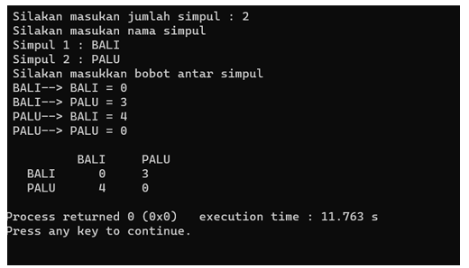

# <h1 align="center">Laporan Praktikum Modul 9 - GRAPH AND TREE</h1>
<p align="center">Christoba Joshua Hutagalung - 2311102133</p>

## Dasar Teori

### Graph
Graf adalah kumpulan noktah (simpul) di dalam bidang dua dimensi yang dihubungkan dengan sekumpulan garis (sisi). Graph dapat digunakan untuk merepresentasikan objek-objek diskrit dan hubungan antara objek-objek tersebut. Representasi visual dari graph adalah dengan menyatakan objek sebagai noktah, bulatan, atau titik (Vertex), sedangkan hubungan antara objek dinyatakan dengan garis (Edge).
G = (V, E)<br>
Dimana<br>
G = Graph<br>
V = Simpul atau Vertex, atau Node, atau Titik<br>
E = Busur atau Edge, atau arc<br>
Graf merupakan suatu cabang ilmu yang memiliki banyak terapan. Banyak sekali struktur yang bisa direpresentasikan dengan graf, dan banyak masalah yang bisa diselesaikan dengan bantuan graf. Seringkali graf digunakan untuk merepresentasikan suatu jaringan. Misalkan, jaringan jalan raya dimodelkan dengan graf, di mana kota sebagai simpul (vertex/node) dan jalan yang menghubungkan setiap kotanya sebagai sisi (edge) yang bobotnya (weight) adalah panjang dari jalan tersebut.<br>

Ada beberapa cara untuk menyimpan graf di dalam sistem komputer. Struktur data bergantung pada struktur graf dan algoritma yang digunakan untuk memanipulasi graf. Secara teori, salah satu dari keduanya dapat dibedakan antara struktur list dan matriks, tetapi dalam penggunaannya, struktur terbaik yang sering digunakan adalah kombinasi keduanya.<br>
- 1.Graf Tak Berarah (Undirected Graph atau Non-directed Graph):
    - Urutan simpul dalam sebuah busur tidak dipentingkan. Misal busur e1 dapat disebut busur AB atau BA.

- 2.Graf Berarah (Directed Graph):
    - Urutan simpul mempunyai arti. Misal busur AB adalah e1, sedangkan busur BA adalah e8.

- 3.Graf Berbobot (Weighted Graph):
    - Jika setiap busur mempunyai nilai yang menyatakan hubungan antara dua buah simpul, maka busur tersebut dinyatakan memiliki bobot.
    - Bobot sebuah busur dapat menyatakan panjang sebuah jalan dari dua buah titik, jumlah rata-rata kendaraan per hari yang melalui sebuah jalan, dan sebagainya.
    

### Tree
Tree adalah salah satu struktur data yang paling penting dalam dunia pemrograman. Banyak aplikasi mengandalkan struktur hirarkis alami ini untuk menyimpan dan mengorganisir data, yang sangat membantu dalam menyelesaikan berbagai masalah algoritmis.
#### 1. Struktur Data Hirarkis Tree
Tree merupakan struktur data yang penting karena banyak aplikasi menggunakan informasi dengan struktur hirarkis. Tree membantu memecahkan masalah algoritmis dengan menyimpan data secara hirarkis.

#### 2. Pembentukan Binary Tree berdasarkan Preorder, Inorder, dan Postorder
Binary Tree dapat dibentuk menggunakan preorder, inorder, atau postorder. Pembentukan dilakukan dengan memperhatikan urutan penelusuran dan hubungan antara node.

#### 3. Terminologi dalam Tree
- Root: Node teratas dalam tree.
- Leaf: Node yang tidak memiliki cabang.
- Internal Node: Node yang bukan leaf.
- Edge: Hubungan antara dua node dalam tree.
- Level: Tingkatan suatu node dalam tree.
- Height: Tinggi tree, yaitu panjang terpanjang dari root ke leaf.
- Depth: Kedalaman suatu node, yaitu jarak dari root ke node tersebut.
- Subtree: Bagian dari tree yang dimulai dari suatu node.
- Siblings: Node-node dengan parent yang sama.
- Path: Lintasan dari root ke suatu node.
- Ancestor dan Descendant: Hubungan antara dua node dalam tree.
  
#### 4. Karakteristik Binary Tree
- Maksimum dua child: left child dan right child.
- Complete Binary Tree: Setiap node kecuali leaf memiliki 0 atau 2 child.
- Skewed Binary Tree: Setiap node kecuali leaf memiliki hanya 1 child.
- Full Binary Tree: Setiap node kecuali leaf memiliki 2 child, dan semua subtree memiliki panjang path yang sama.

#### 5. Traversal Binary Tree
Operasi penelusuran node dalam binary tree terbagi menjadi:
- Preorder
- Inorder
- Postorder

#### 6. Implementasi Binary Tree
Binary Tree dapat diimplementasikan menggunakan array atau linked list. Operasi-operasi standar seperti pencarian, penambahan, penghapusan, dan tampilan data dapat dilakukan pada Binary Tree.

#### 7. Binary Search Tree (BST)
BST adalah jenis Binary Tree di mana setiap node kiri memiliki nilai lebih kecil dari parent, dan setiap node kanan memiliki nilai lebih besar dari parent. Operasi pada BST mencakup pencarian, penambahan, penghapusan, dan tampilan data.

#### 8. AVL Tree
AVL Tree adalah jenis BST yang mempertahankan keseimbangan tinggi, dengan memastikan perbedaan tinggi antara subtree kiri dan kanan tidak lebih dari satu.

#### 9. Heap Tree
Heap Tree adalah jenis Complete Binary Tree yang memenuhi aturan tertentu terkait urutan nilai di setiap nodenya, seperti Minimum Heap dan Maximum Heap.

#### 10. B-Tree
B-Tree adalah jenis tree yang memungkinkan setiap node berisi lebih dari satu elemen. B-Tree memiliki operasi-operasi khusus seperti penambahan, penghapusan, dan tampilan data.

Dengan memahami dasar teori tentang tree dalam struktur data, kita dapat menggunakan struktur data ini untuk menyimpan dan mengelola informasi secara efisien dalam berbagai aplikasi dan algoritma.<br>
<br>
<br>
Gambar diatas merupakan contoh dari Tree.

## Guided 

### 1. Guided I Program Graph
```C++
#include <iostream>
#include <iomanip>
using namespace std;
string simpul[7] = {"Ciamis", "Bandung", "Bekasi",
                    "Tasikmalaya", "Cianjur", "Purwokerto", "Yogyakarta"};
int busur[7][7] = {
    {0, 7, 8, 0, 0, 0, 0},
    {0, 0, 5, 0, 0, 15, 0},
    {0, 6, 0, 0, 5, 0, 0},
    {0, 5, 0, 0, 2, 4, 0},
    {23, 0, 0, 10, 0, 0, 8},
    {0, 0, 0, 0, 7, 0, 3},
    {0, 0, 0, 0, 9, 4, 0}};
void tampilGraph()
{
    for (int baris = 0; baris < 7; baris++)
    {
        cout << " " << setiosflags(ios::left) << setw(15) << simpul[baris] << " : ";
        for (int kolom = 0; kolom < 7; kolom++)
        {
            if (busur[baris][kolom] != 0)
            {
                cout << " " << simpul[kolom] << "(" << busur[baris][kolom] << ")";
            }
        }
        cout << endl;
    }
}
int main()
{
    tampilGraph();
    return 0;
}
```
Program dimulai dengan pendefinisian array `simpul` yang berisi nama-nama simpul dalam graf dan array `busur` yang menggambarkan hubungan antara simpul-simpul tersebut melalui matriks adjacency. Fungsi `tampilGraph()` digunakan untuk menampilkan graf dengan menyajikan setiap simpul beserta daftar simpul terhubung dan bobot busurnya. Di dalam fungsi `main()`, program memanggil fungsi `tampilGraph()` untuk menampilkan representasi graf dalam matriks adjacency. Selesai dieksekusi, program menampilkan informasi graf dan selesai berjalan.

### 2. Guided II Program Tree
```C++
#include <iostream>
#include <iomanip>

using namespace std;

struct Pohon
{
    char data;
    Pohon *left, *right, *parent;
};

Pohon *root, *baru;

void init()
{
    root = NULL;
}

bool isEmpty()
{
    return root == NULL;
}

void buatNode(char data)
{
    if (isEmpty())
    {
        root = new Pohon();
        root->data = data;
        root->left = NULL;
        root->right = NULL;
        root->parent = NULL;
        cout << "\n Node " << data << " berhasil dibuat sebagai root."
             << endl;
    }
    else
    {
        cout << "\n Tree sudah ada!" << endl;
    }
}

Pohon *insertLeft(char data, Pohon *node)
{
    if (isEmpty())
    {
        cout << "\n Buat tree terlebih dahulu!" << endl;
        return NULL;
    }
    else
    {
        if (node->left != NULL)
        {
            cout << "\n Node " << node->data << " sudah ada child kiri !" << endl;
            return NULL;
        }
        else
        {
            Pohon *baru = new Pohon();
            baru->data = data;
            baru->left = NULL;
            baru->right = NULL;
            baru->parent = node;
            node->left = baru;
            cout << "\n Node " << data << " berhasil ditambahkan kechild kiri " << baru->parent->data << endl;
            return baru;
        }
    }
}

Pohon *insertRight(char data, Pohon *node)
{
    if (isEmpty())
    {
        cout << "\n Buat tree terlebih dahulu!" << endl;
        return NULL;
    }
    else
    {
        if (node->right != NULL)
        {
            cout << "\n Node " << node->data << " sudah ada child kanan !" << endl;
            return NULL;
        }
        else
        {
            Pohon *baru = new Pohon();
            baru->data = data;
            baru->left = NULL;
            baru->right = NULL;
            baru->parent = node;
            node->right = baru;
            cout << "\n Node " << data << " berhasil ditambahkan ke child kanan " << baru->parent->data << endl;
            return baru;
        }
    }
}

void update(char data, Pohon *node)
{
    if (isEmpty())
    {
        cout << "\n Buat tree terlebih dahulu!" << endl;
    }
    else
    {
        if (!node)
        {
            cout << "\n Node yang ingin diganti tidak ada!!" << endl;
        }
        else
        {
            char temp = node->data;
            node->data = data;
            cout << "\n Node " << temp << " berhasil diubah menjadi "
                 << data << endl;
        }
    }
}

void retrieve(Pohon *node)
{
    if (isEmpty())
    {
        cout << "\n Buat tree terlebih dahulu!" << endl;
    }
    else
    {
        if (!node)
        {
            cout << "\n Node yang ditunjuk tidak ada!" << endl;
        }
        else
        {
            cout << "\n Data node : " << node->data << endl;
        }
    }
}

void find(Pohon *node)
{
    if (isEmpty())
    {
        cout << "\n Buat tree terlebih dahulu!" << endl;
    }
    else
    {
        if (!node)
        {
            cout << "\n Node yang ditunjuk tidak ada!" << endl;
        }
        else
        {
            cout << "\n Data Node : " << node->data << endl;
            cout << " Root : " << root->data << endl;
            if (!node->parent)
                cout << " Parent : (tidak punya parent)" << endl;
            else
                cout << " Parent : " << node->parent->data << endl;
            if (node->parent != NULL && node->parent->left != node &&
                node->parent->right == node)
                cout << " Sibling : " << node->parent->left->data << endl;
            else if (node->parent != NULL && node->parent->right != node && node->parent->left == node)
                cout << " Sibling : " << node->parent->right->data << endl;
            else
                cout << " Sibling : (tidak punya sibling)" << endl;
            if (!node->left)
                cout << " Child Kiri : (tidak punya Child kiri)" << endl;
            else
                cout << " Child Kiri : " << node->left->data << endl;
            if (!node->right)
                cout << " Child Kanan : (tidak punya Child kanan)" << endl;
            else
                cout << " Child Kanan : " << node->right->data << endl;
        }
    }
}

// Penelusuran (Traversal)
// preOrder
void preOrder(Pohon *node = root)
{
    if (isEmpty())
    {
        cout << "\n Buat tree terlebih dahulu!" << endl;
    }
    else
    {
        if (node != NULL)
        {
            cout << " " << node->data << ", ";
            preOrder(node->left);
            preOrder(node->right);
        }
    }
}

// inOrder
void inOrder(Pohon *node = root)
{
    if (isEmpty())
    {
        cout << "\n Buat tree terlebih dahulu!" << endl;
    }
    else
    {
        if (node != NULL)
        {
            inOrder(node->left);
            cout << " " << node->data << ", ";
            inOrder(node->right);
        }
    }
}

// postOrder
void postOrder(Pohon *node = root)
{
    if (isEmpty())
    {
        cout << "\n Buat tree terlebih dahulu!" << endl;
    }
    else
    {
        if (node != NULL)
        {
            postOrder(node->left);
            postOrder(node->right);
            cout << " " << node->data << ", ";
        }
    }
}

// Hapus Node Tree
void deleteTree(Pohon *node)
{
    if (isEmpty())
    {
        cout << "\n Buat tree terlebih dahulu!" << endl;
    }
    else
    {
        if (node != NULL)
        {
            if (node != root)
            {
                node->parent->left = NULL;
                node->parent->right = NULL;
            }
            deleteTree(node->left);
            deleteTree(node->right);
            if (node == root)
            {
                delete root;
                root = NULL;
            }
            else
            {
                delete node;
            }
        }
    }
}

// Hapus SubTree
void deleteSub(Pohon *node)
{
    if (isEmpty())
    {
        cout << "\n Buat tree terlebih dahulu!" << endl;
    }
    else
    {
        deleteTree(node->left);
        deleteTree(node->right);
        cout << "\n Node subtree " << node->data << " berhasil dihapus." << endl;
    }
}

void clear()
{
    if (isEmpty())
    {
        cout << "\n Buat tree terlebih dahulu!!" << endl;
    }
    else
    {
        deleteTree(root);
        cout << "\n Pohon berhasil dihapus." << endl;
    }
}

// Cek Size Tree
int size(Pohon *node = root)
{
    if (isEmpty())
    {
        cout << "\n Buat tree terlebih dahulu!!" << endl;
        return 0;
    }
    else
    {
        if (!node)
        {
            return 0;
        }
        else
        {
            return 1 + size(node->left) + size(node->right);
        }
    }
}

// Cek Height Level Tree
int height(Pohon *node = root)
{
    if (isEmpty())
    {
        cout << "\n Buat tree terlebih dahulu!" << endl;
        return 0;
    }
    else
    {
        if (!node)
        {
            return 0;
        }
        else
        {
            int heightKiri = height(node->left);
            int heightKanan = height(node->right);
            if (heightKiri >= heightKanan)
            {
                return heightKiri + 1;
            }
            else
            {
                return heightKanan + 1;
            }
        }
    }
}

// Karakteristik Tree
void characteristic()
{
    cout << "\n Size Tree : " << size() << endl;
    cout << " Height Tree : " << height() << endl;
    cout << " Average Node of Tree : " << size() / height() << endl;
}

int main()
{
    buatNode('A');
    Pohon *nodeB, *nodeC, *nodeD, *nodeE, *nodeF, *nodeG, *nodeH, *nodeI, *nodeJ;
    nodeB = insertLeft('B', root);
    nodeC = insertRight('C', root);
    nodeD = insertLeft('D', nodeB);
    nodeE = insertRight('E', nodeB);
    nodeF = insertLeft('F', nodeC);
    nodeG = insertLeft('G', nodeE);
    nodeH = insertRight('H', nodeE);
    nodeI = insertLeft('I', nodeG);
    nodeJ = insertRight('J', nodeG);
    update('Z', nodeC);
    update('C', nodeC);
    retrieve(nodeC);
    find(nodeC);

    cout << "\n PreOrder :" << endl;
    preOrder(root);
    cout << "\n"<< endl;

    cout << " InOrder :" << endl;
    inOrder(root);
    cout << "\n" << endl;

    cout << " PostOrder :" << endl;
    postOrder(root);
    cout << "\n" << endl;

    characteristic();
    deleteSub(nodeE);
    cout << "\n PreOrder :" << endl;
    preOrder();
    cout << "\n" << endl;

    characteristic();
}
```
Program diatas adalah implementasi struktur data pohon biner menggunakan bahasa pemrograman C++. Dalam program ini, sebuah pohon biner dibuat dan diatur oleh pengguna dengan menggunakan berbagai fungsi seperti buatNode, insertLeft, dan insertRight. Setiap simpul dalam pohon memiliki data bertipe karakter ('char'), dan setiap simpul dapat memiliki dua anak, yaitu anak kiri dan anak kanan.program ini juga menyediakan fungsi-fungsi untuk melakukan operasi pada pohon seperti mengubah data simpul ('update'), mengambil data simpul ('retrieve'), mencari informasi terkait simpul tertentu ('find'), dan melakukan penelusuran pohon dengan metode preOrder, inOrder, dan postOrder.Selain dari operasi-operasi dasar tersebut, program juga menyediakan fungsi-fungsi untuk menghapus pohon secara keseluruhan ('deleteTree') atau hanya sebuah sub-pohon ('deleteSub'). Selain itu, terdapat pula fungsi-fungsi untuk menghitung karakteristik pohon seperti ukuran ('size') dan tinggi ('height'), serta menampilkan karakteristik pohon tersebut ('characteristic').penggunaan pada main function atau fungsi main sebuah pohon dibangun dengan simpul-simpul yang diatur dengan metode preOrder. Setelah itu, beberapa operasi dilakukan seperti mengubah data simpul, melakukan penelusuran pohon, menampilkan karakteristik pohon, dan menghapus sebuah sub-pohon.

## Unguided 

### 1. Buatlah program graph dengan menggunakan inputan user untuk menghitung jarak dari sebuah kota ke kota lainnya.Output Program:

```C++
#include <iostream>
#include <iomanip>

using namespace std;

// Fungsi untuk menampilkan graf dalam format matriks
void TampilGraph_133(int JumlahSimpul_2311102133, string* NamaSimpul_2311102133, int** BobotSimpul_133) {
    // Menampilkan baris pertama berupa nama simpul (nama kota)
    cout << setw(10) << " ";
    for (int i = 0; i < JumlahSimpul_2311102133; i++) {
        cout << setw(10) << NamaSimpul_2311102133[i];
    }
    cout << endl;

    // Menampilkan bobot kota dalam format matriks
    for (int baris_133 = 0; baris_133 < JumlahSimpul_2311102133; baris_133++) {
        cout << setw(10) << NamaSimpul_2311102133[baris_133];
        for (int kolom_133 = 0; kolom_133 < JumlahSimpul_2311102133; kolom_133++) {
            cout << setw(10) << BobotSimpul_133[baris_133][kolom_133];
        }
        cout << endl;
    }
}

int main() {
    int JumlahSimpul_2311102133;
    int Nomor_133 = 1;
    int Bobot_133;

    cout << "--- PROGRAM GRAPH SEDERHANA ---" << endl;

    // Pengguna diminta untuk memasukkan jumlah simpul (jumlah kota)
    cout << "Masukkan jumlah simpul = ";
    cin >> JumlahSimpul_2311102133;

    // Membuat array dinamis NamaSimpul_2311102133 berdasarkan input jumlah simpul
    string* NamaSimpul_2311102133 = new string[JumlahSimpul_2311102133];

    // Pengguna diminta untuk memasukkan nama-nama simpul (nama kota)
    cout << "--- Masukkan nama simpul ---" << endl; 
    for (int i = 0; i < JumlahSimpul_2311102133; i++) {
        cout << "Masukkan nama simpul " << Nomor_133++ << " = ";
        cin >> NamaSimpul_2311102133[i];
    }
    cout << endl;

    // Membuat array dinamis BobotSimpul_133 berdasarkan input jumlah simpul
    int** BobotSimpul_133 = new int*[JumlahSimpul_2311102133];
    for (int i = 0; i < JumlahSimpul_2311102133; i++) {
        BobotSimpul_133[i] = new int[JumlahSimpul_2311102133]();
    }

    // Pengguna diminta untuk memasukkan bobot antar simpul (antar kota)
    cout << "--- Masukkan Bobot Antar Simpul ---" << endl;
    for (int i = 0; i < JumlahSimpul_2311102133; i++) {
        for (int j = 0; j < JumlahSimpul_2311102133; j++) {
            if (i != j) {
                cout << "Bobot " << NamaSimpul_2311102133[i] << " --> " << NamaSimpul_2311102133[j] << " = ";
                cin >> Bobot_133;
                BobotSimpul_133[i][j] = Bobot_133;
            }
        }
    }
    cout << endl;

    // Memanggil fungsi TampilGraph_133 untuk menampilkan graf
    TampilGraph_133(JumlahSimpul_2311102133, NamaSimpul_2311102133, BobotSimpul_133);

    return 0;
}
```
#### Output:


Program ini c++ diatas adalah implementasi sederhana dari graf dalam bentuk matriks menggunakan bahasa pemrograman C++. pada program ini, pengguna atau user diminta untuk memasukkan jumlah simpul (yang merepresentasikan jumlah kota), nama-nama simpul (yang menggambarkan nama kota), dan bobot antar simpul (yang menunjukkan jarak antar kota). Setelah semua data dimasukkan, program akan menampilkan representasi graf dalam format matriks, di mana baris dan kolom matriks menunjukkan simpul-simpul (kota-kota), dan entri matriks menunjukkan bobot (jarak) antar simpul-simpul tersebut.

### 2. Modifikasi guided tree diatas dengan program menu menggunakan input data tree dari user dan berikan fungsi tambahan untuk menampilkan node child dan descendant dari node yang diinput kan!
```C++
#include <iostream>
#include <iomanip>
using namespace std;

// Struktur data untuk node dalam pohon
struct Pohon
{
    char data;                    // Data yang disimpan dalam node
    Pohon *left, *right, *parent; // Pointer ke node anak kiri, anak kanan, dan parent
};
Pohon *root, *baru; // Pointer ke root pohon dan node baru

// Fungsi untuk inisialisasi pohon
void init()
{
    root = NULL; // Inisialisasi root pohon menjadi NULL
}

// Fungsi untuk memeriksa apakah pohon kosong atau tidak
bool isEmpty()
{
    return root == NULL; // Mengembalikan true jika root adalah NULL, false jika tidak
}

// Fungsi untuk membuat node baru sebagai root
void buatNode(char data)
{
    if (isEmpty())
    {
        root = new Pohon(); // Alokasi memori untuk node root baru
        root->data = data;  // Isi data node root dengan data yang diberikan
        root->left = NULL;  // Inisialisasi pointer ke anak kiri dan anak kanan menjadi NULL
        root->right = NULL;
        root->parent = NULL; // Pointer ke parent diatur NULL karena root adalah node teratas
        cout << "\n Node " << data << " berhasil dibuat sebagai root." << endl;
    }
    else
    {
        cout << "\n Tree sudah ada!" << endl; // Pesan kesalahan jika pohon sudah ada
    }
}

// Fungsi untuk menambahkan node sebagai anak kiri dari node yang diberikan
Pohon *insertLeft(char data, Pohon *node)
{
    if (isEmpty())
    {
        cout << "\n Buat tree terlebih dahulu!" << endl; // Pesan kesalahan jika pohon belum ada
        return NULL;
    }
    else
    {
        if (node->left != NULL)
        {
            cout << "\n Node " << node->data << " sudah ada child kiri!" << endl; // Pesan kesalahan jika node sudah memiliki anak kiri
            return NULL;
        }
        else
        {
            Pohon *baru = new Pohon(); // Alokasi memori untuk node baru
            baru->data = data;         // Isi data node baru dengan data yang diberikan
            baru->left = NULL;         // Inisialisasi pointer ke anak kiri dan anak kanan menjadi NULL
            baru->right = NULL;
            baru->parent = node; // Pointer ke parent diatur ke node yang diberikan
            node->left = baru;   // Pointer dari node yang diberikan ke anak kiri diatur ke node baru
            cout << "\n Node " << data << " berhasil ditambahkan ke child kiri " << baru->parent->data << endl;
            return baru; // Mengembalikan pointer ke node baru
        }
    }
}

// Fungsi untuk menambahkan node sebagai anak kanan dari node yang diberikan
Pohon *insertRight(char data, Pohon *node)
{
    if (isEmpty())
    {
        cout << "\n Buat tree terlebih dahulu!" << endl; // Pesan kesalahan jika pohon belum ada
        return NULL;
    }
    else
    {
        if (node->right != NULL)
        {
            cout << "\n Node " << node->data << " sudah ada child kanan!" << endl; // Pesan kesalahan jika node sudah memiliki anak kanan
            return NULL;
        }
        else
        {
            Pohon *baru = new Pohon(); // Alokasi memori untuk node baru
            baru->data = data;         // Isi data node baru dengan data yang diberikan
            baru->left = NULL;         // Inisialisasi pointer ke anak kiri dan anak kanan menjadi NULL
            baru->right = NULL;
            baru->parent = node; // Pointer ke parent diatur ke node yang diberikan
            node->right = baru;  // Pointer dari node yang diberikan ke anak kanan diatur ke node baru
            cout << "\n Node " << data << " berhasil ditambahkan ke child kanan " << baru->parent->data << endl;
            return baru; // Mengembalikan pointer ke node baru
        }
    }
}

// Fungsi untuk mengubah data node yang diberikan
void update(char data, Pohon *node)
{
    if (isEmpty())
    {
        cout << "\n Buat tree terlebih dahulu!" << endl; // Pesan kesalahan jika pohon belum ada
    }
    else
    {
        if (!node)
        {
            cout << "\n Node yang ingin diganti tidak ada!!" << endl; // Pesan kesalahan jika node yang ingin diubah tidak ada
        }
        else
        {
            char temp = node->data;                                                    // Simpan data asli node
            node->data = data;                                                         // Ubah data node dengan data yang baru
            cout << "\n Node " << temp << " berhasil diubah menjadi " << data << endl; // Konfirmasi perubahan
        }
    }
}

// Fungsi untuk mengambil data dari node yang diberikan
void retrieve(Pohon *node)
{
    if (isEmpty())
    {
        cout << "\n Buat tree terlebih dahulu!" << endl; // Pesan kesalahan jika pohon belum ada
    }
    else
    {
        if (!node)
        {
            cout << "\n Node yang ditunjuk tidak ada!" << endl; // Pesan kesalahan jika node yang ditunjuk tidak ada
        }
        else
        {
            cout << "\n Data node: " << node->data << endl; // Tampilkan data node yang ditunjuk
        }
    }
}

// Fungsi untuk mencari dan menampilkan informasi tentang node yang diberikan
void find(Pohon *node)
{
    if (isEmpty())
    {
        cout << "\n Buat tree terlebih dahulu!" << endl; // Pesan kesalahan jika pohon belum ada
    }
    else
    {
        if (!node)
        {
            cout << "\n Node yang ditunjuk tidak ada!" << endl; // Pesan kesalahan jika node yang ditunjuk tidak ada
        }
        else
        {
            cout << "\n Data Node: " << node->data << endl; // Tampilkan data node yang ditunjuk
            cout << " Root: " << root->data << endl;        // Tampilkan data root
            // Tampilkan parent, sibling, dan anak
            // Tampilkan parent, sibling, dan anak kiri-kanan dari node
            if (!node->parent)
                cout << " Parent: (tidak punya parent)" << endl; // Jika node tidak memiliki parent, tampilkan pesan
            else
                cout << " Parent: " << node->parent->data << endl; // Jika node memiliki parent, tampilkan data parent

            if (node->parent != NULL && node->parent->left != node && node->parent->right == node)
                cout << " Sibling: " << node->parent->left->data << endl; // Jika node adalah anak kanan, tampilkan sibling kiri
            else if (node->parent != NULL && node->parent->right != node && node->parent->left == node)
                cout << " Sibling: " << node->parent->right->data << endl; // Jika node adalah anak kiri, tampilkan sibling kanan
            else
                cout << " Sibling: (tidak punya sibling)" << endl; // Jika node tidak memiliki sibling, tampilkan pesan

            if (!node->left)
                cout << " Child Kiri: (tidak punya Child kiri)" << endl; // Jika node tidak memiliki anak kiri, tampilkan pesan
            else
                cout << " Child Kiri: " << node->left->data << endl; // Jika node memiliki anak kiri, tampilkan data anak kiri

            if (!node->right)
                cout << " Child Kanan: (tidak punya Child kanan)" << endl; // Jika node tidak memiliki anak kanan, tampilkan pesan
            else
                cout << " Child Kanan: " << node->right->data << endl; // Jika node memiliki anak kanan, tampilkan data anak kanan
        }
    }
}

// Fungsi rekursif untuk traversal pre-order dari pohon
void preOrder(Pohon *node)
{
    if (isEmpty())
    {
        cout << "\n Buat tree terlebih dahulu!" << endl; // Pesan kesalahan jika pohon belum ada
    }
    else
    {
        if (node != NULL)
        {
            cout << " " << node->data << ", "; // Tampilkan data node
            preOrder(node->left);              // Rekursi ke anak kiri
            preOrder(node->right);             // Rekursi ke anak kanan
        }
    }
}

// Fungsi rekursif untuk traversal in-order dari pohon
void inOrder(Pohon *node)
{
    if (isEmpty())
    {
        cout << "\n Buat tree terlebih dahulu!" << endl; // Pesan kesalahan jika pohon belum ada
    }
    else
    {
        if (node != NULL)
        {
            inOrder(node->left);               // Rekursi ke anak kiri
            cout << " " << node->data << ", "; // Tampilkan data node
            inOrder(node->right);              // Rekursi ke anak kanan
        }
    }
}

// Fungsi rekursif untuk traversal post-order dari pohon
void postOrder(Pohon *node)
{
    if (isEmpty())
    {
        cout << "\n Buat tree terlebih dahulu!" << endl; // Pesan kesalahan jika pohon belum ada
    }
    else
    {
        if (node != NULL)
        {
            postOrder(node->left);             // Rekursi ke anak kiri
            postOrder(node->right);            // Rekursi ke anak kanan
            cout << " " << node->data << ", "; // Tampilkan data node
        }
    }
}

// Fungsi untuk menghapus seluruh pohon
void deleteTree(Pohon *node)
{
    if (isEmpty())
    {
        cout << "\n Buat tree terlebih dahulu!" << endl; // Pesan kesalahan jika pohon belum ada
    }
    else
    {
        if (node != NULL)
        {
            if (node != root)
            {
                node->parent->left = NULL;
                node->parent->right = NULL;
            }
            deleteTree(node->left);  // Rekursi untuk menghapus anak kiri
            deleteTree(node->right); // Rekursi untuk menghapus anak kanan
            if (node == root)
            {
                delete root; // Hapus root jika tidak punya parent
                root = NULL;
            }
            else
            {
                delete node; // Hapus node jika bukan root
            }
        }
    }
}

// Fungsi untuk menghapus subtree yang dimulai dari node yang diberikan
void deleteSub(Pohon *node)
{
    if (isEmpty())
    {
        cout << "\n Buat tree terlebih dahulu!" << endl; // Pesan kesalahan jika pohon belum ada
    }
    else
    {
        deleteTree(node->left);                                                   // Hapus anak kiri
        deleteTree(node->right);                                                  // Hapus anak kanan
        cout << "\n Node subtree " << node->data << " berhasil dihapus." << endl; // Konfirmasi penghapusan subtree
    }
}

// Fungsi untuk menghapus seluruh pohon
void clear()
{
    if (isEmpty())
    {
        cout << "\n Buat tree terlebih dahulu!" << endl; // Pesan kesalahan jika pohon belum ada
    }
    else
    {
        deleteTree(root);                             // Hapus seluruh pohon
        cout << "\n Pohon berhasil dihapus." << endl; // Konfirmasi penghapusan pohon
    }
}

// Fungsi untuk menghitung jumlah node dalam pohon
int size(Pohon *node)
{
    if (isEmpty())
    {
        cout << "\n Buat tree terlebih dahulu!" << endl; // Pesan kesalahan jika pohon belum ada
        return 0;
    }
    else
    {
        if (!node)
        {
            return 0; // Mengembalikan 0 jika node kosong
        }
        else
        {
            return 1 + size(node->left) + size(node->right); // Menghitung jumlah node secara rekursif
        }
    }
}

// Fungsi untuk menghitung tinggi pohon
int height(Pohon *node)
{
    if (isEmpty())
    {
        cout << "\n Buat tree terlebih dahulu!" << endl; // Pesan kesalahan jika pohon belum ada
        return 0;
    }
    else
    {
        if (!node)
        {
            return 0; // Mengembalikan 0 jika node kosong
        }
        else
        {
            int heightKiri = height(node->left);  // Hitung tinggi anak kiri secara rekursif
            int heightKanan = height(node->right); // Hitung tinggi anak kanan secara rekursif
            if (heightKiri >= heightKanan)
            {
                return heightKiri + 1; // Mengembalikan tinggi anak kiri ditambah 1
            }
            else
            {
                return heightKanan + 1; // Mengembalikan tinggi anak kanan ditambah 1
            }
        }
    }
}

// Fungsi untuk menampilkan karakteristik pohon
void characteristic()
{
    cout << "\n ukuran pohon: " << size(root) << endl;                      // Tampilkan jumlah node dalam pohon
    cout << " tinggi pohon: " << height(root) << endl;                      // Tampilkan tinggi pohon
    cout << " Rata-rata node pohon: " << size(root) / height(root) << endl; // Tampilkan rata-rata node per level
}

// Fungsi untuk menampilkan anak kiri dan kanan dari node yang diberikan
void displayChildren(Pohon *node)
{
    if (isEmpty())
    {
        cout << "\n Buat tree terlebih dahulu!" << endl; // Pesan kesalahan jika pohon belum ada
    }
    else if (!node)
    {
        cout << "\n Node yang ditunjuk tidak ada!" << endl; // Pesan kesalahan jika node tidak ada
    }
    else
    {
        if (node->left)
            cout << " Child Kiri: " << node->left->data << endl; // Tampilkan data anak kiri jika ada
        else
            cout << " Child Kiri: (tidak punya Child kiri)" << endl; // Tampilkan pesan jika tidak ada anak kiri

        if (node->right)
            cout << " Child Kanan: " << node->right->data << endl; // Tampilkan data anak kanan jika ada
        else
            cout << " Child Kanan: (tidak punya Child kanan)" << endl; // Tampilkan pesan jika tidak ada anak kanan
    }
}

// Fungsi untuk menampilkan semua keturunan dari node yang diberikan
void displayDescendants(Pohon *node)
{
    if (isEmpty())
    {
        cout << "\n Buat tree terlebih dahulu!" << endl; // Pesan kesalahan jika pohon belum ada
    }
    else if (!node)
    {
        cout << "\n Node yang ditunjuk tidak ada!" << endl; // Pesan kesalahan jika node tidak ada
    }
    else
    {
        cout << " Keturunan dari " << node->data << ": "; // Tampilkan pesan dengan data node yang diberikan
        preOrder(node);                                   // Panggil fungsi preOrder untuk menampilkan keturunan
        cout << endl;
    }
}

// Fungsi untuk mencari node dengan data yang diberikan
Pohon *findNode(Pohon *node, char data)
{
    if (node == NULL)
        return NULL;
    if (node->data == data)
        return node;

    Pohon *leftNode = findNode(node->left, data); // Cari node pada anak kiri secara rekursif
    if (leftNode != NULL)
        return leftNode;

    return findNode(node->right, data); // Cari node pada anak kanan secara rekursif
}

// Fungsi utama
int main()
{
    init(); // Inisialisasi pohon
    int pilih_133;
    char data_133;
    Pohon *node = nullptr;

    do
    {
        cout << "\nMenu:\n";
        // Tampilkan menu
        cout << "1. Buat Pohon\n";
        cout << "2. Tambah kiri\n";
        cout << "3. Tambah kanan\n";
        cout << "4. Perbarui Node\n";
        cout << "5. Mengambil Node\n";
        cout << "6. Temukan Node\n";
        cout << "7. Tampilkan node\n";
        cout << "8. Tampilkan keturunan (child)\n";
        cout << "9. Sifat\n";
        cout << "10. PreOrder Traversal\n";
        cout << "11. InOrder Traversal\n";
        cout << "12. PostOrder Traversal\n";
        cout << "13. Hapus pohon\n";
        cout << "14. Keluar\n";
        cout << "Masukkan pilihan : ";
        cin >> pilih_133; // Menerima input dari pengguna

        // Switch untuk memproses pilihan pengguna
        switch (pilih_133)
        {
        // Kasus 1: Buat Pohon
        case 1:
            cout << "Masukkan root: ";
            cin >> data_133;
            buatNode(data_133);
            break;

        // Kasus 2: Tambah kiri
        case 2:
            cout << "Masukkan data node baru: ";
            cin >> data_133;
            cout << "Masukkan data parent baru: ";
            char parentDataLeft;
            cin >> parentDataLeft;
            node = findNode(root, parentDataLeft);
            if (node != nullptr)
                insertLeft(data_133, node);
            break;

        // Kasus 3: Tambah kanan
        case 3:
            cout << "Masukkan data node baru: ";
            cin >> data_133;
            cout << "Masukkan data parent baru: ";
            char parentDataRight;
            cin >> parentDataRight;
            node = findNode(root, parentDataRight);
            if (node != nullptr)
                insertRight(data_133, node);
            break;

        // Kasus 4: Perbarui Node
        case 4:
            cout << "Masukan data yang ingin diubah: ";
            cin >> data_133;
            cout << "Masukkan node baru: ";
            char newData;
            cin >> newData;
            node = findNode(root, data_133);
            if (node != nullptr)
                update(newData, node);
            break;

        // Kasus 5: Mengambil Node
        case 5:
            cout << "Masukan data yang akan diambil: ";
            cin >> data_133;
            node = findNode(root, data_133);
            retrieve(node);
            break;

        // Kasus 6: Temukan Node
        case 6:
            cout << "Masukkan data yang akan ditemukan: ";
            cin >> data_133;
            node = findNode(root, data_133);
            find(node);
            break;

        // Kasus 7: Tampilkan node
        case 7:
            cout << "Masukan data untuk yang ingin ditampilkan: ";
            cin >> data_133;
            node = findNode(root, data_133);
            displayChildren(node);
            break;

        // Kasus 8: Tampilkan keturunan (child)
        case 8:
            cout << "Masukkan data untuk menampilkan keturunan(child): ";
            cin >> data_133;
            node = findNode(root, data_133);
            displayDescendants(node);
            break;

        // Kasus 9: Sifat
        case 9:
            characteristic();
            break;

        // Kasus 10: PreOrder Traversal
        case 10:
            cout << "PreOrder Traversal: ";
            preOrder(root);
            cout << endl;
            break;

        // Kasus 11: InOrder Traversal
        case 11:
            cout << "InOrder Traversal: ";
            inOrder(root);
            cout << endl;
            break;

        // Kasus 12: PostOrder Traversal
        case 12:
            cout << "PostOrder Traversal: ";
            postOrder(root);
            cout << endl;
            break;

        // Kasus 13: Hapus pohon
        case 13:
            clear();
            break;

        // Kasus 14: Keluar
        case 14:
            cout << "Keluar program" << endl;
            break;

        // Default: Pilihan tidak tersedia
        default:
            cout << "Pilihan tidak tersedia" << endl;
        }
    } while (pilih_133 != 14); // Ulangi sampai pengguna memilih untuk keluar

    return 0;
}
```
#### Output:
.png)
.png)
.png)
.png)
.png)
.png)
.png)
.png)
.png)
.png)

Program di c++ diatas adalah implementasi dari struktur data pohon biner menggunakan bahasa pemrograman C++. Pohon biner adalah struktur data hierarkis yang terdiri dari simpul-simpul atau node, di mana setiap node memiliki maksimal dua anak (anak kiri dan anak kanan). Program ini menggunakan sebuah `struct` yang disebut `Pohon` untuk merepresentasikan setiap node dalam pohon. Setiap node memiliki tiga pointer: `left` untuk menunjukkan anak kiri, `right` untuk menunjukkan anak kanan, dan `parent` untuk menunjukkan induknya.<br>
Berikut ini penjelasan fungsi-fungsi utama dalam program ini adalah sebagai berikut:
- `init()`: Fungsi ini menginisialisasi pohon dengan mengatur pointer `root` menjadi `NULL`, menandakan bahwa pohon belum memiliki node apapun.
- `isEmpty()`: Fungsi ini memeriksa apakah pohon kosong dengan memeriksa apakah pointer `root` NULL.
- `buatNode(char data)`: Fungsi ini digunakan untuk membuat node baru sebagai root jika pohon masih kosong. Node baru tersebut diinisialisasi dengan data yang diberikan.
- `insertLeft(char data, Pohon *node)`: Fungsi ini menambahkan node baru sebagai anak kiri dari node yang ditentukan. Jika node sudah memiliki anak kiri, fungsi akan menampilkan pesan kesalahan.
- `insertRight(char data, Pohon *node)`: Fungsi ini mirip dengan `insertLeft`, tetapi menambahkan node sebagai anak kanan.
- `update(char data, Pohon *node)`: Fungsi ini memperbarui data dari node yang ditentukan dengan data baru yang diberikan.
- `retrieve(Pohon *node)`: Fungsi ini digunakan untuk mengambil data dari node yang ditentukan.
- `find(Pohon *node)`: Fungsi ini mencari dan menampilkan informasi tentang node yang ditentukan, termasuk data node, parent, sibling, dan anak-anaknya.

## Kesimpulan


## Referensi
 